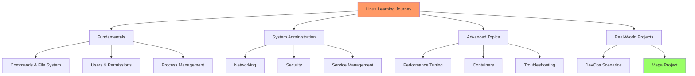

# Day 00: Introduction & Course Goals

## Learning Objectives
By the end of Day 0, you will:
- Understand the course structure and goals
- Set up a Linux environment for hands-on practice
- Join relevant communities for ongoing support
- Define your personal learning goals

**Estimated Time:** 1-2 hours

## Notes
- **Welcome!**
  - This course is designed for aspiring DevOps, SRE, System, and Cloud Engineers who want to master Linux from the ground up.
  - No prior Linux experience required, but basic computer literacy is helpful.

- **Why Learn Linux?**
  - Linux powers most servers, cloud platforms, and DevOps tools worldwide.
  - Essential for automation, scripting, troubleshooting, and system administration.
  - In-demand skill for top tech jobs (DevOps, SRE, Cloud, System Engineer, etc.).

- **What Will You Learn?**
  - Linux fundamentals, commands, and file system
  - Virtualization, networking, security, and automation
  - Real-world scenarios, troubleshooting, and a mega project

- **How to Get the Most Out of This Course:**
  - Practice hands-on with every topic (use a VM, WSL, or cloud instance)
  - Complete all exercises and review solutions
  - Experiment, break things, and learn by doing
  - Join online communities for support and networking

- **Recommended Prerequisites:**
  - Curiosity and willingness to learn
  - Basic computer and internet skills

- **Setting Up Your Learning Environment:**
  - **Online Terminal (Easiest):** https://bellard.org/jslinux/ or https://www.tutorialspoint.com/terminal_online.php
  - **VirtualBox VM:** Download Ubuntu ISO + VirtualBox, create new VM with 2GB RAM
  - **WSL (Windows):** Run `wsl --install` in PowerShell as Administrator
  - **Cloud VM:** AWS EC2 t2.micro (free tier), GCP Compute Engine, or Azure VM

- **Community & Support:**
  - **Course Community:** Join our Discord server: https://discord.gg/mNDm39qB8t
  - **Google Group:** https://groups.google.com/forum/#!forum/daily-devops-sre-challenge-series/join
  - **YouTube Channel:** https://www.youtube.com/@Sagar.Utekar

## Sample Exercises
1. Write down your personal goals for this course.
2. Join a Linux or DevOps online community (e.g., Reddit, Discord, LinkedIn group).
3. Set up your first Linux environment (online terminal, VM, WSL, or cloud instance).
4. Research and note down 3 ways Linux is used in the tech industry.

## Solutions
1. **Example goals:** "Get a DevOps job", "Automate tasks with Linux", "Understand cloud infrastructure", "Pass Linux certification".

2. **Recommended communities:**
   - **Course Discord:** https://discord.gg/mNDm39qB8t (Join for course support and discussions)
   - **Google Group:** https://groups.google.com/forum/#!forum/daily-devops-sre-challenge-series/join
   - **YouTube:** Subscribe to https://www.youtube.com/@Sagar.Utekar for video tutorials

3. **Setup Instructions:**
   - **Online Terminal:** Visit https://bellard.org/jslinux/, click "Boot Linux"
   - **VirtualBox:** Download VirtualBox + Ubuntu ISO → New VM → 2GB RAM → Install Ubuntu
   - **WSL:** Open PowerShell as Admin → `wsl --install` → Restart → Install Ubuntu from Microsoft Store
   - **AWS:** Launch EC2 → Ubuntu Server → t2.micro → Connect via SSH

4. **Linux usage examples:** Web servers (Apache/Nginx), cloud infrastructure (AWS/GCP), container orchestration (Docker/Kubernetes), automation (Ansible/Terraform), security testing (Kali Linux).

## Completion Checklist
- [ ] Defined personal learning goals
- [ ] Joined at least one Linux/DevOps community
- [ ] Set up Linux environment and can access terminal
- [ ] Researched Linux industry applications
- [ ] Ready to start Day 1

## Troubleshooting
- **VirtualBox issues:** Enable virtualization in BIOS/UEFI
- **WSL not working:** Ensure Windows 10 version 2004+ or Windows 11
- **Cloud VM access:** Check security groups allow SSH (port 22)

## Next Steps
Proceed to [Day 1: What is Linux?](../Day_01/notes_and_exercises.md) once you've completed the checklist above.
