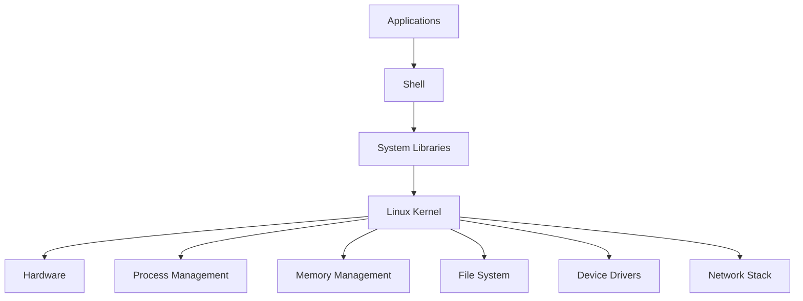
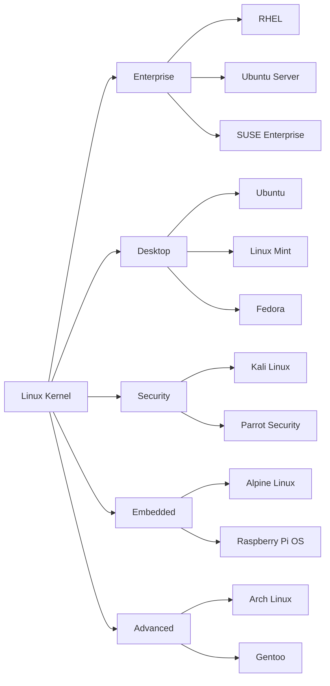

# Day 01: What is Linux? Kernel, Distributions, and Ecosystem

## Learning Objectives
By the end of Day 1, you will:
- Understand what Linux is and its history
- Know the role and function of the Linux kernel
- Identify major Linux distributions and their use cases
- Understand the Linux ecosystem and open-source philosophy

**Estimated Time:** 2-3 hours

## Notes
- **What is Linux?**
  - Linux is a free, open-source, Unix-like operating system kernel created by Linus Torvalds in 1991.
  - It forms the core of many operating systems called "Linux distributions" (distros).
  - Used in servers, desktops, embedded systems, supercomputers, IoT, and mobile devices (Android).

- **Linux vs Windows:**
  - Linux is open-source; Windows is proprietary.
  - Linux uses a hierarchical file system; Windows uses drive letters.
  - Linux is case-sensitive; Windows is not.
  - Linux supports multiple users natively and is preferred for servers.
  - Package management and software installation differ greatly.

  | Feature         | Linux                | Windows           |
  |-----------------|----------------------|-------------------|
  | Source          | Open Source          | Proprietary       |
  | File System     | Hierarchical (/)     | Drive Letters (C:)|
  | Case Sensitivity| Yes                  | No                |
  | Users           | Multi-user           | Single-user focus |
  | Package Mgmt    | apt, yum, etc.       | .exe, .msi        |

- **Core Components of Linux:**
  - **Kernel:** The core that manages hardware, memory, processes, and system calls.
  - **Shell:** Command-line interface to interact with the OS (bash, zsh, sh, etc.).
  - **File System:** Organizes data in a hierarchical structure; everything is a file.
  - **Processes:** Running instances of programs, managed by the kernel.
  - **Init System:** Manages system startup and services (systemd, SysVinit, Upstart).

- **Popular Linux Distributions by Category:**
  - **Beginner-friendly:** Ubuntu, Linux Mint, Fedora, openSUSE
  - **Enterprise/Server:** RHEL, CentOS Stream, Ubuntu Server, SUSE Enterprise
  - **Security-focused:** Kali Linux, Parrot Security OS
  - **Lightweight:** Alpine Linux, Puppy Linux, antiX
  - **Advanced:** Arch Linux, Gentoo, Slackware
  - **Specialized:** Raspberry Pi OS (ARM), Android (mobile)

- **Open Source Philosophy & GNU Project:**
  - Linux is licensed under GPL; source code is freely available.
  - GNU provides essential tools and utilities (coreutils, bash, gcc, etc.).
  - Community-driven development and contributions.

- **Linux in DevOps, SRE, System, and Cloud Roles:**
  - Most servers, cloud VMs, and containers run Linux.
  - Essential for automation, scripting, CI/CD, monitoring, and troubleshooting.
  - Used in Kubernetes, Docker, AWS, GCP, Azure, and more.

- **The Linux Kernel:**
  - **What it does:** Manages hardware resources, memory, processes, and system calls
  - **Kernel space vs User space:** Kernel runs in privileged mode, applications in user mode
  - **Kernel versions:** Numbered as X.Y.Z (e.g., 5.15.0) - X=major, Y=minor, Z=patch
  - **Monolithic kernel:** All core services run in kernel space for performance
  - **Key subsystems:** Process scheduler, memory manager, file systems, device drivers, network stack

- **Linux Distributions (Distros):**
  - **Enterprise/Server:** RHEL, CentOS, Ubuntu Server, SUSE Enterprise
  - **Desktop/User-friendly:** Ubuntu, Linux Mint, Fedora, openSUSE
  - **Security/Penetration Testing:** Kali Linux, Parrot Security
  - **Lightweight/Embedded:** Alpine Linux, Tiny Core, Raspberry Pi OS
  - **Advanced/Customizable:** Arch Linux, Gentoo, Linux From Scratch

- **Package Management by Distro:**
  - **Debian-based:** apt, dpkg (.deb packages) - Ubuntu, Debian, Mint
  - **Red Hat-based:** yum, dnf, rpm (.rpm packages) - RHEL, CentOS, Fedora
  - **Arch-based:** pacman (.pkg.tar.xz packages) - Arch, Manjaro
  - **SUSE-based:** zypper (.rpm packages) - openSUSE, SLES

- **Linux Ecosystem:**
  - **GNU Project:** Provides essential tools (bash, gcc, coreutils, glibc)
  - **Desktop Environments:** GNOME, KDE, XFCE, LXDE
  - **Init Systems:** systemd (modern), SysVinit (traditional), OpenRC
  - **Container Technologies:** Docker, Podman, LXC/LXD
  - **Cloud Platforms:** Most cloud services run on Linux (AWS, GCP, Azure)

## Sample Exercises
1. Explain what the Linux kernel is and list 3 main functions it performs.
2. Compare 3 different Linux distributions and their target use cases.
3. Research and explain the difference between the Linux kernel and a Linux distribution.
4. Identify which package manager is used by Ubuntu, CentOS, and Arch Linux.
5. Explain the role of the GNU Project in the Linux ecosystem.

## Solutions
1. **Linux kernel functions:**
   - Hardware management (CPU, memory, I/O devices)
   - Process scheduling and management
   - Memory management and virtual memory
   - File system operations
   - Network stack and communication

2. **Distribution comparison:**
   - **Ubuntu:** User-friendly, great for beginners and desktops, strong community support
   - **CentOS/RHEL:** Enterprise-focused, stable, long-term support, used in production servers
   - **Arch Linux:** Rolling release, cutting-edge, highly customizable, for advanced users

3. **Kernel vs Distribution:**
   - **Kernel:** Core operating system that manages hardware and system resources
   - **Distribution:** Complete operating system package including kernel + GNU tools + package manager + desktop environment + applications

4. **Package managers:**
   - **Ubuntu:** apt (Advanced Package Tool)
   - **CentOS:** yum (older) or dnf (newer)
   - **Arch Linux:** pacman

5. **GNU Project role:**
   - Provides essential userland tools and utilities (bash shell, gcc compiler, coreutils)
   - Created the GPL license that Linux uses
   - Develops the C library (glibc) that most Linux programs use

## Completion Checklist
- [ ] Understand what Linux is and its history
- [ ] Can explain the role of the Linux kernel
- [ ] Know major Linux distributions and their use cases
- [ ] Understand the difference between kernel and distribution
- [ ] Familiar with package management concepts
- [ ] Understand the Linux ecosystem and GNU Project

## Key Takeaways
- Linux is a kernel, not a complete operating system
- Distributions package the kernel with tools to create complete systems
- Different distros serve different purposes (desktop, server, security, embedded)
- The GNU Project provides essential tools that work with the Linux kernel
- Package managers vary by distribution family

## Next Steps
Proceed to [Day 2: Virtualization & Setting Up Linux](../Day_02/notes_and_exercises.md) to learn how to set up your own Linux environment.
