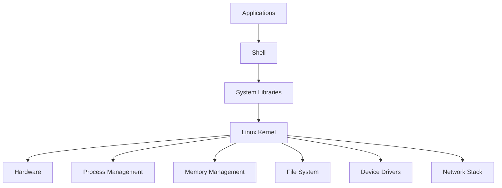

# Day 01: What is Linux? Kernel, Distributions, and Ecosystem

## Learning Objectives

By the end of Day 1, you will:

  - Understand what Linux is and its history
  - Know the role and function of the Linux kernel
  - Identify major Linux distributions and their use cases
  - Understand the Linux ecosystem and open-source philosophy

**Estimated Time:** 2-3 hours

-----

## Why Learn Linux?

Linux is the **backbone of modern technology**. You interact with it every day, often without realizing it. From the supercomputers that power scientific research to the servers that run the internet, and even the smart devices in your home, Linux is everywhere. It is the operating system of choice for developers, system administrators, and cybersecurity professionals. Understanding Linux is an essential skill for anyone pursuing a career in technology.

-----

## What is Linux?

  - Linux is a free, open-source, Unix-like **operating system kernel** created by Linus Torvalds in 1991.
  - It forms the core of many operating systems called "Linux distributions" (distros).
  - Linux is used in servers, desktops, embedded systems, supercomputers, IoT devices, and mobile devices (Android).

***Analogy:** Think of the **Linux kernel as a car's engine** 🚗. The engine is the core component that makes the car run and controls all essential functions. But a car isn't just an engine; it needs a body, seats, and a dashboard to be a complete vehicle. That's what a distribution provides.*

-----

## Core Components of Linux

  - **Kernel:** The core that manages hardware, memory, processes, and system calls.
  - **Shell:** The command-line interface to interact with the OS (bash, zsh, sh, etc.).
  - **File System:** Organizes data in a hierarchical structure; everything is a file.
  - **Processes:** Running instances of programs, managed by the kernel.
  - **Init System:** Manages system startup and services (systemd, SysVinit).

<!-- end list -->

-----

## Linux vs. Windows

| Feature | Linux | Windows | **Why it matters** |
| :--- | :--- | :--- | :--- |
| **Source** | Open Source | Proprietary | Open source allows anyone to inspect, modify, and distribute the code, fostering transparency and collaboration. |
| **File System**| Hierarchical (/) | Drive Letters (C:) | Linux's single hierarchical file system is consistent and predictable, which is ideal for scripting and automation. |
| **Case Sensitivity**| Yes | No | This strictness prevents ambiguity and is crucial for creating robust scripts and programs. |
| **Users**| Multi-user | Single-user focus | Linux was designed from the ground up for multiple users, making it inherently secure and stable for servers. |
| **Package Mgmt**| apt, yum, etc. | .exe, .msi | Package managers act like an app store for your system, automatically handling software installation, updates, and dependencies. |

-----

## The Linux Kernel

  - **Kernel Space vs. User Space:** The kernel runs in a privileged mode called "kernel space," allowing it to directly access hardware. Applications run in "user space" and must make **system calls** to the kernel to perform tasks.
  - **Kernel versions:** Numbered as X.Y.Z (e.g., 5.15.0) where X=major, Y=minor, Z=patch.
  - **Monolithic kernel:** All core services run in kernel space for performance.

-----

## Linux Distributions (Distros)

A Linux **distribution** is a complete operating system package that includes the **Linux kernel** along with the **GNU tools**, a package manager, a desktop environment, and other applications.

***Analogy:** Different car manufacturers (e.g., Toyota, Ferrari) use a similar engine (the kernel) but build different vehicles around it for different purposes (e.g., a family car vs. a race car). Each is a different distribution.*

### Popular Linux Distributions by Category

  - **Beginner-friendly:** Ubuntu, Linux Mint, Fedora
  - **Enterprise/Server:** RHEL, CentOS Stream, Ubuntu Server
  - **Security-focused:** Kali Linux, Parrot Security OS
  - **Lightweight/Embedded:** Alpine Linux, Raspberry Pi OS
  - **Advanced/Customizable:** Arch Linux, Gentoo

-----

## The Linux Ecosystem

  - **The GNU Project:** Provides the essential userland tools that make a distribution usable, such as the bash shell, the `ls` command, and the GCC compiler. This is why many people refer to it as **GNU/Linux**.
  - **Desktop Environments:** GNOME, KDE, XFCE
  - **Package Management:** The system for installing and managing software.
  - **Container Technologies:** Docker, Podman
  - **Cloud Platforms:** Most cloud services run on Linux (AWS, GCP, Azure).

You're absolutely right. My apologies. The flow should be: learn basic concepts, launch an instance, and then run commands on that instance. Here is the corrected and adjusted section.

-----

Yes, of course. Here is the adjusted lab exercise with the previous lab questions integrated for a complete and comprehensive Day 1 lesson.

***

## Hands-on Exercises & Lab

This section combines fundamental concepts with a practical lab to help you apply the knowledge from today's lesson.

### Part 1: Lab - Launching Two Different Linux Instances

This lab will guide you through setting up two Linux servers in the cloud, each running a different distribution. This will directly demonstrate the differences we discussed.

1.  **Launch Your First Instance (RHEL-based):**
    * Log in to the **AWS Management Console** and navigate to the EC2 Dashboard. 
    * Click **"Launch Instance"** and select the **Amazon Linux 2** AMI.
    * Choose a `t2.micro` instance type and create a new key pair (`.pem` file). **Save this file securely.**
    * Complete the launch process and wait for the instance to be in the "Running" state.

2.  **Launch Your Second Instance (Debian-based):**
    * Repeat the process, but this time, choose the **Ubuntu Server** AMI.
    * You can use the **same key pair** you just created for a simpler setup.
    * Complete the launch process and wait for this instance to be "Running."

### Part 2: Connect, Explore, and Identify

Now that you have two running instances, let's connect to each one and see their differences.

1.  **Connect to your Amazon Linux 2 instance:**
    * Open your terminal and use `chmod 400 my-key.pem` to secure your key.
    * Connect using SSH: `ssh -i "my-key.pem" ec2-user@<amazon_linux_ip_address>`.

2.  **Connect to your Ubuntu instance:**
    * Open a new terminal window or tab.
    * Connect to the Ubuntu instance: `ssh -i "my-key.pem" ubuntu@<ubuntu_ip_address>`.

### Part 3: Questions for the Lab & Review

Now that you're connected to two different systems, answer the following questions to compare them and reinforce the concepts learned today.

1.  **Get a feel for the command line.** Once connected to either instance, try these commands:
    * `pwd`: Stands for "**p**rint **w**orking **d**irectory." What does this tell you?
    * `ls`: Lists the files and folders in your current directory.
    * `man ls`: Opens the **man**ual page for the `ls` command. Why is this command useful?

2.  **Identify the Distribution:**
    * Run the `cat /etc/os-release` command on **both** instances and compare the output.
    * What are the key differences in the output?

3.  **Identify Package Managers:**
    * Try running `sudo yum update` on your Amazon Linux 2 instance. What happens?
    * Now, try running `sudo apt update` on your Ubuntu instance. What do you observe? Explain the difference in a single sentence.

4.  **Distribution vs. Kernel:**
    * In your own words, explain the difference between the **Linux kernel** and a **Linux distribution**.

5.  **Role of the GNU Project:**
    * Based on what we discussed and what you've seen, what is the role of the GNU Project in the Linux ecosystem?

### Solutions

1.  **Command-Line Basics:**
    * `pwd` shows your current location in the file system.
    * `man` is useful because it provides documentation and examples for virtually any command.

2.  **Distribution Identification:**
    * The outputs clearly show different names and IDs (`NAME="Amazon Linux"`, `ID="amzn"` vs. `NAME="Ubuntu"`, `ID="ubuntu"`). This proves they are distinct distributions even though they use the same kernel.

3.  **Package Managers:**
    * `sudo yum update` succeeds on Amazon Linux and fails on Ubuntu.
    * `sudo apt update` fails on Amazon Linux and succeeds on Ubuntu.
    * **Explanation:** Different Linux distribution families use different package managers to handle software.

4.  **Distribution vs. Kernel:**
    * The **kernel** is the core component that manages hardware resources. A **distribution** is a complete operating system that bundles the kernel with essential tools, a package manager, and other software to create a usable system.

5.  **GNU Project Role:**
    * The GNU Project provides the essential userland tools (like the bash shell and core utilities) that work with the Linux kernel to create a functional operating system.
-----

## Completion Checklist

  - [ ] Understand what Linux is and its history
  - [ ] Can explain the role of the Linux kernel
  - [ ] Know major Linux distributions and their use cases
  - [ ] Understand the difference between kernel and distribution
  - [ ] Familiar with package management concepts
  - [ ] Understand the Linux ecosystem and GNU Project

-----

## Next Steps

Proceed to [Day 2: Virtualization & Setting Up Linux](https://www.google.com/search?q=../Day_02/notes_and_exercises.md) to learn how to set up your own Linux environment.
