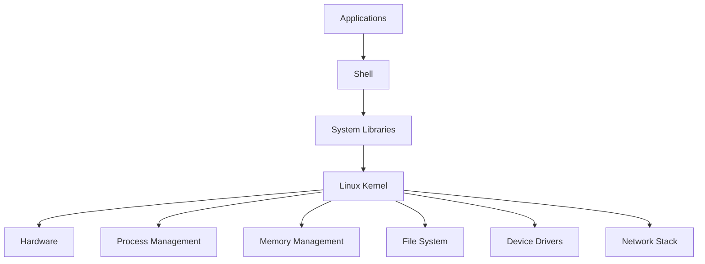
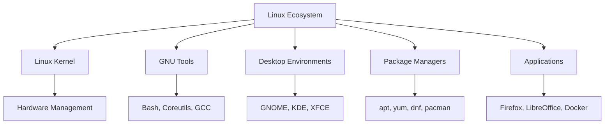

# Day 01: What is Linux? Kernel, Distributions, and Ecosystem

## Learning Objectives
By the end of Day 1, you will:
- Understand what Linux is and its history
- Know the role and function of the Linux kernel
- Identify major Linux distributions and their use cases
- Understand the Linux ecosystem and open-source philosophy
- Recognize why Linux is critical for DevOps, SRE, and Cloud Engineers

**Estimated Time:** 1-2 hours

## Why Learn Linux?
Linux is the **backbone of modern technology**. You interact with it every day, often without realizing it. From supercomputers powering scientific research to servers running the internet and smart devices in your home, Linux is everywhere. It is the operating system of choice for developers, system administrators, and cybersecurity professionals. Understanding Linux is an essential skill for anyone pursuing a career in technology.

### Why Linux Matters to You as a DevOps/SRE/Cloud Engineer
Linux is the foundation of modern infrastructure, making it indispensable for DevOps, Site Reliability Engineers (SREs), and Cloud Engineers:
- **DevOps:** Linux powers CI/CD pipelines (e.g., Jenkins, GitLab) and container platforms (e.g., Docker, Kubernetes). Bash scripting automates deployment workflows.
- **SRE:** Linux’s stability and configurability ensure reliable, scalable systems. SREs use Linux for monitoring (e.g., Prometheus), logging, and high-availability setups.
- **Cloud Engineers:** Major cloud platforms (AWS, GCP, Azure) run on Linux instances. Linux proficiency is key for managing VMs, optimizing costs, and configuring cloud services.
- **Automation and Scalability:** Linux’s command-line tools and scripting enable automation, while its lightweight nature supports scaling across thousands of servers.
- **Industry Dominance:** Over 96% of the top 1 million web servers and 100% of the top 500 supercomputers run Linux (as of 2025).

**Quick Fact:** Most cloud-native tools (e.g., Kubernetes, Terraform) are Linux-native, and employers expect Linux proficiency for DevOps/SRE/Cloud roles.

## What is Linux?
- Linux is a free, open-source, Unix-like **operating system kernel** created by Linus Torvalds in 1991.
- It forms the core of many operating systems called "Linux distributions" (distros).
- Linux is used in servers, desktops, embedded systems, supercomputers, IoT devices, and mobile devices (Android).

***Analogy:** Think of the **Linux kernel as a car's engine** 🚗. The engine is the core component that makes the car run and controls all essential functions. But a car isn't just an engine; it needs a body, seats, and a dashboard to be a complete vehicle. That's what a distribution provides.*

### A Brief History of Linux
- **1983:** Richard Stallman starts the **GNU Project** to create a free, Unix-like operating system.
- **1991:** Linus Torvalds releases the first Linux kernel (version 0.01) as a personal project.
- **1993:** Debian, one of the oldest Linux distributions, is founded.
- **1994:** Linux kernel 1.0 is released, marking a stable milestone.
- **2000s:** Linux gains traction in servers, supercomputers, and embedded systems.
- **2010s:** Linux powers Android, cloud platforms (AWS, Azure), and containers (Docker).
- **2025:** Linux runs on over 80% of cloud workloads and is the foundation for AI and IoT ecosystems.

**Fun Fact:** Linus Torvalds still oversees Linux kernel development through the Linux Kernel Mailing List (LKML), ensuring its collaborative spirit.

## Core Components of Linux
- **Kernel:** The core that manages hardware, memory, processes, and system calls.
- **Shell:** The command-line interface to interact with the OS (bash, zsh, sh, etc.).
- **File System:** Organizes data in a hierarchical structure; everything is a file.
- **Processes:** Running instances of programs, managed by the kernel.
- **Init System:** Manages system startup and services (systemd, SysVinit).



## Linux vs. Windows
| Feature | Linux | Windows | **Why it matters** |
|-------|-------|---------|---------------------|
| **Source** | Open Source | Proprietary | Open source allows inspection, modification, and distribution, fostering transparency and collaboration critical for DevOps workflows. |
| **File System** | Hierarchical (/) | Drive Letters (C:) | Linux’s hierarchical file system is consistent, ideal for scripting and automation in cloud environments. |
| **Case Sensitivity** | Yes | No | Strict case sensitivity prevents ambiguity, crucial for robust CI/CD scripts. |
| **Users** | Multi-user | Single-user focus | Linux’s multi-user design ensures secure, stable server operations for SREs. |
| **Package Mgmt** | apt, yum, etc. | .exe, .msi | Package managers streamline software and dependency management, essential for cloud automation. |

## The Linux Kernel
- **Kernel Space vs. User Space:** The kernel runs in privileged "kernel space," accessing hardware directly. Applications run in "user space" and use **system calls** to interact with the kernel.
- **Kernel versions:** Numbered as X.Y.Z (e.g., 5.15.0) where X=major, Y=minor, Z=patch.
- **Monolithic kernel:** Core services run in kernel space for performance, vital for low-latency cloud and container applications.

## Linux Distributions (Distros)
A Linux **distribution** is a complete OS package including the **Linux kernel**, **GNU tools**, a package manager, and applications.

***Analogy:** Different car manufacturers (e.g., Toyota, Ferrari) use a similar engine (the kernel) but build different vehicles for different purposes (e.g., family car vs. race car). Each is a different distribution.*

### Popular Linux Distributions by Category
- **Beginner-friendly:** Ubuntu, Linux Mint, Fedora
- **Enterprise/Server:** RHEL, CentOS Stream, Ubuntu Server
- **Security-focused:** Kali Linux, Parrot Security OS
- **Lightweight/Embedded:** Alpine Linux, Raspberry Pi OS
- **Advanced/Customizable:** Arch Linux, Gentoo

**For DevOps/SRE/Cloud Engineers:**
- **Ubuntu Server** and **CentOS Stream**: Widely used in cloud for stability and support.
- **Alpine Linux**: Popular for lightweight containers due to its minimal footprint.
- **RHEL**: Common in enterprises for long-term support and compliance.

## The Linux Ecosystem
- **The GNU Project:** Provides userland tools (e.g., bash, ls, GCC), making distributions usable. Hence, the term **GNU/Linux**.
- **Desktop Environments:** GNOME, KDE, XFCE (less relevant for server-focused roles).
- **Package Management:** Tools like apt, yum, and dnf simplify software management for automation.
- **Container Technologies:** Docker, Podman, and Kubernetes, critical for DevOps.
- **Cloud Platforms:** AWS, GCP, and Azure rely on Linux instances.

### Visualizing the Linux Ecosystem


### The Open-Source Philosophy
Linux is built on the **open-source philosophy**:
- **Freedom:** Anyone can use, modify, and distribute the code.
- **Collaboration:** Global developers contribute, making Linux robust and innovative.
- **Transparency:** Open code ensures trust and security, vital for enterprise and cloud environments.

The Linux kernel is licensed under the **GNU General Public License (GPL)**, ensuring derivative works remain free. This drives innovation in DevOps tools and cloud infrastructure.

**Discussion Question:** Why do companies like Google, AWS, and Red Hat invest in open-source Linux projects?

### Common Myths About Linux for DevOps/SRE/Cloud Engineers
- **Myth 1: Linux is too complex for cloud work.** Distros like Ubuntu Server and tools like Docker simplify cloud management.
- **Myth 2: Linux isn’t used in production.** Over 80% of cloud workloads and most Kubernetes clusters run on Linux.
- **Myth 3: Linux lacks support for DevOps tools.** Tools like Jenkins, Terraform, and Kubernetes are Linux-native and widely supported.

## Hands-on Exercises & Lab
### Preparing for the Lab
If you don’t have an AWS account:
- **Virtual Machines:** Use VirtualBox/VMware with Ubuntu Server or CentOS Stream ISOs.
- **Free Cloud Alternatives:** Oracle Cloud Free Tier or Google Cloud’s free trial.
- **Local Terminal:** macOS/Linux users can practice commands locally.

**Troubleshooting SSH Issues:**
- **"Permission Denied"**: Run `chmod 400 my-key.pem` and verify username (`ec2-user` for Amazon Linux, `ubuntu` for Ubuntu).
- **Connection Timeout**: Ensure the security group allows SSH (port 22) and check the public IP.

### Part 1: Lab - Launching Two Different Linux Instances
1. **Launch Your First Instance (RHEL-based):**
   - Log in to the **AWS Management Console** and navigate to the EC2 Dashboard.
   - Click **"Launch Instance"** and select the **Amazon Linux 2** AMI.
   - Choose a `t2.micro` instance type and create a new key pair (`.pem` file). **Save this file securely.**
   - Complete the launch process and wait for the instance to be "Running."

2. **Launch Your Second Instance (Debian-based):**
   - Repeat, selecting the **Ubuntu Server** AMI.
   - Use the **same key pair** for simplicity.
   - Complete the launch process and wait for the instance to be "Running."

### Part 2: Connect, Explore, and Identify
1. **Connect to Amazon Linux 2:**
   - Run `chmod 400 my-key.pem`.
   - Connect: `ssh -i "my-key.pem" ec2-user@<amazon_linux_ip_address>`.

2. **Connect to Ubuntu:**
   - Open a new terminal tab/window.
   - Connect: `ssh -i "my-key.pem" ubuntu@<ubuntu_ip_address>`.

### Part 3: Questions for the Lab & Review
1. **Command-Line Basics:**
   - Run `pwd`, `ls`, and `man ls` on either instance.
   - **Questions:** What does `pwd` tell you? Why is `man` useful?

2. **Identify the Distribution:**
   - Run `cat /etc/os-release` on both instances and compare.
   - **Question:** What are the key differences in the output?

3. **Identify Package Managers:**
   - Run `sudo yum update` on Amazon Linux 2 and `sudo apt update` on Ubuntu.
   - **Question:** What happens? Explain the difference in one sentence.

4. **Distribution vs. Kernel:**
   - **Question:** Explain the difference between the **Linux kernel** and a **Linux distribution** in your own words.

5. **Role of the GNU Project:**
   - **Question:** What is the role of the GNU Project in the Linux ecosystem?

### Part 4: Write and Run a Simple Script
1. On either instance, create `hello.sh`:
   ```bash
   nano hello.sh
   ```
2. Add:
   ```bash
   #!/bin/bash
   echo "Hello, Linux World!"
   echo "My current directory is: $(pwd)"
   echo "My distribution is:"
   cat /etc/os-release | grep PRETTY_NAME
   ```
3. Save (`Ctrl+O`, `Enter`, `Ctrl+X`), make executable (`chmod +x hello.sh`), and run (`./hello.sh`).
4. **Question:** What does each line do? Compare outputs on both instances.

### Part 5: Challenge for DevOps/SRE/Cloud Engineers
- **Task:** Run `uname -r` to check the kernel version on either instance. Compare it to the latest stable version on kernel.org. Why might cloud providers like AWS use older kernels?
- **Hint:** Consider stability, compatibility with cloud tools, and enterprise support.

### Learn in public:
- Share your daily learnings publicly on social media (X, LinkedIn, etc.) using hashtags #linuxthefinalboss and #getfitwithsagar. This helps you get noticed by recruiters and builds your professional brand.

### Solutions
1. **Command-Line Basics:**
   - `pwd` shows your current location in the file system.
   - `man` provides documentation and examples for commands.

2. **Distribution Identification:**
   - Outputs show different names/IDs (e.g., `NAME="Amazon Linux"`, `ID="amzn"` vs. `NAME="Ubuntu"`, `ID="ubuntu"`), proving distinct distributions.

3. **Package Managers:**
   - `sudo yum update` succeeds on Amazon Linux, fails on Ubuntu.
   - `sudo apt update` succeeds on Ubuntu, fails on Amazon Linux.
   - **Explanation:** Different distributions use different package managers (yum for RHEL-based, apt for Debian-based).

4. **Distribution vs. Kernel:**
   - The **kernel** manages hardware resources; a **distribution** bundles the kernel with tools, package managers, and software for a complete OS.

5. **GNU Project Role:**
   - Provides userland tools (e.g., bash, coreutils) that complement the kernel to create a functional OS.

## Glossary of Key Terms
- **Kernel:** The core of the OS that manages hardware and system resources.
- **Distribution (Distro):** A complete OS built around the Linux kernel, including tools and applications.
- **Shell:** A command-line interface for interacting with the OS (e.g., bash).
- **Package Manager:** A tool for installing, updating, and managing software (e.g., apt, yum).
- **GNU:** A project providing essential tools that complement the Linux kernel.
- **Open Source:** Software whose source code is freely available for modification and distribution.

## Completion Checklist
- [ ] Understand what Linux is and its history
- [ ] Can explain the role of the Linux kernel
- [ ] Know major Linux distributions and their use cases
- [ ] Understand the difference between kernel and distribution
- [ ] Familiar with package management concepts
- [ ] Understand the Linux ecosystem and GNU Project
- [ ] Recognize Linux’s importance for DevOps/SRE/Cloud roles
- [ ] Successfully launched and connected to two Linux instances
- [ ] Ran basic commands and a simple script in the lab
- [ ] Completed the challenge question for deeper insight
- [ ] Share your learnings on social media

## Resources for DevOps/SRE/Cloud Engineers
- **Official Sites:** Ubuntu (ubuntu.com), RHEL (redhat.com), Alpine Linux (alpinelinux.org)
- **Course Discord:** https://discord.gg/mNDm39qB8t (Join for course support and discussions)
- **Google Group:** https://groups.google.com/forum/#!forum/daily-devops-sre-challenge-series/join
- **YouTube:** Subscribe to https://www.youtube.com/@Sagar.Utekar for video tutorials

## Next Steps
Proceed to [Day 2: Virtualization & Setting Up Linux](https://www.google.com/search?q=../Day_02/notes_and_exercises.md) to learn how to set up your own Linux environment.
