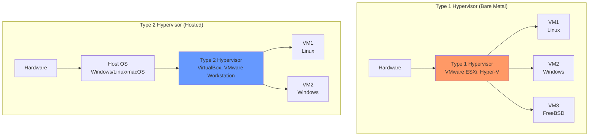
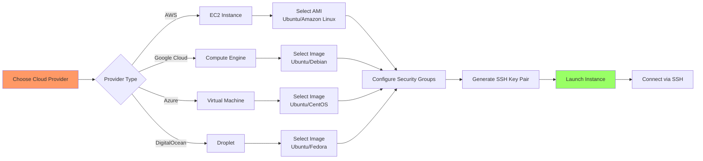

# Day 02: Virtualization & Setting Up Linux (VM, WSL, Cloud)

## Learning Objectives
By the end of Day 2, you will:
- Understand virtualization concepts and types
- Set up Linux using VirtualBox, VMware, or cloud platforms
- Configure WSL on Windows
- Connect to remote Linux instances via SSH
- Take snapshots and manage VM resources

**Estimated Time:** 3-4 hours

## Notes
- **What is Virtualization?**
  - Virtualization allows you to run multiple operating systems on a single physical machine by creating virtual machines (VMs).
  - Hypervisors manage VMs. Two types:
    - Type 1 (bare-metal): Runs directly on hardware (e.g., VMware ESXi, Microsoft Hyper-V)
    - Type 2 (hosted): Runs on top of an existing OS (e.g., VirtualBox, VMware Workstation)

- **Why Use Virtualization?**
  - Safe environment for learning, testing, and development
  - Snapshots and easy recovery
  - Resource isolation and efficient hardware use

- **Popular Virtualization Tools:**
  - VirtualBox (free, cross-platform)
  - VMware Workstation/Player
  - KVM (Linux native)
  - Parallels (Mac)

- **Setting Up a Linux VM (Detailed Steps):**
  1. **Download ISO:** Get Ubuntu 22.04 LTS or CentOS Stream from official sites
  2. **Install Hypervisor:** Download VirtualBox (free) or VMware Workstation
  3. **Create VM:** 
     - Name: Ubuntu-Lab
     - RAM: 2-4GB (minimum 2GB)
     - Disk: 20-40GB dynamic
     - CPU: 2 cores recommended
  4. **Configure Settings:**
     - Enable virtualization features
     - Attach ISO to optical drive
     - Configure network (NAT or Bridged)
  5. **Install OS:** Boot from ISO, follow installer, create user account
  6. **Post-install:** Install Guest Additions, update system, take snapshot

- **WSL (Windows Subsystem for Linux):**
  - **WSL 1:** Translation layer between Linux and Windows kernel
  - **WSL 2:** Real Linux kernel in lightweight VM (recommended)
  - **Installation:** `wsl --install` (installs WSL 2 + Ubuntu by default)
  - **Available distros:** Ubuntu, Debian, SUSE, Kali, Alpine
  - **Access:** Windows Terminal, VS Code integration
  - **File access:** `/mnt/c/` for Windows C: drive

- **Cloud Linux Instances:**
  - **AWS EC2:** t2.micro (free tier), Ubuntu/Amazon Linux AMIs
  - **Google Compute Engine:** e2-micro (free tier), various Linux images
  - **Azure VMs:** B1s (low cost), Ubuntu/CentOS/RHEL options
  - **DigitalOcean:** Droplets starting at $5/month
  - **Linode:** Nanode 1GB for $5/month
  - **Key features:** Auto-scaling, load balancing, managed services
  - **Security:** SSH keys, security groups, firewalls

- **Best Practices:**
  - Allocate enough resources for smooth operation
  - Use snapshots/backups before making major changes
  - Secure remote access (use SSH keys, disable password login)
  - Keep your VM and host OS updated

## Sample Exercises
1. Set up a Linux VM using VirtualBox or VMware and install Ubuntu or CentOS.
2. Install and launch WSL on a Windows machine.
3. Launch a cloud Linux instance (AWS, GCP, or Azure) and connect via SSH.
4. Take a snapshot of your VM and restore it.
5. Compare Type 1 and Type 2 hypervisors with examples.

## Solutions
1. **VirtualBox Setup:**
   - Download VirtualBox + Ubuntu ISO
   - Create new VM: 2GB RAM, 20GB disk
   - Mount ISO, boot, follow installer
   - Install Guest Additions for better integration

2. **WSL Setup:**
   - Open PowerShell as Administrator
   - Run: `wsl --install`
   - Restart computer
   - Install Ubuntu from Microsoft Store
   - Launch and create user account

3. **Cloud Instance:**
   - **AWS:** EC2 → Launch Instance → Ubuntu → t2.micro → Create key pair
   - **Connect:** `ssh -i keyfile.pem ubuntu@public-ip`
   - **GCP:** Compute Engine → Create Instance → Ubuntu
   - **Azure:** Virtual Machines → Create → Ubuntu

4. **Snapshots:**
   - VirtualBox: Machine → Take Snapshot
   - VMware: VM → Snapshot → Take Snapshot
   - Restore: Select snapshot → Restore

5. **Hypervisor Types:**
   - **Type 1 (Bare-metal):** VMware ESXi, Microsoft Hyper-V, Xen
   - **Type 2 (Hosted):** VirtualBox, VMware Workstation, Parallels

## Completion Checklist
- [ ] Understand virtualization concepts and hypervisor types
- [ ] Successfully set up at least one Linux environment (VM/WSL/Cloud)
- [ ] Can connect to Linux instance via terminal/SSH
- [ ] Created and restored a VM snapshot
- [ ] Familiar with resource allocation for VMs

## Troubleshooting
- **VirtualBox won't start:** Enable virtualization in BIOS/UEFI
- **WSL installation fails:** Ensure Windows 10 version 2004+ or Windows 11
- **SSH connection refused:** Check security groups allow port 22
- **VM performance issues:** Increase RAM allocation or enable hardware acceleration

## Sample Interview Questions
1. What is virtualization and why is it important in modern IT?
2. Explain the difference between Type 1 and Type 2 hypervisors with examples.
3. How would you set up a Linux VM on your local machine? What are the key steps?
4. What is WSL and how does it differ from a traditional VM?
5. How do you connect to a cloud Linux instance securely?
6. What are the advantages of using snapshots in virtualization?
7. What are some best practices for securing a cloud VM?
8. How do you allocate resources efficiently for a VM?
9. What is the role of the bootloader in a VM?
10. How can you automate the provisioning of VMs in the cloud?

## Interview Question Answers
1. **Virtualization:** Allows multiple OS instances on one physical machine, improving resource utilization, isolation, and flexibility
2. **Hypervisor Types:** Type 1 (bare-metal): VMware ESXi, Hyper-V; Type 2 (hosted): VirtualBox, VMware Workstation
3. **VM Setup:** Download hypervisor + OS ISO → Create VM → Allocate resources → Install OS → Install guest additions
4. **WSL:** Runs Linux compatibility layer on Windows kernel; VMs run complete separate OS with own kernel
5. **Cloud Connection:** Use SSH with key pairs: `ssh -i keyfile.pem user@public-ip`
6. **Snapshot Advantages:** Point-in-time recovery, testing rollback, backup before changes, development environments
7. **Cloud VM Security:** Use SSH keys, disable password auth, configure security groups, keep OS updated, use firewalls
8. **Resource Allocation:** Monitor CPU/RAM usage, start small and scale up, use appropriate instance types for workload
9. **VM Bootloader:** Same as physical - GRUB loads kernel, but hypervisor manages virtual hardware presentation
10. **VM Automation:** Use Infrastructure as Code (Terraform), cloud templates, configuration management (Ansible)

## Next Steps
Proceed to [Day 3: Linux Folder Structure & File Types](../Day_03/notes_and_exercises.md) to explore the Linux filesystem.
