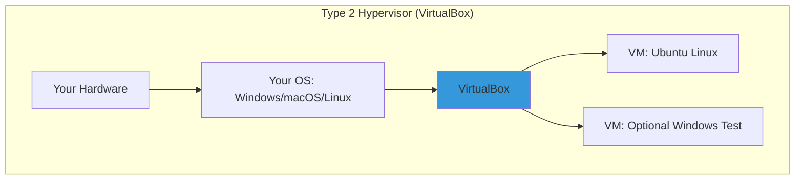

# Day 02: Virtualization & Setting Up Linux (Focus: VirtualBox Hands-On)

## Learning Objectives
By the end of Day 2, you will:
- Understand basic virtualization concepts and hypervisor types
- Install and configure a Linux VM step-by-step in VirtualBox
- Play with your VM: Check network connectivity, take snapshots, and tweak settings
- Get a quick view of the Linux boot process
- Troubleshoot simple VM issues

**Estimated Time:** 1-2 hours

## Why Learn Virtualization?
Virtualization lets you create a "mini-computer" (VM) inside your real one—perfect for safely trying Linux without risking your main setup. Start here, and you're prepped for cloud magic.

### Why It Matters to You as a DevOps/SRE/Cloud Engineer
- **DevOps:** Test scripts in an isolated VM before deploying to real servers.
- **SRE:** Use snapshots to "undo" mistakes, like a time machine for troubleshooting.
- **Cloud Engineers:** Local VMs mimic cloud instances (e.g., AWS EC2) for free practice.
- **Quick Win:** VirtualBox is free and runs on any OS—your portable Linux lab.

**Quick Fact:** Most cloud servers are VMs; mastering VirtualBox is like learning the alphabet before writing code.

## What is Virtualization?
Virtualization is the technology that creates **virtual versions of physical resources** (like servers, storage, or networks) on a single piece of hardware. It abstracts the underlying hardware, allowing multiple isolated environments—called **virtual machines (VMs)**—to run simultaneously without interfering.

### Key Components and How It Works
- **Host vs. Guest:** The host is your physical machine (e.g., your laptop). Guests are the VMs running on it (e.g., a Linux server VM).
- **Abstraction Layer:** The hypervisor (more on this below) emulates hardware for guests, allocating slices of CPU, RAM, disk, and network.
- **Types of Virtualization:**
  - **Server Virtualization:** Multiple OSes on one server (e.g., running Ubuntu and Windows VMs).
  - **Desktop Virtualization:** Remote access to VMs (e.g., VDI for secure desktops).
  - **Network/Storage Virtualization:** Pooling resources across devices.

#### Benefits (Why Interviewers Love This)
- **Efficiency:** One server runs 10+ VMs, cutting hardware costs by 70-80%.
- **Isolation:** A crash in one VM doesn't affect others—crucial for SRE reliability.
- **Scalability:** Spin up VMs on-demand (e.g., auto-scaling in AWS).
- **Testing/DevOps:** Reproducible environments; snapshot for "what if" scenarios.
- **Security:** Sandbox malware analysis or multi-tenant clouds.

In interviews, tie this to real-world: "Virtualization enables Kubernetes pods to run isolated on shared nodes, reducing overhead vs. bare metal."

#### Drawbacks (Show Balance)
- Overhead: 5-15% performance hit from emulation.
- Complexity: Managing hypervisors adds a layer (but tools like Kubernetes abstract it).

It's software (hypervisor) that tricks an OS into thinking it's on real hardware, so you can run Linux on Windows (or vice versa).

- **Hypervisors:** The "VM bosses."
  - **Type 1:** Hardware-direct (servers, e.g., VMware ESXi).
  - **Type 2:** On your OS (laptops, e.g., VirtualBox—we're using this!).

***Analogy:** VirtualBox is your **personal hotel manager** —it books rooms (VMs) in your building (hardware) without you lifting a finger.

## Hypervisors: The Engine of Virtualization
A **hypervisor** (or Virtual Machine Monitor, VMM) is the software/firmware that creates, runs, and manages VMs. It's the "brain" allocating resources and enforcing isolation. As of 2025, hypervisors power 95%+ of cloud workloads.

### Type 1 vs. Type 2: The Big Divide
Hypervisors split into two camps based on where they run—interviewers often ask you to compare them.

| Aspect | Type 1 (Bare-Metal/Native) | Type 2 (Hosted) |
|--------|-----------------------------|-----------------|
| **Runs On** | Directly on hardware (no host OS). | On top of a host OS (e.g., Windows). |
| **Performance** | Near-native (1-5% overhead)—ideal for prod servers. | Higher overhead (5-20%)—fine for dev/testing. |
| **Security/Isolation** | Strongest; failures rarely affect hardware. | Depends on host OS; potential single point of failure. |
| **Use Cases** | Enterprise data centers, clouds (e.g., AWS Nitro). | Laptops for learning (e.g., VirtualBox for local labs). |
| **Examples (2025)** | VMware ESXi (vSphere 9.0 with AI optimizations), Microsoft Hyper-V (integrated in Azure), KVM (Linux kernel module, used in OpenStack), Citrix XenServer (now Citrix Hypervisor 8.3). | Oracle VirtualBox (7.0 with Wayland support), VMware Workstation 17 (Pro for teams), Parallels Desktop 20 (Apple Silicon focus). |
| **Pros** | Better scalability, efficiency for high-load (e.g., 1000+ VMs/node). | Easier setup, portable across OSes. |
| **Cons** | Harder to install (dedicated hardware); vendor lock-in risks. | Slower; host OS vulnerabilities expose VMs. |

**Interview Tip:** Say, "For prod SRE at scale, I'd pick Type 1 like KVM for cost/performance; for local dev, Type 2 VirtualBox for quick spins." Draw the table above on a whiteboard to impress.

### Emerging Trends in 2025
- **Unikernels:** Lightweight VMs with minimal OS (e.g., MirageOS)—faster boot, smaller footprint for microservices.
- **GPU/ARM Support:** Hypervisors like ESXi 9 now optimize for AI workloads on NVIDIA GPUs.
- **Open Source Rise:** KVM leads in clouds (Red Hat OpenShift); expect more container-hypervisor hybrids like Firecracker (AWS Lambda).

## Quick Peek: The Linux Boot Process
When your VM starts, it "wakes up" in steps—watch it to feel the flow.

The Linux boot is a choreographed sequence turning hardware into a usable OS. It's interview gold—expect "Walk me through it" or "Debug a hang at stage X." As of 2025, systemd dominates (95% distros), but the core flow is timeless.

### Detailed Step-by-Step

1. **Power-On Self-Test (POST) & Firmware (BIOS/UEFI):** 
   - Hardware powers up; firmware (BIOS legacy or UEFI modern) tests components (CPU, RAM, disks). In VMs, hypervisor emulates this (~1-2s).
   - Locates boot device (e.g., /dev/sda in VM disk). UEFI uses GPT partitions; BIOS MBR.

2. **Bootloader Stage (GRUB2):**
   - GRUB (GNU GRand Unified Bootloader) loads from boot sector. Scans /boot/grub/grub.cfg for kernels (vmlinuz-*).
   - Shows menu (hold Shift); user selects entry. Passes params (e.g., root=/dev/sda1) to kernel.
   - Chains to other OSes if dual-boot. Time: <5s.

3. **Kernel Initialization:**
   - Kernel (bzImage) decompresses into RAM. Mounts initramfs (compressed FS with early drivers).
   - Probes hardware (via modules like virtio for VMs), sets up memory (paging), mounts real root FS (/).
   - Starts PID 1 (init). Logs to dmesg. Time: 5-20s.

4. **Init System (systemd):**
   - systemd reads /etc/fstab for mounts; parses units in /lib/systemd/system.
   - Reaches default target (multi-user.target for servers; graphical.target for desktops).
   - Starts services parallel (e.g., NetworkManager, sshd). Time: 10-60s.

5. **User Space & Login:**
   - getty spawns on tty/SSH; PAM authenticates user.
   - Shell (bash) loads ~/.profile; prompt appears. GUI: display manager (gdm) starts X11/Wayland.

**Total Time:** 30-90s on SSD; slower on HDD. In 2025, dracut optimizes initramfs for faster embedded boots.

**VM Nuances:** Hypervisor provides virtual BIOS (SeaBIOS) or UEFI (OVMF); boot faster sans real hardware checks.

**Debug Tips:** `journalctl -b` (systemd logs), `dmesg` (kernel), `systemd-analyze blame` (service timings)—interview gold for "slow boot?" scenarios.

Run `systemd-analyze` after boot to see timings—fun metric!

## Step-by-Step: Installing Your First VM in VirtualBox
Let's build an Ubuntu VM—follow along, pause if needed. We'll use Ubuntu 25.04 (Plucky Puffin) and username "linuxthefinalboss".

### Prerequisites
- Download: VirtualBox from virtualbox.org (install + Extension Pack).
- ISO: Visit https://ubuntu.com/download/desktop and download Ubuntu 25.04 Desktop (5.8 GB ISO for x86_64; requires 4 GB RAM, 25 GB disk min—adjust VM accordingly).

### Step 1: Launch VirtualBox & Create VM
1. Open VirtualBox → Click "New."
2. Name: "MyUbuntuLab" | Folder: Default | ISO Image: Select your Ubuntu 25.04 ISO | Type: Linux | Version: Ubuntu (64-bit) → Next.
3. Hardware: Base Memory: 4096 MB (4GB to match prereqs) → Next.
4. Processors: 2 CPUs → Next.
5. Hard Disk: Create new → VDI → Dynamically allocated → 30 GB (above min) → Create.

**Your VM is born!** (Takes ~2 min.)

### Step 2: Configure VM Settings
1. Select your VM → Settings.
2. **System:** Motherboard: Enable EFI (modern boot); Processor: 2 CPUs.
3. **Display:** Screen: 128 MB Video Memory; Enable 3D Acceleration (smoother GUI).
4. **Storage:** Under Controller: IDE → Empty → Optical Drive icon → Choose your Ubuntu 25.04 ISO.
5. **Network:** Adapter 1: Enable → Attached to: NAT (easy internet).
6. **USB:** Enable USB Controller.
7. OK → Start the VM.

### Step 3: Install Ubuntu in the VM
1. VM boots to ISO → "Try or Install Ubuntu" → Install.
2. Keyboard: English → Continue.
3. Updates: Normal → Continue.
4. Type: Erase disk & install → Continue (VM disk only!).
5. Location: Your region → Continue.
6. Who: Name "linuxthefinalboss", computer "lab-vm", username "linuxthefinalboss", password (simple for now) → Continue.
7. Wait ~10-15 min for install → Restart (remove ISO when prompted: Devices → Optical Drives → Remove).

**Success!** Log in as "linuxthefinalboss"—explore the desktop.

### Step 4: First Tweaks in Your VM
1. Open Terminal (Ctrl+Alt+T).
2. Update: `sudo apt update && sudo apt upgrade -y`.
3. Install basics: `sudo apt install curl htop -y`.
4. Reboot: `sudo reboot`—watch the boot flow.

**Pro Tip:** Install Guest Additions for clipboard sharing: Devices → Insert Guest Additions CD → Run in terminal: `sudo sh ./VBoxLinuxAdditions.run`.

## Playing with Your VM: Networking, Snapshots, & More
Now that it's running, let's experiment—like a playground.

### Check Network Connectivity
1. In VM Terminal: `ping google.com` (tests internet—should reply).
2. If fails: VM Settings → Network → Ensure NAT enabled → Restart adapter (right-click in Network menu).
3. Fun Test: `curl ifconfig.me` (shows VM's public IP via host).

**Question:** Why NAT? (Hides VM behind your IP—secure & simple.)

### Take & Use Snapshots
1. VM running? → Machine → Take Snapshot → Name: "Fresh Ubuntu" → Take.
2. Make a change: Create file `touch ~/experiment.txt` → ls ~ (see it).
3. Take another: "With File" → OK.
4. "Oops!" → Snapshots pane → Right-click "Fresh Ubuntu" → Restore.
5. Reboot/refresh—file gone!

**Why Cool?** Undo button for experiments—SREs use this for "before/after" deploys.

### Quick Tweaks & Exploration
- **Resize Window:** View → Auto-resize Guest Display (full-screen magic).
- **Shared Folders:** Settings → Shared Folders → Add host folder → Access in VM: `sudo mount -t vboxsf shared /mnt/shared`.
- **Boot Peek:** Reboot → Hold Shift for GRUB menu → Select Advanced → Recovery (safe mode fun).

## Hands-on Exercises & Lab
Step-by-step playtime—build confidence one tweak at a time.

### Part 1: VM Creation & First Boot
1. Follow Steps 1-3 above—get Ubuntu 25.04 installed & logged in as linuxthefinalboss.
2. **Exercise:** Run `neofetch` (install if needed: `sudo apt install neofetch`)—screenshot your system info.
3. **Question:** What kernel version shows? (Compare to Day 1's `uname -r`.)

### Part 2: Network Check & Fix
1. Ping test: `ping 8.8.8.8` (IP) & `ping google.com` (DNS).
2. **Exercise:** If DNS fails, edit /etc/resolv.conf (add `nameserver 8.8.8.8`) → Test again.
3. **Question:** How does VM networking differ from your host?

### Part 3: Snapshot Practice
1. Take "Baseline" snapshot.
2. **Exercise:** Install a fun tool (`sudo apt install cowsay -y; cowsay "Hello VM!"`) → Take "With Cow" snapshot.
3. Restore to Baseline—cow gone? Reinstall to confirm.
4. **Question:** Imagine a bad config change—how does snapshot save you?

### Part 4: Simple Config Tweak
1. **Exercise:** Change hostname: `sudo hostnamectl set-hostname my-lab-server` → Reboot → `hostname` confirms.
2. Add to snapshot chain: "Renamed Host."
3. **Question:** Why tweak hostname in a VM (e.g., for multi-VM testing)?

### Part 5: Quick Challenge - Boot Observation
- Reboot VM; time the boot (`time sleep 1` post-login for fun).
- **Exercise:** Run `journalctl -b -p err` (boot errors? Usually none!).
- **Question:** What service starts last (hint: `systemd-analyze blame`)?

### Solutions
1. **First Boot:** Kernel like 6.14—matches Ubuntu 25.04.
2. **Network:** VM uses host's connection; DNS via resolv.conf.
3. **Snapshot:** Instant rollback—no data loss.
4. **Tweak:** Hostnames avoid confusion in teams/clusters.
5. **Boot:** Login managers last; blame shows timings.

## Glossary of Key Terms
- **Hypervisor:** VM runner (VirtualBox = Type 2).
- **VM:** Your virtual Linux box.
- **Snapshot:** Save/restore point.
- **NAT:** Easy network mode.
- **GRUB:** Boot chooser.
- **systemd:** Service manager.

## Completion Checklist
- [ ] Installed VirtualBox & created Ubuntu 25.04 VM
- [ ] Booted, updated, and explored as linuxthefinalboss
- [ ] Tested network connectivity
- [ ] Took/restored snapshots
- [ ] Tweaked a simple setting

## Troubleshooting
- **VM Black Screen:** Increase video memory (Settings → Display).
- **No Internet:** NAT on; host online? Restart VM.
- **Slow GUI:** Enable 3D accel; use Server ISO for CLI-only.
- **Snapshot Error:** VM off; enough host disk space.
- **Install Stuck:** Check ISO download (re-download if corrupt).

## Sample Interview Questions
1. What's VirtualBox, and why use it for learning?
2. Step-by-step: How do you create a VM?
3. Why snapshots in virtualization?
4. Basic network check in a VM?
5. Quick boot overview?

## Interview Answers
1. **VirtualBox:** Free Type 2 hypervisor—easy local VMs for testing.
2. **Create VM:** New → ISO → RAM/Disk → Settings (Network/Storage) → Install.
3. **Snapshots:** Rollback changes safely.
4. **Network:** Ping IP/DNS; NAT for quick connect.
5. **Boot:** BIOS → GRUB → Kernel → Services → Login.

## Resources
- VirtualBox.org tutorials; ubuntu.com/download/desktop (Ubuntu 25.04).
- YouTube: @Sagar.Utekar VM guides.
- Discord: discord.gg/mNDm39qB8t; Google Group: groups.google.com/forum/#!forum/daily-devops-sre-challenge-series/join.

## Reflection
- What surprised you about VM setup?
- Ready to "play" more tomorrow?

## Share Your Learnings
Share your VM desktop pic with #LinuxFinalBoss! Tag @Sagar.Utekar.

## Next Steps
Day 3: Files & folders.
