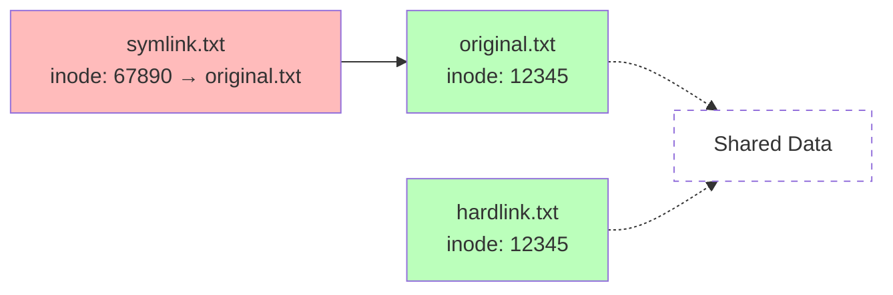

# Day 03: Linux Folder Structure & File Types

## Learning Objectives
By the end of Day 3, you will:
- Understand the Linux filesystem hierarchy (FHS)
- Navigate the filesystem using absolute and relative paths
- Identify different file types in Linux
- Create and manage symbolic and hard links
- Understand the purpose of key directories

**Estimated Time:** 30 mins

## What is the Linux Filesystem Hierarchy?

Linux organizes everything under a single tree starting at root / — no drive letters like Windows. The Filesystem Hierarchy Standard (FHS) standardizes it for consistency across distros (Ubuntu, RHEL, etc.). It's a logical blueprint: system files low, user files high.

When you log in, the shell prompt (e.g., `root@ubuntu:/#` or `ubuntu@ip-172-31-xx-xx:~$`) tells your story:
- **User:** First part (root/ubuntu) — root is admin (full access); regular users (e.g., ubuntu on EC2) have limited perms for security. Multiple users share the machine.
- **Hostname:** Middle (ubuntu/ip-172-... ) — system ID; irrelevant for single machines but key for fleets.
- **Path:** Last (`/` or `~`) — current dir. `/` is root (file system top); `~` is home (/home/username or /root for root—exception!).
- **Why?** Shows who/where you are — `echo $USER` (user), `hostname`, `pwd` (path). In Docker: root@container:/; EC2: ubuntu@host:/home/ubuntu (safer default).

- **Key Directories (Categorized):**
  

- **/bin:** Essential user binaries (ls, cp, mv), non-admin, accessible to all.
- **/sbin:** System binaries (administrative commands), admin-only for managing users/groups.
- **/lib, /lib64:** Essential libraries for kernel/system calls.
- **/boot:** Boot loader files (kernel, initrd), used on restarts.
- **/dev:** Device files.
- **/etc:** System configuration files.
- **/proc:** Virtual filesystem for process and kernel info.
- **/sys:** Virtual filesystem for system info.
- **/run:** Runtime variable data.

#### User Data & Home
- **/home:** User home directories (/home/linuxthefinalboss)—personal; /root for root (exception).
- **/root:** Home directory for root user.

#### Variable & Temporary Data
- **/var:** Variable data (logs, mail, spool)—logs (/var/log for Apache/HTTPD), libs (/var/lib), cache (/var/cache).
- **/tmp:** Temporary files (writable by all users)—auto-cleaned (like recently deleted photos).

#### Additional Software & User Programs
- **/usr:** User programs, libraries, documentation (/usr/bin apps like curl, /usr/lib libs, /usr/local local installs)—/bin shortcut to /usr/bin.
- **/usr/bin, /usr/sbin:** Non-essential user/system binaries.
- **/usr/local:** Locally installed software.
- **/opt:** Optional/additional software (e.g., Java versions) — common for org tools.

#### Mount Points
- **/mnt:** Temporary mount point for filesystems (manual, e.g., NFS).
- **/media:** Removable media (USB, CD-ROM)—auto.
- **/srv:** Data for services (web, ftp)—for sharing.


## File Types in Linux:
Linux treats everything as files even devices (/dev/null swallows output). Identify with ls -l (first char) or the file command.

### Common Types -
  - Regular files: Text, binary, scripts, etc.
  - Directories: Folders containing files
  - **Symbolic links (symlinks):** Pointers to other files or directories. Created with `ln -s`. Can span filesystems. If the target is deleted, the symlink is broken (dangling link).
  - **Hard links:** Additional directory entries for a file. Created with `ln`. Share the same inode as the original file. Cannot span filesystems or link to directories. File is only deleted when all hard links are removed.
  - Device files:
    1. Block (b): Storage (e.g., /dev/sda—disks).
    2. Character (c): Streams (e.g., /dev/tty—keyboard).
  - Named pipes (FIFOs): For inter-process communication
  - Sockets: For network communication

## Symbolic vs. Hard Links: The Twin Files
Links let files "point" elsewhere—key for backups and configs.

- **Symbolic (Soft) Links:** Like shortcuts—point to path. Break if target gone. Cross FS. `ln -s target link`.
- **Hard Links:** Extra names for same data (same inode). Delete only when all gone. Same FS. `ln target link`.

| Feature | Symbolic Link | Hard Link |
|---------|---------------|-----------|
| Command | `ln -s target link` | `ln target link` |
| Inode | New (points to path) | Same as original |
| Cross-FS | Yes | No |
| Dangling | Yes (if target deleted) | No (data persists) |
| Dirs | Yes | No |
| Use Case | Config aliases (/etc/nginx/sites-available → enabled) | Version backups (multiple names for one file) |



**Test It:** `echo "Hi" > file; ln -s file sym; ln file hard; ls -li` (sym has new inode).

- **Navigating the Filesystem:**
  - `cd <dir>`: Change directory
  - `ls`: List directory contents
  - `pwd`: Print working directory
  - `tree`: Visualize directory structure (may need to install)
 
- **Commands to Identify File Types:**
  - `ls -l`: Shows file type in first character:
    - `-` Regular file
    - `d` Directory
    - `l` Symbolic link
    - `c` Character device
    - `b` Block device
    - `p` Named pipe (FIFO)
    - `s` Socket
  - `file <filename>`: Describes file content type
  - `stat <filename>`: Detailed file metadata including inode


## Navigating: Paths & Hidden Files
- **Absolute Paths:** Full from / (e.g., /home/linuxthefinalboss/docs.txt).
- **Relative Paths:** From current dir (e.g., ~/docs.txt or ../docs.txt).
- **Hidden:** Dot-prefixed (.bashrc)—`ls -a` reveals; `find . -name ".*"` hunts.

**Commands:** `cd /etc`; `pwd`; `ls -la /home`; `tree -L 2 ~` (install tree if needed).

-----------------------
## Hands-on Exercises & Lab
### Part 1: Root Hierarchy & Purposes
1. **Exercise:** `ls -l /`—list all root directories. For each key one (e.g., /bin, /etc, /home, /var, /usr, /tmp), run `ls <dir>` and describe its purpose/category (e.g., /bin: essential binaries).
2. **Question:** What's in /boot? Why essential for boot (from Day 2)?

### Part 2: Visualize Structure & Hidden Files
1. Install if needed: `sudo apt install tree -y`.
2. **Exercise:** `tree -L 2 /` (root with 2 levels); `tree ~` (home structure). Then `ls -la ~` to find/display all hidden files—list 3 examples (e.g., .bashrc).
3. **Question:** How do hidden files like .ssh help in DevOps (secure keys)?

### Part 3: File Types & Inspection
1. `ls -l /`—spot types (d for dirs, l for links).
2. **Exercise:** Use `file` and `stat` to inspect: `file /bin/ls /etc/passwd /dev/sda` (types); `stat /bin/ls` (details). Explain /etc/passwd vs. /etc/shadow (user info vs. hashed passwords).
3. **Question:** Why device files like /dev/sda as files? (Uniform handling—e.g., dd for backups.)

### Part 4: Links Creation & Differences
1. `echo "Hello World" > original.txt`.
2. **Exercise:** `ln -s original.txt symlink.txt` (sym); `ln original.txt hardlink.txt` (hard); `ls -li *.txt` (compare inodes). Delete original → test `cat symlink.txt` (broken?) vs. `cat hardlink.txt` (works?).
3. **Question:** Practical use cases: Sym for configs (easy swap); hard for backups (space-saving)—when each?

### Part 5: Paths, Navigation, & Hunt
1. `cd /var/log` → `pwd` (absolute).
2. **Exercise:** Relative nav: `cd ..` → `cd log` back; `find ~ -name ".*" -type f` (all hidden files). Use absolute/relative to create a file in /tmp/lab via cd.
3. **Question:** Absolute paths for scripts? (No cd surprises.)

### Part 6: Challenge - Full Workflow
1. **Exercise:** In /tmp: mkdir lab → echo "test" > lab/file.txt → sym/hard links → `du -sh /*` (sizes); inspect /proc (virtual? `cat /proc/version`).
2. **Question:** Troubleshoot broken symlink: How detect/fix? (ls -l spots; recreate.)

### Solutions
1. **Root:** `ls -l /` shows; /bin (essentials: ls, cp, mv—category: binaries); /etc (configs); /home (users); /var (variable: logs, mail); /usr (user programs/libs); /tmp (temp). /boot: kernels for startup.
2. **Viz/Hidden:** tree -L 2 / roots tree; ls -la ~ lists .bashrc, .profile, .ssh—hidden for configs/keys.
3. **Types:** file: /bin/ls (ELF binary), /etc/passwd (ASCII text), /dev/sda (block device); stat shows inode. /etc/passwd: user info (UID, home); /etc/shadow: passwords (secure split).
4. **Links:** sym: ln -s (new inode); hard: ln (same inode). Delete original: sym dangles (cat fails); hard works (data linked). Sym: aliases; hard: multi-version files.
5. **Paths:** Abs: full (/home/file); rel: current (file or ../file)—find hunts hidden. Scripts prefer abs for reliability.
6. **Challenge:** du skips /proc (virtual); broken: ls -l (→ target), find -L (locate), ln -sf (fix/recreate).

## Completion Checklist
- [ ] Navigated root & key dirs
- [ ] Practiced paths & hidden files
- [ ] Identified file types with ls/file
- [ ] Created/managed links
- [ ] Visualized hierarchy with tree

## Troubleshooting
- **Permission Denied:** `sudo` for system dirs; chown for ownership.
- **Broken Symlink:** `ls -l` spots (→ target); recreate or fix path.
- **No tree:** `sudo apt install tree`.
- **Inode Full:** df -i checks; clean /tmp.


## Completion Checklist
- [ ] Can navigate filesystem using cd, ls, pwd
- [ ] Understand purpose of major directories (/bin, /etc, /home, /var, /usr)
- [ ] Can identify file types using ls -l and file command
- [ ] Created both symbolic and hard links
- [ ] Understand difference between absolute and relative paths
- [ ] Can find and work with hidden files

## Key Commands Summary
```bash
# Navigation
cd /path/to/directory    # Change directory
ls -la                   # List all files with details
pwd                      # Print working directory
tree                     # Show directory structure

# File types
file filename           # Identify file type
stat filename          # Detailed file information
ls -li                 # Show inodes

# Links
ln -s target linkname  # Create symbolic link
ln target linkname     # Create hard link
readlink linkname      # Show link target
```

## Next Steps
Proceed to [Day 4: Linux Boot Process & Service Management](../Day_04/notes_and_exercises.md) to learn how Linux starts up and manages services.

----------


## Troubleshooting (Optional)
Common filesystem hiccups — diagnose and fix like an SRE. Always start with `ls -l` or `pwd` to orient.

### Permission Denied
- **When:** Trying to edit /etc (root-owned) or access /root as user.
- **Why:** Linux's multi-user security—files have owner/group (uid/gid) and perms (rwx for user/group/other).
- **Fix Steps:**
  1. Quick: `sudo <command>` (e.g., `sudo nano /etc/hosts`—elevates to root).
  2. Change owner: `sudo chown linuxthefinalboss:linuxthefinalboss /path/file` (user:group).
  3. Adjust perms: `sudo chmod 644 /path/file` (rw-r--r--: owner read/write, others read).
- **Pro Tip:** `ls -l` shows perms (e.g., -rw-r--r--); `id` your user. In DevOps, use sudoers for non-root automation.

### Broken Symlink
- **When:** `cat link.txt` says "No such file"—link points to missing target.
- **Why:** Target deleted/moved; symlinks are just paths, not data copies.
- **Fix Steps:**
  1. Detect: `ls -l link.txt` (shows lrwxrwxrwx → old/target); `readlink link.txt` (target path).
  2. Check: `ls -l <target>` (exists?).
  3. Fix: `ln -sf newtarget link.txt` (-f forces overwrite); or `rm link.txt; ln -s new link.txt`.
- **Pro Tip:** `find / -type l -exec test ! -e {} \; -print` hunts all broken links. Use in scripts to clean configs.

### No tree Command
- **When:** `tree` not found—common on minimal installs.
- **Why:** Not pre-installed; optional viz tool.
- **Fix Steps:**
  1. Install: `sudo apt update && sudo apt install tree -y` (Debian/Ubuntu).
  2. Alt: `apt search tree` for options; or use `find . -type d | sort`.
- **Pro Tip:** Tree great for docs—`tree -I 'node_modules' > structure.txt` excludes junk.

### Inode Full (or Disk Space Issues)
- **When:** `touch file` fails with "No space left"—but `df -h` shows space.
- **Why:** Inodes (file metadata slots) exhausted; ext4 limits ~4B inodes.
- **Fix Steps:**
  1. Check: `df -i /` (inode % used); `df -h /` (blocks).
  2. Clean: `sudo find /tmp -type f -delete` (temp files); `sudo journalctl --vacuum-time=1d` (logs).
  3. Prevent: Use larger FS on resize (`resize2fs`); monitor with `ncdu /`.
- **Pro Tip:** Rare in /home but hits /var/log—rotate logs (`logrotate`) for SRE hygiene.

**General Debug Flow:** `strace <command>` traces syscalls; `echo $?` checks exit codes.
