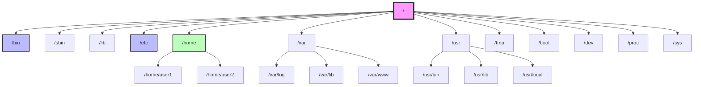
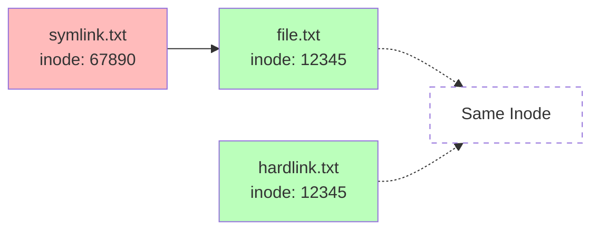

# Day 03: Linux Folder Structure & File Types

## Learning Objectives
By the end of Day 3, you will:
- Understand the Linux filesystem hierarchy (FHS)
- Navigate the filesystem using absolute and relative paths
- Identify different file types in Linux
- Create and manage symbolic and hard links
- Understand the purpose of key directories

**Estimated Time:** 2-3 hours

## Notes
- **Linux Filesystem Hierarchy**
  - The Linux filesystem is hierarchical, starting from the root directory `/`.
  - Each directory has a specific purpose and is standardized by the Filesystem Hierarchy Standard (FHS).


- **Key Directories (Categorized):**
  - **Essential System Directories:**
    - `/bin`: Essential user binaries (ls, cp, mv)
    - `/sbin`: System binaries (administrative commands)
    - `/lib`, `/lib64`: Essential shared libraries
    - `/boot`: Boot loader files (kernel, initrd)
    - `/dev`: Device files
    - `/etc`: System configuration files
    - `/proc`: Virtual filesystem for process and kernel info
    - `/sys`: Virtual filesystem for system info
    - `/run`: Runtime variable data
  - **User Data & Home:**
    - `/home`: User home directories
    - `/root`: Home directory for root user
  - **Variable & Temporary Data:**
    - `/var`: Variable data (logs, mail, spool)
    - `/tmp`: Temporary files (writable by all users)
  - **Additional Software & User Programs:**
    - `/usr`: User programs, libraries, documentation
    - `/usr/bin`, `/usr/sbin`: Non-essential user/system binaries
    - `/usr/local`: Locally installed software
    - `/opt`: Optional/additional software
  - **Mount Points:**
    - `/mnt`: Temporary mount point for filesystems
    - `/media`: Removable media (USB, CD-ROM)
    - `/srv`: Data for services (web, ftp)



- **File Types in Linux:**
  - Regular files: Text, binary, scripts, etc.
  - Directories: Folders containing files
  - **Symbolic links (symlinks):** Pointers to other files or directories. Created with `ln -s`. Can span filesystems. If the target is deleted, the symlink is broken (dangling link).
  - **Hard links:** Additional directory entries for a file. Created with `ln`. Share the same inode as the original file. Cannot span filesystems or link to directories. File is only deleted when all hard links are removed.
  - Device files: Represent hardware (block/character devices)
  - Named pipes (FIFOs): For inter-process communication
  - Sockets: For network communication

  | Feature         | Symbolic Link (symlink) | Hard Link           |
  |-----------------|------------------------|---------------------|
  | Command         | ln -s target linkname  | ln target linkname  |
  | Inode           | New inode              | Same as original    |
  | Cross-filesystem| Yes                    | No                  |
  | Directories     | Yes (with -s)          | No                  |
  | If target gone  | Dangling (broken)      | File remains        |



- **Commands to Identify File Types:**
  - `ls -l`: Shows file type in first character:
    - `-` Regular file
    - `d` Directory
    - `l` Symbolic link
    - `c` Character device
    - `b` Block device
    - `p` Named pipe (FIFO)
    - `s` Socket
  - `file <filename>`: Describes file content type
  - `stat <filename>`: Detailed file metadata including inode

- **Navigating the Filesystem:**
  - `cd <dir>`: Change directory
  - `ls`: List directory contents
  - `pwd`: Print working directory
  - `tree`: Visualize directory structure (may need to install)

- **Absolute vs Relative Paths:**
  - Absolute: Starts from `/` (e.g., `/home/user/file.txt`)
  - Relative: Based on current directory (e.g., `../file.txt`)

- **Hidden Files:**
  - Files starting with `.` are hidden (e.g., `.bashrc`). Use `ls -a` to view.

- **Best Practices:**
  - Use symbolic links for flexibility (e.g., config files, shared resources), but avoid circular links.
  - Use hard links for backup/versioning within the same filesystem.
  - Do not modify files in `/bin`, `/sbin`, `/lib`, `/usr` unless necessary.
  - Store personal files in `/home/<username>`.

## Sample Exercises
1. List all directories in the root (`/`) and describe their purpose and category.
2. Use `tree` to visualize your home directory structure.
3. Find and display all hidden files in your home directory.
4. Explain the difference between `/etc/passwd` and `/etc/shadow`.
5. Create a symbolic link and a hard link for a file. Show the difference.
6. Use `file` and `stat` to inspect different file types.
7. Explain the difference between symbolic and hard links, and give practical use cases for each.


## Solutions
1. **Root directory contents:**
   ```bash
   ls -l /
   ```
   - `/bin` - Essential binaries (ls, cp, mv)
   - `/etc` - Configuration files
   - `/home` - User directories
   - `/var` - Variable data (logs, mail)
   - `/usr` - User programs and libraries
   - `/tmp` - Temporary files

2. **Visualize directory structure:**
   ```bash
   tree ~          # Home directory
   tree -L 2 /     # Root with 2 levels
   ```

3. **Find hidden files:**
   ```bash
   ls -la ~                    # List all including hidden
   find ~ -name ".*" -type f   # Find hidden files
   ```

4. **System files comparison:**
   - `/etc/passwd` - User account information (username, UID, home directory)
   - `/etc/shadow` - Encrypted passwords and password policies

5. **Links demonstration:**
   ```bash
   echo "Hello World" > original.txt
   ln -s original.txt symlink.txt     # Symbolic link
   ln original.txt hardlink.txt       # Hard link
   ls -li *.txt                       # Compare inodes
   ```

6. **File type inspection:**
   ```bash
   file /bin/ls        # Binary executable
   file /etc/passwd    # ASCII text
   file /dev/sda       # Block device
   stat original.txt   # Detailed file info
   ```

7. **Link differences:**
   - **Symbolic links:** Point to file path, can cross filesystems, break if target deleted
   - **Hard links:** Point to same inode, same filesystem only, file persists until all links removed

## Completion Checklist
- [ ] Can navigate filesystem using cd, ls, pwd
- [ ] Understand purpose of major directories (/bin, /etc, /home, /var, /usr)
- [ ] Can identify file types using ls -l and file command
- [ ] Created both symbolic and hard links
- [ ] Understand difference between absolute and relative paths
- [ ] Can find and work with hidden files

## Key Commands Summary
```bash
# Navigation
cd /path/to/directory    # Change directory
ls -la                   # List all files with details
pwd                      # Print working directory
tree                     # Show directory structure

# File types
file filename           # Identify file type
stat filename          # Detailed file information
ls -li                 # Show inodes

# Links
ln -s target linkname  # Create symbolic link
ln target linkname     # Create hard link
readlink linkname      # Show link target
```

## Sample Interview Questions
1. Explain the Linux filesystem hierarchy and the purpose of key directories.
2. What is the difference between /bin and /usr/bin?
3. What are the different file types in Linux? How can you identify them?
4. Explain the difference between a symbolic link and a hard link. When would you use each?
5. How do you find all hidden files in a directory?
6. What is the purpose of the /proc and /sys directories?
7. How do you check the inode number of a file? Why is it important?
8. What are device files and where are they located?
9. What is the difference between absolute and relative paths?
10. How would you troubleshoot a broken symlink?

## Interview Question Answers
1. **Filesystem Hierarchy:** Starts at `/` with standardized directories: `/bin` (binaries), `/etc` (configs), `/home` (users), `/var` (variable data)
2. **bin vs usr/bin:** `/bin` contains essential system binaries; `/usr/bin` has user applications and non-essential binaries
3. **File Types:** Regular files (-), directories (d), symlinks (l), device files (c/b), pipes (p), sockets (s). Use `ls -l` or `file` command
4. **Links:** Symlinks point to file paths, can cross filesystems; hard links share same inode, same filesystem only
5. **Hidden Files:** Use `ls -a` or `find . -name ".*"` to show files starting with dot
6. **Virtual Filesystems:** `/proc` shows process/kernel info; `/sys` exposes kernel and hardware information
7. **Inodes:** Use `ls -i` or `stat`; inodes store file metadata and are crucial for hard links and file system operations
8. **Device Files:** Located in `/dev`, represent hardware devices (e.g., `/dev/sda` for disks, `/dev/tty` for terminals)
9. **Paths:** Absolute paths start with `/` (full path); relative paths are based on current directory
10. **Broken Symlinks:** Use `ls -l` to identify (shows target), `find -L` to locate, recreate or fix target path

## Next Steps
Proceed to [Day 4: Linux Boot Process & Service Management](../Day_04/notes_and_exercises.md) to learn how Linux starts up and manages services.
