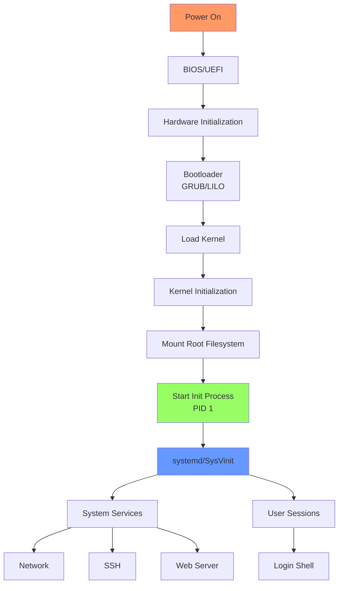

# Day 04: Linux Boot Process & Service Management

## Learning Objectives
By the end of Day 4, you will:
- Understand the complete Linux boot process
- Manage services using systemctl
- View and analyze boot logs
- Configure services to start at boot
- Troubleshoot boot and service issues

**Estimated Time:** 2-3 hours

## Notes
- **What is the Linux Boot Process?**
  - The boot process is the sequence of steps the system takes to start up and become ready for use.
  - Understanding the boot process is crucial for troubleshooting startup issues and managing services.

- **Boot Process Steps:**
  1. **BIOS/UEFI:** Initializes hardware and loads the bootloader from disk.
  2. **Bootloader (GRUB/LILO):** Loads the Linux kernel into memory.
  3. **Kernel:** Initializes hardware, mounts root filesystem, starts the first process (init/systemd).
  4. **Init System (systemd, SysVinit, Upstart):** Launches system services and user sessions.




- **Bootloader Details:**
  - GRUB (GRand Unified Bootloader) is the most common bootloader.
  - Allows selection of OS/kernel version at boot.
  - Configured via `/boot/grub/grub.cfg` or `/etc/default/grub`.

- **Init Systems:**
  - **systemd:** Modern, parallel service startup, used by most distros (Ubuntu, CentOS 7+, Debian, etc.).
  - **SysVinit:** Older, sequential startup using scripts in `/etc/init.d/`.
  - **Upstart:** Transitional system (Ubuntu 9.10–14.10).

- **Service Management with systemd:**
  ```bash
  # Service control
  systemctl status <service>     # Show service status
  systemctl start <service>      # Start a service
  systemctl stop <service>       # Stop a service
  systemctl restart <service>    # Restart a service
  systemctl reload <service>     # Reload config without restart
  
  # Boot management
  systemctl enable <service>     # Enable service at boot
  systemctl disable <service>    # Disable service at boot
  systemctl is-enabled <service> # Check if enabled
  
  # Information
  systemctl list-units --type=service        # List all services
  systemctl list-units --state=failed        # List failed services
  systemctl list-unit-files --type=service   # List all service files
  
  # Logs
  journalctl -u <service>        # View logs for service
  journalctl -u <service> -f     # Follow logs in real-time
  journalctl -b                  # Boot logs
  ```

- **Checking Boot Logs:**
  ```bash
  # Kernel messages
  dmesg                    # Kernel ring buffer
  dmesg | grep -i error    # Filter for errors
  dmesg -T                 # Human-readable timestamps
  
  # System logs
  journalctl -b            # Current boot logs
  journalctl -b -1         # Previous boot logs
  journalctl --list-boots  # List all boots
  journalctl -p err        # Error priority and above
  journalctl --since "1 hour ago"  # Recent logs
  ```

- **Best Practices:**
  - Only enable necessary services at boot
  - Regularly check service status and logs
  - Secure the bootloader with a password if needed
  - Keep kernel and initramfs updated

## Sample Exercises
1. List and describe each step of the Linux boot process.
2. Check the status of the `ssh` (or `sshd`) service and restart it.
3. Enable a service to start at boot and then disable it.
4. View the kernel boot messages and identify any errors.
5. List all running services and their status.

## Solutions
1. **Boot Process Steps:**
   - **BIOS/UEFI:** Hardware initialization, POST, bootloader location
   - **Bootloader (GRUB):** Loads kernel and initramfs into memory
   - **Kernel:** Hardware detection, driver loading, root filesystem mount
   - **Init (systemd):** Service startup, target achievement, user space

2. **SSH Service Management:**
   ```bash
   systemctl status ssh      # or sshd on RHEL/CentOS
   systemctl restart ssh
   systemctl status ssh      # Verify restart
   ```

3. **Service Boot Configuration:**
   ```bash
   systemctl enable nginx    # Enable at boot
   systemctl is-enabled nginx # Check status
   systemctl disable nginx   # Disable at boot
   ```

4. **Boot Message Analysis:**
   ```bash
   dmesg | grep -i "error\|fail\|warn"
   journalctl -b -p err
   ```

5. **Service Listing:**
   ```bash
   systemctl list-units --type=service --state=running
   systemctl list-units --type=service --state=failed
   ```

## Completion Checklist
- [ ] Understand the 4 main boot process stages
- [ ] Can manage services with systemctl commands
- [ ] Know how to enable/disable services at boot
- [ ] Can view and analyze boot logs
- [ ] Understand systemd vs SysVinit differences
- [ ] Can troubleshoot basic service issues

## Key Commands Summary
```bash
# Service management
systemctl status|start|stop|restart <service>
systemctl enable|disable <service>
systemctl list-units --type=service

# Logs and diagnostics
journalctl -u <service>
dmesg
systemd-analyze

# Boot analysis
journalctl -b
systemd-analyze blame
```

## Troubleshooting Tips
- **Service won't start:** Check `systemctl status` and `journalctl -u service`
- **Boot issues:** Use rescue mode, check `journalctl -b`
- **Slow boot:** Use `systemd-analyze blame` to identify bottlenecks
- **Failed services:** `systemctl list-units --state=failed`

## Sample Interview Questions
1. Explain the complete Linux boot process, step by step.
2. What is the difference between BIOS and UEFI?
3. What is the role of the bootloader, and how can you troubleshoot bootloader issues?
4. Compare systemd, SysVinit, and Upstart. Why is systemd preferred in modern distributions?
5. How do you check if a service is enabled to start at boot? How do you enable/disable it?
6. What is the difference between `systemctl stop` and `systemctl disable`?
7. How can you view logs for a specific service?
8. What would you do if a critical service fails to start during boot?
9. How can you secure the bootloader?
10. What is the purpose of the `dmesg` command?

## Interview Question Answers
1. **Boot Process:** BIOS/UEFI → Bootloader (GRUB) → Kernel loading → Init system (systemd) → User space services
2. **BIOS vs UEFI:** BIOS is legacy firmware with 16-bit mode; UEFI is modern with 32/64-bit, faster boot, secure boot, and GUI
3. **Bootloader:** GRUB loads kernel and initramfs; troubleshoot with rescue mode, check `/boot/grub/grub.cfg`, use `grub-install`
4. **Init Systems:** systemd is parallel, faster, dependency-based; SysVinit is sequential, script-based; Upstart was transitional
5. **Service Boot Management:** `systemctl is-enabled service`, `systemctl enable/disable service`
6. **Stop vs Disable:** `stop` halts running service; `disable` prevents auto-start at boot
7. **Service Logs:** `journalctl -u service`, `systemctl status service` shows recent logs
8. **Failed Service:** Check `systemctl status`, `journalctl -u service`, use rescue mode, check dependencies
9. **Secure Bootloader:** Set GRUB password, enable secure boot, restrict physical access
10. **dmesg Purpose:** Shows kernel ring buffer messages, hardware detection, driver loading, boot errors


## Next Steps
Proceed to [Day 5: Basic Linux Commands for DevOps Engineers](../Day_05/notes_and_exercises.md) to learn essential command-line tools.
