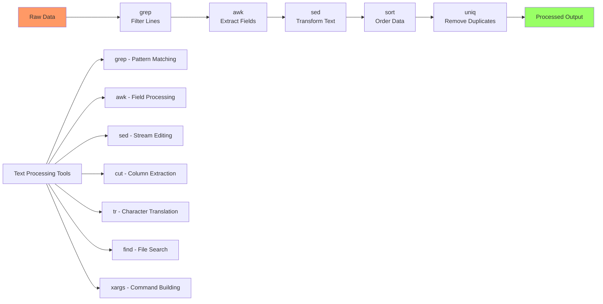

# Day 06: Advanced Linux Commands (grep, awk, sed, find, xargs, etc.)

## Learning Objectives
By the end of Day 6, you will:
- Master advanced text processing with grep, awk, and sed
- Use find and xargs for file operations
- Combine commands with pipes for powerful one-liners
- Process and manipulate text data efficiently
- Apply these tools in real DevOps scenarios

**Estimated Time:** 4-5 hours

## Notes
- **Why Learn Advanced Linux Commands?**
  - These commands are essential for text processing, automation, and efficient system administration.
  - Mastery of these tools is expected in DevOps, SRE, and system engineering interviews.



- **grep (Global Regular Expression Print):**
  ```bash
  # Basic usage
  grep 'pattern' file.txt              # Search for pattern
  grep -i 'pattern' file.txt           # Case insensitive
  grep -r 'pattern' /path/             # Recursive search
  grep -v 'pattern' file.txt           # Invert match (exclude)
  grep -n 'pattern' file.txt           # Show line numbers
  grep -c 'pattern' file.txt           # Count matches
  
  # Context and advanced
  grep -A 3 -B 2 'pattern' file.txt    # 3 lines after, 2 before
  grep -E 'pattern1|pattern2' file.txt # Extended regex (OR)
  grep '^start' file.txt               # Lines starting with 'start'
  grep 'end$' file.txt                 # Lines ending with 'end'
  ```

- **awk:**
  ```bash
  # Column processing
  awk '{print $1}' file.txt                    # Print first column
  awk '{print $1, $3}' file.txt               # Print columns 1 and 3
  awk -F: '{print $1, $3}' /etc/passwd        # Custom delimiter
  awk '{print NF}' file.txt                   # Number of fields per line
  
  # Filtering and calculations
  awk '$3 > 1000 {print $1}' /etc/passwd      # Users with UID > 1000
  awk '{sum += $1} END {print sum}' numbers.txt # Sum first column
  awk 'length($0) > 80' file.txt              # Lines longer than 80 chars
  awk '/pattern/ {print $2}' file.txt         # Print column 2 of matching lines
  ```

- **sed (Stream Editor):**
  ```bash
  # Text replacement
  sed 's/old/new/' file.txt               # Replace first occurrence per line
  sed 's/old/new/g' file.txt              # Replace all occurrences
  sed 's/old/new/gi' file.txt             # Case insensitive replacement
  sed -i 's/old/new/g' file.txt           # Edit file in place
  
  # Line operations
  sed -n '5,10p' file.txt                 # Print lines 5-10
  sed '3d' file.txt                       # Delete line 3
  sed '/pattern/d' file.txt               # Delete lines matching pattern
  sed '2i\New line' file.txt              # Insert line before line 2
  ```

- **find:**
  ```bash
  # Basic searches
  find /path -name '*.log'                    # Find by name pattern
  find /path -type f -name '*.txt'            # Find files only
  find /path -type d -name 'cache'            # Find directories only
  
  # Size and time
  find /path -size +100M                      # Files larger than 100MB
  find /path -size -1k                       # Files smaller than 1KB
  find /path -mtime -1                        # Modified in last 24 hours
  find /path -atime +30                       # Accessed more than 30 days ago
  
  # Execute actions
  find /path -name '*.log' -exec rm {} \;     # Delete found files
  find /path -name '*.txt' -exec grep 'pattern' {} +  # Search in found files
  ```

- **xargs:**
  ```bash
  # Basic usage
  find . -name '*.log' | xargs rm             # Delete found files
  echo 'dir1 dir2 dir3' | xargs mkdir        # Create multiple directories
  cat filelist.txt | xargs cp -t /backup/    # Copy files to backup
  
  # Advanced options
  find . -name '*.txt' | xargs -I {} cp {} /backup/  # Use placeholder
  find . -name '*.log' | xargs -n 1 wc -l    # Process one file at a time
  find . -name '*.tmp' | xargs -r rm         # Only run if input exists
  ```

- **cut, sort, uniq, tr:**
  ```bash
  # cut - extract columns
  cut -d: -f1 /etc/passwd                     # Extract first field
  cut -c1-10 file.txt                        # Extract characters 1-10
  
  # sort - sort lines
  sort file.txt                               # Sort alphabetically
  sort -n numbers.txt                         # Sort numerically
  sort -r file.txt                            # Reverse sort
  sort -k2 file.txt                           # Sort by second column
  
  # uniq - remove duplicates
  sort file.txt | uniq                        # Remove adjacent duplicates
  sort file.txt | uniq -c                     # Count occurrences
  sort file.txt | uniq -d                     # Show only duplicates
  
  # tr - translate characters
  tr 'a-z' 'A-Z' < file.txt                  # Convert to uppercase
  tr -d '0-9' < file.txt                      # Delete digits
  tr -s ' ' < file.txt                        # Squeeze multiple spaces
  ```

## Solutions
1. **Search for "error" in log files:**
   ```bash
   grep -i "error" /var/log/*.log
   find /var/log -name "*.log" -exec grep -i "error" {} +
   ```

2. **Extract username and shell from /etc/passwd:**
   ```bash
   awk -F: '{print $1, $7}' /etc/passwd
   cut -d: -f1,7 /etc/passwd
   ```

3. **Replace "foo" with "bar":**
   ```bash
   sed 's/foo/bar/g' file.txt > newfile.txt
   sed -i 's/foo/bar/g' file.txt              # In-place edit
   ```

4. **Find large files:**
   ```bash
   find ~ -type f -size +100M
   find ~ -type f -size +100M -exec ls -lh {} +
   ```

5. **Count unique lines:**
   ```bash
   sort file.txt | uniq | wc -l
   sort file.txt | uniq -c | wc -l
   ```

6. **Extract IP addresses:**
   ```bash
   grep -oE '([0-9]{1,3}\.){3}[0-9]{1,3}' logfile.txt
   awk '/[0-9]+\.[0-9]+\.[0-9]+\.[0-9]+/ {print $1}' access.log
   ```

7. **Find and delete empty files:**
   ```bash
   find /path -type f -empty -delete
   find /path -type f -size 0 | xargs rm
   ```

## Completion Checklist
- [ ] Can use grep with various options for text searching
- [ ] Understand awk for column processing and calculations
- [ ] Use sed for text replacement and line operations
- [ ] Master find for file searching with multiple criteria
- [ ] Combine commands with pipes and xargs
- [ ] Can create complex one-liners for data processing

## Key Command Combinations
```bash
# Log analysis
grep "ERROR" /var/log/app.log | awk '{print $1, $4}' | sort | uniq -c

# File cleanup
find /tmp -name "*.tmp" -mtime +7 | xargs rm

# Data processing
cat data.csv | cut -d, -f2 | sort -n | tail -10

# System analysis
ps aux | awk '{print $1}' | sort | uniq -c | sort -nr
```

## Best Practices
- Test commands on sample data first
- Use `--help` or `man` pages to learn options
- Combine simple commands for complex tasks
- Use `-i` flags carefully (they modify files in place)
- Always backup important files before bulk operations

## Sample Interview Questions
1. What is the difference between `grep` and `egrep`?
2. How do you use `awk` to process columns in a text file?
3. Give an example of using `sed` to replace text in a file.
4. How do you find all files modified in the last 24 hours?
5. What is the use of `xargs`? Give a practical example.
6. How do you combine `find` and `grep` to search for content in files?
7. What is the difference between `cut` and `awk`?
8. How do you sort and remove duplicate lines from a file?
9. How do you use `tr` for string manipulation?
10. How do you use pipes to chain multiple commands?

## Interview Question Answers
1. **grep vs egrep:** `grep` uses basic regex; `egrep` (or `grep -E`) uses extended regex with more operators like `+`, `?`, `|`
2. **awk Columns:** `awk '{print $2}' file` prints second column; use `-F:` to set field separator
3. **sed Replace:** `sed 's/old/new/g' file` replaces all occurrences of 'old' with 'new'
4. **Recent Files:** `find /path -mtime -1` finds files modified in last 24 hours
5. **xargs Usage:** Builds command lines from input; `find . -name '*.log' | xargs rm` deletes all .log files
6. **find + grep:** `find /path -type f -exec grep 'pattern' {} +` searches content in found files
7. **cut vs awk:** `cut` extracts fixed columns by delimiter; `awk` is programmable with pattern matching and calculations
8. **Sort + Unique:** `sort file | uniq` removes duplicate adjacent lines; `sort -u file` combines both operations
9. **tr Usage:** `tr 'a-z' 'A-Z'` converts lowercase to uppercase; `tr -d '0-9'` deletes digits
10. **Pipes:** `|` passes output of one command as input to next; enables complex data processing chains

## Next Steps
Proceed to [Day 7: Users, Groups & Permissions](../Day_07/notes_and_exercises.md) to learn user management and security.

## Sample Exercises
1. Search for the word "error" in all `.log` files in `/var/log` (case-insensitive).
2. Print the username and shell from `/etc/passwd` using `awk`.
3. Replace all occurrences of "foo" with "bar" in a file using `sed`.
4. Find all files larger than 100MB in your home directory.
5. Count the number of unique lines in a file.
6. Extract all IP addresses from a log file.
7. Find and delete all empty files in a directory tree.

## Sample Interview Questions
1. What is the difference between `grep` and `egrep`?
2. How do you use `awk` to process columns in a text file?
3. Give an example of using `sed` to replace text in a file.
4. How do you find all files modified in the last 24 hours?
5. What is the use of `xargs`? Give a practical example.
6. How do you combine `find` and `grep` to search for content in files?
7. What is the difference between `cut` and `awk`?
8. How do you sort and remove duplicate lines from a file?
9. How do you use `tr` for string manipulation?
10. How do you use pipes to chain multiple commands?

## Interview Question Answers
1. `grep` uses basic regex by default; `egrep` (or `grep -E`) uses extended regex, allowing more complex patterns.
2. Use `awk '{print $2}' file.txt` to print the second column; you can specify field separators with `-F`.
3. `sed 's/old/new/g' file.txt` replaces all occurrences of 'old' with 'new' in a file.
4. `find . -mtime -1` finds files modified in the last 24 hours.
5. `xargs` builds and executes command lines from input; e.g., `find . -name '*.log' | xargs rm` deletes all .log files.
6. `find . -type f -exec grep 'pattern' {} +` searches for content in files found by `find`.
7. `cut` extracts columns by delimiter; `awk` is more powerful for pattern matching and processing.
8. `sort file.txt | uniq` sorts and removes duplicate lines from a file.
9. `tr 'a-z' 'A-Z'` translates lowercase to uppercase; `tr` is used for character-level string manipulation.
10. Pipes (`|`) chain commands, passing output of one as input to the next for complex processing.

