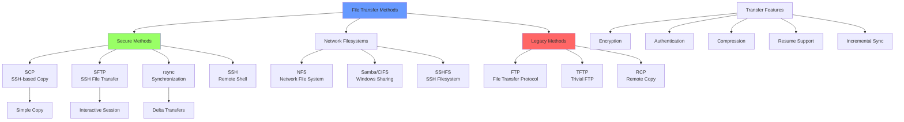

# Day 09: File Transfer (SCP, SFTP, rsync, FTP, NFS, Samba)

## Learning Objectives
By the end of Day 9, you will:
- Master secure file transfer protocols (SCP, SFTP, rsync)
- Understand network file systems (NFS, Samba)
- Configure and troubleshoot file sharing services
- Apply security best practices for file transfers
- Automate file synchronization tasks

**Estimated Time:** 4-5 hours

## Notes
- **Why File Transfer & Remote Access Matter:**
  - Essential for system administration, automation, backups, and collaboration.
  - Secure and efficient file transfer is a core DevOps/SRE skill.



- **SSH (Secure Shell):**
  - Secure remote login and command execution.
  - `ssh user@host` — Connect to remote host
  - `ssh -i key.pem user@host` — Use private key
  - `ssh -p 2222 user@host` — Custom port
  - `ssh -L local_port:remote_host:remote_port user@host` — Port forwarding
  - `ssh-copy-id user@host` — Copy public key for passwordless login

- **SCP (Secure Copy):**
  - Copy files securely between hosts.
  - `scp file.txt user@host:/path/` — Upload file
  - `scp user@host:/path/file.txt .` — Download file
  - `scp -r dir/ user@host:/path/` — Recursive copy
  - `scp -P 2222 ...` — Custom port

- **SFTP (SSH File Transfer Protocol):**
  - Interactive file transfer over SSH.
  - `sftp user@host` — Start SFTP session
  - Commands: `put`, `get`, `ls`, `cd`, `mget`, `mput`, `exit`

- **rsync:**
  - Fast, incremental file transfer and synchronization.
  - `rsync -avz source/ user@host:/dest/` — Archive, verbose, compress
  - `rsync -e ssh ...` — Use SSH for transfer
  - `rsync --delete ...` — Delete files not in source
  - `rsync -n ...` — Dry run

- **NFS (Network File System):**
  - Share directories over network (Linux/Unix)
  - `/etc/exports` — NFS server config
  - `mount -t nfs server:/share /mnt` — Mount NFS share
  - `showmount -e server` — List exports

- **Samba (SMB/CIFS):**
  - Share files between Linux and Windows
  - `smbclient //server/share -U user` — Access share
  - `mount -t cifs //server/share /mnt -o user=user` — Mount SMB share
  - Config: `/etc/samba/smb.conf`

- **Best Practices:**
  - Use SSH keys, disable password login for security
  - Use `rsync` for large or repeated transfers
  - Limit NFS/Samba access to trusted networks
  - Monitor and audit remote access logs
  - Use strong passwords and encryption


## Sample Exercises
1. Set up SSH key-based authentication between two machines.
2. Transfer a directory recursively to a remote server using `scp`.
3. Synchronize two directories using `rsync` and verify changes.
4. Mount an NFS share on a client machine.
5. Access a Samba share from Linux and Windows.
6. Use SFTP to upload and download files interactively.
7. Perform a dry run with `rsync` before actual transfer.
8. Restrict SSH access to a specific user.

## Sample Interview Questions
1. What is the difference between SCP and SFTP?
2. How do you set up passwordless SSH login?
3. How does `rsync` differ from `scp`?
4. What are the security risks of NFS and how do you mitigate them?
5. How do you mount a Samba share on Linux?
6. How do you restrict SSH access to certain users or IPs?
7. What is the purpose of `ssh-copy-id`?
8. How do you troubleshoot failed SSH connections?
9. How do you automate file transfers securely?
10. What are the advantages of using `rsync` for backups?

## Solutions
1. **SSH Key Setup:**
   ```bash
   ssh-keygen -t rsa -b 4096        # Generate key pair
   ssh-copy-id user@host            # Copy public key
   ssh user@host                    # Test passwordless login
   ```

2. **SCP Directory Transfer:**
   ```bash
   scp -r /local/dir user@host:/remote/path/
   scp -P 2222 -r dir/ user@host:/path/    # Custom port
   ```

3. **rsync Synchronization:**
   ```bash
   rsync -avz --progress source/ user@host:/dest/
   rsync -n -avz source/ dest/      # Dry run first
   rsync --delete source/ dest/     # Delete extra files
   ```

4. **NFS Mount:**
   ```bash
   # Server: /etc/exports
   /shared/data 192.168.1.0/24(rw,sync,no_root_squash)
   
   # Client:
   sudo mount -t nfs server:/shared/data /mnt/nfs
   ```

5. **Samba Access:**
   ```bash
   # Interactive access
   smbclient //server/share -U username
   
   # Mount share
   sudo mount -t cifs //server/share /mnt/smb -o username=user
   ```

6. **SFTP Session:**
   ```bash
   sftp user@host
   put localfile.txt               # Upload
   get remotefile.txt              # Download
   mput *.txt                      # Upload multiple
   exit                            # Close session
   ```

7. **rsync Dry Run:**
   ```bash
   rsync -n -avz source/ dest/     # Show what would be transferred
   rsync -avz source/ dest/        # Actual transfer
   ```

8. **SSH Access Restriction:**
   ```bash
   # Edit /etc/ssh/sshd_config
   AllowUsers user1 user2
   DenyUsers baduser
   sudo systemctl restart sshd
   ```

## Interview Question Answers
1. **SCP vs SFTP:** SCP is simple, non-interactive file copy; SFTP is interactive with directory browsing and multiple operations
2. **Passwordless SSH:** Generate key with `ssh-keygen`, copy with `ssh-copy-id user@host`
3. **rsync vs scp:** rsync transfers only changes (incremental), supports resume, compression; scp copies entire files
4. **NFS Security:** Use firewalls, export restrictions, root_squash, NFSv4 with Kerberos for encryption
5. **Samba Mount:** `mount -t cifs //server/share /mnt -o username=user,password=pass`
6. **SSH Restrictions:** Edit `/etc/ssh/sshd_config` with AllowUsers, DenyUsers, or use firewall rules
7. **ssh-copy-id:** Copies your public key to remote host's authorized_keys for passwordless authentication
8. **SSH Troubleshooting:** Check logs (`/var/log/auth.log`), use `ssh -v` for verbose output, verify network/firewall
9. **Automated Transfers:** Use rsync with SSH keys, cron jobs, or configuration management tools
10. **rsync Advantages:** Incremental transfers, bandwidth efficient, resume capability, preserve permissions, ideal for backups

## Completion Checklist
- [ ] Can transfer files securely using SCP and SFTP
- [ ] Understand rsync for efficient synchronization
- [ ] Know how to mount and use NFS shares
- [ ] Can access Samba/CIFS shares from Linux
- [ ] Configured SSH key-based authentication
- [ ] Understand security implications of each method

## Key Commands Summary
```bash
# Secure file transfer
scp file user@host:/path         # Copy file
sftp user@host                   # Interactive transfer
rsync -avz source/ dest/         # Synchronize directories

# Network file systems
mount -t nfs server:/share /mnt  # Mount NFS
mount -t cifs //server/share /mnt # Mount Samba

# SSH setup
ssh-keygen                       # Generate key pair
ssh-copy-id user@host           # Copy public key
```

## Security Best Practices
- Use SSH keys instead of passwords
- Restrict SSH access by user/IP
- Use firewalls for NFS/Samba
- Enable encryption where possible
- Monitor file transfer logs
- Use least privilege principle

## Next Steps
Proceed to [Day 10: Environment Variables, Aliases & Shell Customization](../Day_10/notes_and_exercises.md) to customize your shell environment.
