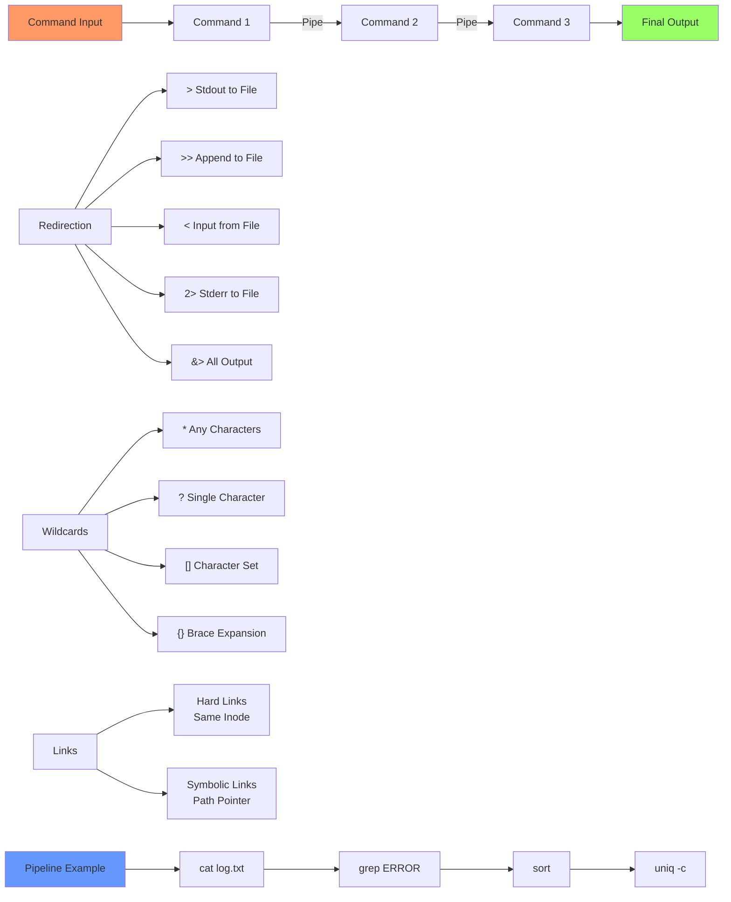

# Day 11: Pipes, Redirects, Wildcards, and Links

## Learning Objectives
By the end of Day 11, you will:
- Master pipes for command chaining
- Understand input/output redirection
- Use wildcards for flexible file operations
- Create and manage hard and symbolic links
- Build powerful command combinations

**Estimated Time:** 3-4 hours

## Notes
- **Why These Tools Matter:**
  - Essential for chaining commands, automating tasks, and flexible file management in Linux.
  - Mastery is expected for DevOps, SRE, and system engineering roles.



- **Pipes (`|`):**
  - Pass output of one command as input to another.
  - Example: `cat file.txt | grep error | sort | uniq`

- **Redirects:**
  - `>`: Redirect output to file (overwrite)
  - `>>`: Redirect output to file (append)
  - `<`: Use file as input
  - `2>`: Redirect stderr
  - `2>&1`: Redirect stderr to stdout
  - Example: `ls > files.txt 2> errors.txt`

- **Wildcards (Globbing):**
  - `*`: Any number of characters
  - `?`: Single character
  - `[abc]`: Any one character in set
  - `[a-z]`: Any character in range
  - Example: `ls *.txt`, `rm file?.log`, `ls [a-c]*`

- **Links:**
  - **Hard Link:** `ln file1 file2` — Same inode, file exists until all links are deleted
  - **Symbolic Link (Symlink):** `ln -s target linkname` — Pointer to another file or directory
  - Use `ls -li` to view inodes and link types

- **Best Practices:**
  - Use pipes to build powerful one-liners
  - Redirect output to log files for troubleshooting
  - Use wildcards carefully to avoid accidental deletion
  - Prefer symlinks for configs/scripts; use hard links for backup/versioning


## Sample Exercises
1. Use pipes to count the number of lines containing "error" in a log file.
2. Redirect both stdout and stderr of a command to a file.
3. List all files starting with "test" and ending with ".sh" in a directory.
4. Create a symbolic link and a hard link for a file, then show the difference.
5. Use wildcards to delete all `.tmp` files in a directory.

- **Advanced Redirection:**
  ```bash
  # File descriptors
  command 1> stdout.txt 2> stderr.txt    # Separate stdout/stderr
  command &> all_output.txt              # Both to same file (bash)
  command > output.txt 2>&1              # Both to same file (POSIX)
  
  # Here documents
  cat << EOF > file.txt
  Line 1
  Line 2
  EOF
  
  # Process substitution
  diff <(sort file1) <(sort file2)       # Compare sorted files
  ```

- **Advanced Wildcards:**
  ```bash
  # Extended globbing (bash)
  shopt -s extglob
  ls !(*.txt)                            # All except .txt files
  ls *.@(jpg|png|gif)                    # Multiple extensions
  
  # Brace expansion
  touch file{1..10}.txt                  # Create file1.txt to file10.txt
  mkdir -p project/{src,docs,tests}      # Create directory structure
  ```

## Sample Exercises
1. Use pipes to count the number of lines containing "error" in a log file.
2. Redirect both stdout and stderr of a command to a file.
3. List all files starting with "test" and ending with ".sh" in a directory.
4. Create a symbolic link and a hard link for a file, then show the difference.
5. Use wildcards to delete all `.tmp` files in a directory.
6. Create a complex pipeline to analyze log files.
7. Use brace expansion to create a directory structure.

## Solutions
1. **Count error lines:**
   ```bash
   grep error logfile.txt | wc -l
   cat logfile.txt | grep -c error        # Alternative
   ```

2. **Redirect stdout and stderr:**
   ```bash
   command > output.txt 2>&1
   command &> output.txt                  # Bash shorthand
   ```

3. **Wildcard matching:**
   ```bash
   ls test*.sh
   ls test?.sh                            # Single character
   ls test[0-9].sh                        # Numeric range
   ```

4. **Create links:**
   ```bash
   echo "Hello World" > original.txt
   ln -s original.txt symlink.txt         # Symbolic link
   ln original.txt hardlink.txt           # Hard link
   ls -li *.txt                           # Compare inodes
   ```

5. **Delete temp files:**
   ```bash
   ls *.tmp                               # Check first!
   rm *.tmp                               # Delete all .tmp files
   ```

6. **Complex pipeline:**
   ```bash
   # Analyze Apache access log
   cat access.log | grep "404" | awk '{print $1}' | sort | uniq -c | sort -nr | head -10
   ```

7. **Directory structure:**
   ```bash
   mkdir -p project/{src/{main,test},docs,config}
   touch project/src/main/app.{py,js,go}
   ```

## Sample Interview Questions
1. What is the difference between a pipe and a redirect?
2. How do you append output to a file instead of overwriting it?
3. What is the difference between a hard link and a symbolic link?
4. How do you use wildcards to match files?
5. How do you redirect both stdout and stderr to the same file?
6. What happens if you delete the original file for a symlink? For a hard link?
7. How do you find all files with a certain extension in a directory and its subdirectories?
8. What are the risks of using wildcards with `rm`?
9. How do you check the inode number of a file?
10. How do you use pipes to combine multiple commands?

## Interview Question Answers
1. **Pipe vs Redirect:** Pipe (`|`) passes output between commands; redirect (`>`, `<`) sends output/input to/from files
2. **Append Output:** Use `>>` to append instead of `>` which overwrites
3. **Links:** Hard links share same inode/data, can't cross filesystems; symlinks point to path, can cross filesystems
4. **Wildcards:** `*` (any chars), `?` (single char), `[]` (char set), `{}` (brace expansion)
5. **Combined Redirect:** `command > file 2>&1` or `command &> file` (bash)
6. **Link Behavior:** Symlink breaks if target deleted; hard link keeps file accessible until all links removed
7. **Recursive Find:** `find . -name '*.ext'` or `ls **/*.ext` (with globstar)
8. **Wildcard Risks:** Can match unintended files; always test with `ls` before using with `rm`
9. **Inode Check:** `ls -li filename` or `stat filename`
10. **Command Chaining:** Pipes create powerful one-liners: `ps aux | grep process | awk '{print $2}' | xargs kill`

## Completion Checklist
- [ ] Can chain commands effectively with pipes
- [ ] Understand all redirection operators
- [ ] Use wildcards safely and effectively
- [ ] Know difference between hard and symbolic links
- [ ] Can build complex command pipelines
- [ ] Understand file descriptors and advanced redirection

## Key Commands Summary
```bash
# Pipes and redirection
command1 | command2              # Pipe output
command > file                   # Redirect stdout
command >> file                  # Append stdout
command 2> file                  # Redirect stderr
command &> file                  # Redirect both

# Wildcards
*.txt                           # All .txt files
file?.log                       # Single character
file[0-9].txt                   # Character range
{1..10}                         # Brace expansion

# Links
ln target hardlink              # Hard link
ln -s target symlink            # Symbolic link
```

## Best Practices
- Test wildcards with `ls` before using with destructive commands
- Use quotes to prevent unwanted expansion
- Prefer symlinks for configuration files and scripts
- Always check link targets before following
- Use meaningful names for links
- Document complex pipelines with comments

## Next Steps
Proceed to [Day 12: Compression, Archiving, and Backups](../Day_12/notes_and_exercises.md) to learn data protection and storage optimization.