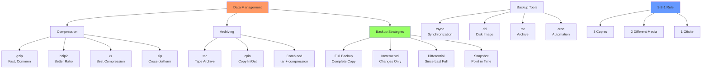

# Day 12: Compression, Archiving, and Backups

## Learning Objectives
By the end of Day 12, you will:
- Master compression and archiving tools
- Implement effective backup strategies
- Automate backup processes
- Verify backup integrity
- Understand different backup types and use cases

**Estimated Time:** 3-4 hours

## Notes
- **Why Compression & Backups Matter:**
  - Save disk space, speed up transfers, and protect data from loss.
  - Essential for system admins, DevOps, and SREs.



- **Compression Tools:**
  - `gzip file` — Compresses to file.gz; `gunzip file.gz` decompresses
  - `bzip2 file` — Compresses to file.bz2; `bunzip2 file.bz2` decompresses
  - `xz file` — Compresses to file.xz; `unxz file.xz` decompresses
  - `zip file.zip file1 file2` — Create zip archive; `unzip file.zip` extracts

- **Archiving Tools:**
  - `tar -cvf archive.tar files/` — Create tar archive
  - `tar -xvf archive.tar` — Extract tar archive
  - `tar -czvf archive.tar.gz files/` — Create compressed tarball
  - `tar -xzvf archive.tar.gz` — Extract compressed tarball

- **Backup Tools:**
  - `rsync -av source/ dest/` — Sync files/directories
  - `cp -a source/ dest/` — Archive copy
  - `dd if=/dev/sda of=/backup.img` — Disk image (use with caution)
  - `cron` — Schedule regular backups

- **Best Practices:**
  - Automate backups with scripts/cron
  - Store backups offsite or in the cloud
  - Test restores regularly
  - Use checksums (`md5sum`, `sha256sum`) to verify integrity


- **Compression Comparison:**
  ```bash
  # Speed vs Compression ratio
  gzip file.txt      # Fast, moderate compression (~60-70%)
  bzip2 file.txt     # Slower, better compression (~70-80%)
  xz file.txt        # Slowest, best compression (~80-90%)
  
  # Parallel compression (faster on multi-core)
  pigz file.txt      # Parallel gzip
  pbzip2 file.txt    # Parallel bzip2
  ```

- **Advanced tar Operations:**
  ```bash
  # Exclude files/directories
  tar -czf backup.tar.gz --exclude='*.log' --exclude='tmp/*' /home/user/
  
  # Incremental backups
  tar -czf full.tar.gz -g snapshot.snar /home/user/
  tar -czf incr.tar.gz -g snapshot.snar /home/user/
  
  # Extract specific files
  tar -xzf backup.tar.gz path/to/specific/file
  
  # List archive contents
  tar -tzf backup.tar.gz | head -20
  ```

- **Backup Strategies:**
  - **Full Backup:** Complete copy of all data
  - **Incremental:** Only files changed since last backup
  - **Differential:** Files changed since last full backup
  - **3-2-1 Rule:** 3 copies, 2 different media, 1 offsite

- **Backup Verification:**
  ```bash
  # Generate checksums
  find /backup -type f -exec sha256sum {} \; > backup_checksums.txt
  
  # Verify checksums
  sha256sum -c backup_checksums.txt
  
  # Test tar archives
  tar -tzf backup.tar.gz > /dev/null && echo "Archive OK" || echo "Archive corrupted"
  ```

## Sample Exercises
1. Compress and decompress a file using gzip and bzip2.
2. Create a tar archive of a directory and extract it.
3. Use rsync to backup your home directory to another location.
4. Schedule a daily backup using cron.
5. Verify the integrity of a backup file using checksums.

## Sample Exercises
1. Compress and decompress a file using gzip and bzip2.
2. Create a tar archive of a directory and extract it.
3. Use rsync to backup your home directory to another location.
4. Schedule a daily backup using cron.
5. Verify the integrity of a backup file using checksums.
6. Create an incremental backup system.
7. Exclude specific file types from a backup.

## Solutions
1. **Compression/Decompression:**
   ```bash
   # gzip
   gzip file.txt                        # Creates file.txt.gz
   gunzip file.txt.gz                   # Restores file.txt
   
   # bzip2
   bzip2 file.txt                       # Creates file.txt.bz2
   bunzip2 file.txt.bz2                 # Restores file.txt
   
   # Keep original
   gzip -k file.txt                     # Keep original file
   ```

2. **Tar operations:**
   ```bash
   # Create archive
   tar -czvf backup.tar.gz mydir/
   
   # Extract archive
   tar -xzvf backup.tar.gz
   
   # List contents
   tar -tzf backup.tar.gz
   ```

3. **rsync backup:**
   ```bash
   rsync -av --progress ~/ /backup/home_backup/
   rsync -av --delete ~/ /backup/home_backup/  # Delete extra files
   ```

4. **Automated backup:**
   ```bash
   # Edit crontab
   crontab -e
   
   # Add daily backup at 2 AM
   0 2 * * * /usr/local/bin/backup_script.sh
   
   # Backup script example
   #!/bin/bash
   DATE=$(date +%Y%m%d_%H%M%S)
   tar -czf /backup/home_$DATE.tar.gz /home/user/
   ```

5. **Integrity verification:**
   ```bash
   # Generate checksum
   sha256sum backup.tar.gz > backup.sha256
   
   # Verify later
   sha256sum -c backup.sha256
   
   # Test archive integrity
   tar -tzf backup.tar.gz > /dev/null
   ```

6. **Incremental backup:**
   ```bash
   # Full backup with snapshot
   tar -czf full_backup.tar.gz -g backup.snar /home/user/
   
   # Incremental backup
   tar -czf incr_backup.tar.gz -g backup.snar /home/user/
   ```

7. **Exclude files:**
   ```bash
   # tar exclusions
   tar -czf backup.tar.gz --exclude='*.log' --exclude='tmp/*' /home/user/
   
   # rsync exclusions
   rsync -av --exclude='*.log' --exclude='tmp/' ~/ /backup/
   ```

## Sample Interview Questions
1. What is the difference between compression and archiving?
2. How do you create and extract a compressed tarball?
3. What are the advantages of using rsync for backups?
4. How do you automate backups in Linux?
5. How do you verify the integrity of a backup?
6. What is the risk of using `dd` for disk backups?
7. How do you exclude files from a tar or rsync backup?
8. What is the difference between gzip, bzip2, and xz?
9. How do you restore a single file from a tar archive?
10. Why is it important to test your backups?

## Interview Question Answers
1. **Compression vs Archiving:** Compression reduces file size; archiving combines multiple files. tar can do both
2. **Tarball Operations:** `tar -czvf archive.tar.gz files/` creates; `tar -xzvf archive.tar.gz` extracts
3. **rsync Advantages:** Incremental transfers, resume capability, preserves permissions, bandwidth efficient
4. **Automated Backups:** Use cron jobs, systemd timers, or backup software with scheduling
5. **Backup Verification:** Use checksums (sha256sum), test extractions, verify file counts and sizes
6. **dd Risks:** Can overwrite wrong disk, no compression, copies bad sectors, requires exact space
7. **File Exclusions:** Use `--exclude` with tar/rsync, or `.rsyncignore` files
8. **Compression Tools:** gzip (fast), bzip2 (better compression), xz (best compression, slowest)
9. **Single File Restore:** `tar -xzf archive.tar.gz path/to/file` extracts specific file
10. **Backup Testing:** Ensures recoverability, validates backup integrity, identifies corruption early

## Completion Checklist
- [ ] Can compress/decompress files with different tools
- [ ] Understand tar archiving and extraction
- [ ] Know how to use rsync for backups
- [ ] Can automate backups with cron
- [ ] Understand backup verification methods
- [ ] Know different backup strategies

## Key Commands Summary
```bash
# Compression
gzip/gunzip file                 # Fast compression
bzip2/bunzip2 file              # Better compression
xz/unxz file                    # Best compression

# Archiving
tar -czf archive.tar.gz dir/    # Create compressed archive
tar -xzf archive.tar.gz         # Extract archive
tar -tzf archive.tar.gz         # List contents

# Backup
rsync -av source/ dest/         # Synchronize directories
dd if=/dev/sda of=backup.img    # Disk image (careful!)
```

## Best Practices
- Follow 3-2-1 backup rule (3 copies, 2 media types, 1 offsite)
- Test backups regularly
- Encrypt sensitive backups
- Document backup and restore procedures
- Monitor backup job success/failure
- Keep backup logs for auditing

## Next Steps
Proceed to [Day 13: Process Management & Scheduling](../Day_13/notes_and_exercises.md) to learn task automation and process control.
