# Day 14: System Monitoring & Log Management

## Learning Objectives
By the end of Day 14, you will:
- Monitor system resources effectively
- Manage and analyze log files
- Set up log rotation and cleanup
- Troubleshoot performance issues
- Understand monitoring best practices

**Estimated Time:** 3-4 hours

## Notes
- **Why Monitoring & Logs Matter:**
  - Proactive monitoring prevents outages and enables fast troubleshooting.
  - Log management is essential for auditing, compliance, and root cause analysis.

```mermaid
flowchart TD
    A[System Monitoring & Logs] --> B[Real-time Monitoring]
    A --> C[Resource Monitoring]
    A --> D[Log Management]
    A --> E[Performance Analysis]
    
    B --> B1[top/htop<br/>Process Viewer]
    B --> B2[watch<br/>Repeat Commands]
    B --> B3[tail -f<br/>Live Logs]
    
    C --> C1[free<br/>Memory Usage]
    C --> C2[df/du<br/>Disk Usage]
    C --> C3[iostat<br/>I/O Stats]
    C --> C4[vmstat<br/>Virtual Memory]
    C --> C5[uptime<br/>Load Average]
    
    D --> D1[journalctl<br/>systemd Logs]
    D --> D2["/var/log/*"<br/>System Logs]
    D --> D3[logrotate<br/>Log Rotation]
    D --> D4[grep/awk<br/>Log Analysis]
    
    E --> E1[sar<br/>System Activity]
    E --> E2[dstat<br/>System Stats]
    E --> E3[netstat/ss<br/>Network Stats]
    E --> E4[lsof<br/>Open Files]
    
    F[Monitoring Strategy] --> F1[Proactive Alerts]
    F --> F2[Historical Trends]
    F --> F3[Capacity Planning]
    F --> F4[Troubleshooting]
    
    style A fill:#f96
    style D fill:#9f6
    style F fill:#69f
```



- **System Monitoring Tools:**
  - `top`, `htop`: Real-time process/resource monitoring
  - `vmstat`: Virtual memory stats
  - `iostat`: CPU and disk I/O stats
  - `free -h`: Memory usage
  - `uptime`: System load
  - `dstat`, `sar`: Advanced stats (may need install)
  - `df -h`, `du -sh`: Disk usage
  - `watch`: Repeatedly run a command

- **Log Management Tools:**
  - `journalctl`: View systemd logs
  - `tail -f /var/log/syslog` or `/var/log/messages`: Live log monitoring
  - `grep`, `awk`, `less`, `more`: Log searching and filtering
  - `logrotate`: Automated log rotation and cleanup

- **Best Practices:**
  - Set up alerts for resource thresholds
  - Rotate and archive logs regularly
  - Monitor key metrics (CPU, memory, disk, network)
  - Use centralized logging for large environments
  - Secure log files (permissions, access control)


- **Advanced Monitoring Commands:**
  ```bash
  # System overview
  uptime                           # Load average and uptime
  w                                # Who's logged in and what they're doing
  
  # Resource monitoring
  vmstat 2                         # Virtual memory stats every 2 seconds
  iostat -x 2                      # Extended I/O stats
  sar -u 2 5                       # CPU usage, 2 sec intervals, 5 times
  
  # Network monitoring
  netstat -tuln                    # Network connections
  ss -tuln                         # Modern netstat replacement
  iftop                            # Network bandwidth usage
  ```

- **Log Analysis Techniques:**
  ```bash
  # Common log locations
  /var/log/syslog                  # General system messages
  /var/log/auth.log                # Authentication logs
  /var/log/kern.log                # Kernel messages
  /var/log/apache2/                # Web server logs
  
  # Log analysis commands
  grep "ERROR" /var/log/syslog | tail -20
  awk '/ERROR/ {print $1, $2, $3, $NF}' /var/log/syslog
  journalctl --since "1 hour ago" --priority=err
  ```

## Sample Exercises
1. Monitor CPU and memory usage in real time.
2. Find the top 5 memory-consuming processes.
3. Watch disk usage grow in a directory.
4. View and filter system logs for errors.
5. Set up log rotation for a custom log file.

## Solutions
1. **Real-time monitoring:**
   ```bash
   htop                             # Interactive process viewer
   top                              # Standard process viewer
   watch -n 1 'free -h && uptime'  # Memory and load
   ```

2. **Top memory consumers:**
   ```bash
   ps aux --sort=-%mem | head -6
   top -o %MEM                      # Sort by memory in top
   ```

3. **Watch disk usage:**
   ```bash
   watch -n 2 'df -h /mydir'
   watch -n 1 'du -sh /mydir/*'
   ```

4. **Log analysis:**
   ```bash
   journalctl --priority=err
   grep -i error /var/log/syslog | tail -20
   tail -f /var/log/syslog | grep error
   ```

5. **Log rotation setup:**
   ```bash
   # Create /etc/logrotate.d/myapp
   /var/log/myapp.log {
       daily
       rotate 7
       compress
       missingok
       notifempty
   }
   ```

## Sample Interview Questions
1. What tools do you use to monitor system resources?
2. How do you find and troubleshoot high CPU usage?
3. How do you monitor logs in real time?
4. What is log rotation and why is it important?
5. How do you set up alerts for resource usage?
6. How do you secure log files?
7. What is the difference between `top` and `htop`?
8. How do you monitor disk I/O?
9. How do you centralize logs from multiple servers?
10. How do you automate log cleanup?

## Interview Question Answers
1. **Monitoring Tools:** top, htop, vmstat, iostat, free, df, sar, dstat for system resources
2. **High CPU Troubleshooting:** Use top/htop to identify processes, check with ps, strace, logs
3. **Real-time Logs:** `tail -f /var/log/file` or `journalctl -f` for live monitoring
4. **Log Rotation:** Prevents disk space issues, archives old logs, managed by logrotate
5. **Resource Alerts:** Use monitoring tools (Nagios, Prometheus) or custom scripts with thresholds
6. **Log Security:** Restrict permissions (640), secure storage, audit access, encrypt if needed
7. **top vs htop:** htop is interactive/colorful; top is standard and universally available
8. **Disk I/O Monitoring:** iostat, iotop, dstat, sar -d for disk performance metrics
9. **Centralized Logging:** ELK stack, rsyslog, syslog-ng, Fluentd for log aggregation
10. **Automated Cleanup:** logrotate with retention policies, compression, and cleanup scripts

## Completion Checklist
- [ ] Can monitor system resources in real-time
- [ ] Know how to analyze log files effectively
- [ ] Understand log rotation configuration
- [ ] Can troubleshoot performance issues
- [ ] Familiar with key system metrics
- [ ] Know log file locations and formats

## Key Commands Summary
```bash
# System monitoring
top/htop                         # Process monitoring
free -h                          # Memory usage
df -h                            # Disk usage
iostat -x 2                      # I/O statistics
vmstat 2                         # Virtual memory stats

# Log management
journalctl -f                    # Follow systemd logs
tail -f /var/log/syslog         # Follow system log
grep ERROR /var/log/syslog      # Search logs
logrotate -f /etc/logrotate.conf # Force log rotation
```

## Best Practices
- Monitor key metrics: CPU, memory, disk, network
- Set up alerting for critical thresholds
- Rotate logs regularly to prevent disk space issues
- Secure log files with appropriate permissions
- Use centralized logging for multiple systems
- Document monitoring procedures and thresholds

## Next Steps
Proceed to [Day 15: Networking & Troubleshooting](../Day_15/notes_and_exercises.md) to learn network configuration and diagnostics.
