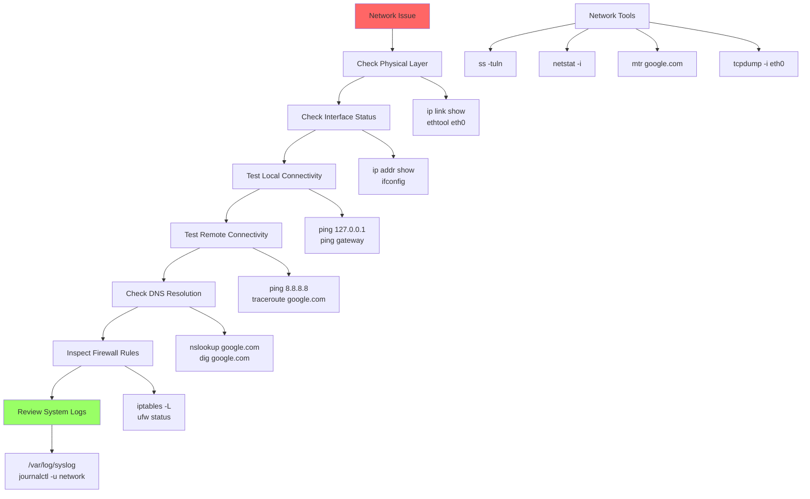

# Day 15: Networking & Troubleshooting

## Learning Objectives
By the end of Day 15, you will:
- Configure and troubleshoot network interfaces
- Use network diagnostic tools effectively
- Understand TCP/IP fundamentals
- Secure network services
- Resolve connectivity issues

**Estimated Time:** 4-5 hours

## Notes
- **Why Networking Skills Matter:**
  - Networking is foundational for system connectivity, troubleshooting, and security.
  - Essential for DevOps, SRE, and cloud engineers.

- **Network Configuration & Tools:**
  - `ip a` or `ifconfig`: Show network interfaces
  - `ip route` or `route -n`: Show routing table
  - `ping host`: Test connectivity
  - `traceroute host`: Trace network path
  - `netstat -tuln` or `ss -tuln`: List open ports
  - `nslookup`, `dig`: DNS queries
  - `curl`, `wget`: HTTP requests
  - `scp`, `rsync`: File transfer
  - `nmcli`, `nmtui`: NetworkManager tools

- **Troubleshooting Steps:**
  - Check physical connections and interface status
  - Test local and remote connectivity
  - Check DNS resolution
  - Inspect firewall rules (`iptables`, `ufw`, `firewalld`)
  - Review logs (`/var/log/syslog`, `/var/log/messages`)



- **Best Practices:**
  - Document network configs and changes
  - Use version control for config files
  - Limit open ports and use firewalls
  - Monitor network traffic for anomalies
  - Use strong passwords and encryption for remote access


- **Advanced Network Commands:**
  ```bash
  # Interface management
  ip link show                     # Show interfaces
  ip addr add 192.168.1.10/24 dev eth0  # Add IP
  ip route add default via 192.168.1.1   # Add route
  
  # Network diagnostics
  mtr google.com                   # Continuous traceroute
  tcpdump -i eth0 port 80         # Packet capture
  nmap -sS -O target              # Port scan with OS detection
  
  # DNS troubleshooting
  dig @8.8.8.8 example.com        # Query specific DNS server
  host -t MX example.com          # Mail exchange records
  ```

- **Network Troubleshooting Methodology:**
  1. **Physical Layer:** Check cables, interface status
  2. **Network Layer:** Test IP connectivity with ping
  3. **Transport Layer:** Check port accessibility
  4. **Application Layer:** Test service functionality
  5. **DNS Resolution:** Verify name resolution
  6. **Firewall Rules:** Check filtering rules

## Sample Exercises
1. Display all network interfaces and their IP addresses.
2. Test connectivity to a remote server and trace the route.
3. List all open TCP/UDP ports on your system.
4. Query DNS records for a domain.
5. Transfer a file to another machine using `scp`.

## Solutions
1. **Network interfaces:**
   ```bash
   ip a                             # Modern command
   ifconfig                         # Legacy command
   ip link show                     # Interface status
   ```

2. **Connectivity testing:**
   ```bash
   ping -c 4 google.com            # Test connectivity
   traceroute google.com           # Trace route
   mtr google.com                  # Continuous trace
   ```

3. **Port listing:**
   ```bash
   ss -tuln                        # Modern command
   netstat -tuln                   # Legacy command
   lsof -i :80                     # Process using port 80
   ```

4. **DNS queries:**
   ```bash
   dig example.com                 # Detailed DNS info
   nslookup example.com            # Simple lookup
   host example.com                # Basic lookup
   ```

5. **File transfer:**
   ```bash
   scp file.txt user@host:/path/
   rsync -av file.txt user@host:/path/
   ```

## Sample Interview Questions
1. How do you check network interface configuration?
2. How do you test and troubleshoot network connectivity?
3. What is the difference between TCP and UDP?
4. How do you check which process is using a specific port?
5. How do you perform a DNS lookup?
6. How do you secure remote access to a Linux server?
7. What is the purpose of a routing table?
8. How do you monitor network traffic?
9. How do you troubleshoot DNS issues?
10. How do you transfer files securely between servers?

## Interview Question Answers
1. **Interface Config:** `ip a` or `ifconfig` shows IP addresses, status, and interface details
2. **Connectivity Troubleshooting:** Use ping, traceroute, check firewall rules, verify DNS, test ports
3. **TCP vs UDP:** TCP is reliable, connection-oriented; UDP is fast, connectionless, no guarantees
4. **Port Process Mapping:** `ss -tulnp` or `netstat -tulnp` shows which process uses which port
5. **DNS Lookup:** `dig domain.com` or `nslookup domain.com` for DNS resolution
6. **Secure Remote Access:** SSH keys, disable password auth, firewall rules, fail2ban, non-standard ports
7. **Routing Table:** Determines packet forwarding paths between networks, view with `ip route`
8. **Traffic Monitoring:** iftop, nload, tcpdump, wireshark, netstat for network analysis
9. **DNS Troubleshooting:** Check /etc/resolv.conf, test with dig, verify DNS server connectivity
10. **Secure File Transfer:** scp, sftp, rsync over SSH for encrypted file transfers

## Completion Checklist
- [ ] Can configure network interfaces
- [ ] Know how to troubleshoot connectivity issues
- [ ] Understand TCP/IP protocol basics
- [ ] Can use network diagnostic tools
- [ ] Know how to secure network services
- [ ] Can analyze network traffic

## Key Commands Summary
```bash
# Network configuration
ip a                             # Show interfaces
ip route                         # Show routing table

# Connectivity testing
ping host                        # Test connectivity
traceroute host                  # Trace route
mtr host                         # Continuous trace

# Port and service analysis
ss -tuln                         # Show listening ports
lsof -i :port                    # Process using port
nmap host                        # Port scan

# DNS resolution
dig domain.com                   # DNS lookup
host domain.com                  # Simple lookup
```

## Next Steps
Proceed to [Day 16: Security, Firewalls & Hardening](../Day_16/notes_and_exercises.md) to learn system security.
