# Day 16: Security, Firewalls & Hardening

## Learning Objectives
By the end of Day 16, you will:
- Implement system security best practices
- Configure and manage firewalls
- Harden Linux systems against attacks
- Monitor security events and logs
- Apply encryption and access controls

**Estimated Time:** 4-5 hours

## Notes
- **Why Security Matters:**
  - Protects systems from unauthorized access, data loss, and attacks.
  - Essential for compliance, uptime, and trust.

```mermaid
flowchart TD
    A[Linux Security & Hardening] --> B[Network Security]
    A --> C[System Hardening]
    A --> D[Access Control]
    A --> E[Monitoring & Auditing]
    
    B --> B1[Firewalls<br/>ufw, iptables, firewalld]
    B --> B2[Port Management]
    B --> B3[Service Hardening]
    B --> B4[Network Encryption]
    
    C --> C1[System Updates]
    C --> C2[Remove Unused Software]
    C --> C3[File Permissions]
    C --> C4[Security Tools]
    
    D --> D1[User Management]
    D --> D2[SSH Security]
    D --> D3[sudo Configuration]
    D --> D4[Password Policies]
    
    E --> E1[Log Analysis]
    E --> E2[fail2ban]
    E --> E3[auditd]
    E --> E4[Intrusion Detection]
    
    F[Security Layers] --> F1[Network Perimeter]
    F --> F2[Host Security]
    F --> F3[Application Security]
    F --> F4[Data Encryption]
    
    G[Common Threats] --> G1[Brute Force Attacks]
    G --> G2[Privilege Escalation]
    G --> G3[Malware/Rootkits]
    G --> G4[Data Breaches]
    
    style A fill:#f96
    style C fill:#9f6
    style G fill:#f66
```



- **User & File Security:**
  - Use strong, unique passwords; enforce password policies (`/etc/login.defs`, `chage`)
  - Limit sudo/root access; use `sudo` logs (`/var/log/auth.log`)
  - Set correct file permissions (`chmod`, `chown`, `umask`)
  - Use ACLs for fine-grained access

- **Network Security:**
  - Close unused ports; use `netstat`, `ss`, `lsof` to audit
  - Use firewalls: `ufw` (simple), `iptables` (advanced), `firewalld` (zones)
  - Example: `ufw enable`, `ufw allow 22/tcp`, `iptables -L -n`
  - Disable unused services (`systemctl disable <service>`)

- **System Hardening:**
  - Keep system/packages updated (`apt update && apt upgrade`)
  - Remove unnecessary software (`apt purge`, `yum remove`)
  - Use security tools: `fail2ban`, `auditd`, `AppArmor`, `SELinux`
  - Monitor logs for suspicious activity (`journalctl`, `/var/log/auth.log`)
  - Set up automatic security updates

- **Encryption:**
  - Encrypt sensitive data at rest (`gpg`, `openssl`, LUKS/dm-crypt)
  - Use SSH keys for remote access; disable password login
  - Use VPNs for secure remote connections

- **Best Practices:**
  - Principle of least privilege
  - Regularly audit users, groups, and permissions
  - Use multi-factor authentication (MFA) where possible
  - Backup configs and document security policies


- **Firewall Management:**
  ```bash
  # UFW (Ubuntu Firewall)
  ufw enable                       # Enable firewall
  ufw allow 22/tcp               # Allow SSH
  ufw deny 23                     # Deny telnet
  ufw status verbose              # Show rules
  
  # iptables (Advanced)
  iptables -L -n                  # List rules
  iptables -A INPUT -p tcp --dport 80 -j ACCEPT
  iptables-save > /etc/iptables/rules.v4
  
  # firewalld (RHEL/CentOS)
  firewall-cmd --list-all
  firewall-cmd --add-service=http --permanent
  firewall-cmd --reload
  ```

- **Security Monitoring:**
  ```bash
  # Log analysis
  grep "Failed password" /var/log/auth.log
  journalctl -u ssh --since "1 hour ago"
  
  # Security tools
  fail2ban-client status          # Check fail2ban
  auditctl -l                     # List audit rules
  aa-status                       # AppArmor status
  ```

## Sample Exercises
1. Set up a firewall to allow only SSH and HTTP/HTTPS traffic.
2. Enforce password aging and complexity for all users.
3. Find and disable all unused services on your system.
4. Encrypt a file using GPG and decrypt it.
5. Set up fail2ban to protect SSH from brute-force attacks.

## Solutions
1. **Firewall setup:**
   ```bash
   # UFW method
   ufw allow 22/tcp
   ufw allow 80/tcp
   ufw allow 443/tcp
   ufw enable
   
   # iptables method
   iptables -A INPUT -p tcp --dport 22 -j ACCEPT
   iptables -A INPUT -p tcp --dport 80 -j ACCEPT
   iptables -A INPUT -p tcp --dport 443 -j ACCEPT
   ```

2. **Password policies:**
   ```bash
   # Edit /etc/login.defs
   PASS_MAX_DAYS 90
   PASS_MIN_DAYS 7
   PASS_WARN_AGE 14
   
   # Apply to user
   chage -M 90 -m 7 -W 14 username
   ```

3. **Disable unused services:**
   ```bash
   systemctl list-unit-files --state=enabled
   systemctl disable telnet
   systemctl stop telnet
   ```

4. **File encryption:**
   ```bash
   gpg -c sensitive.txt            # Encrypt
   gpg sensitive.txt.gpg           # Decrypt
   ```

5. **Fail2ban setup:**
   ```bash
   apt install fail2ban
   cp /etc/fail2ban/jail.conf /etc/fail2ban/jail.local
   # Edit jail.local for SSH protection
   systemctl restart fail2ban
   ```

## Sample Interview Questions
1. How do you secure SSH access on a Linux server?
2. What is the difference between a firewall and SELinux/AppArmor?
3. How do you audit user and group permissions?
4. How do you set up automatic security updates?
5. What is the principle of least privilege?
6. How do you encrypt data at rest on Linux?
7. How do you monitor for unauthorized access attempts?
8. What are the risks of running services as root?
9. How do you check for open ports and running services?
10. How do you recover from a security breach?

## Interview Question Answers
1. **SSH Security:** Use keys, disable root/password login, change port, firewall rules, fail2ban
2. **Firewall vs MAC:** Firewalls filter network traffic; SELinux/AppArmor control process capabilities
3. **Permission Auditing:** Use find, ls -lR, getfacl, audit logs to review file/directory permissions
4. **Automatic Updates:** unattended-upgrades (Debian/Ubuntu), yum-cron (RHEL/CentOS), dnf-automatic
5. **Least Privilege:** Grant minimum necessary permissions to users and services
6. **Data Encryption:** GPG for files, LUKS for disks, OpenSSL for data, dm-crypt for volumes
7. **Access Monitoring:** Monitor /var/log/auth.log, use auditd, set up alerting systems
8. **Root Service Risks:** Full system compromise if exploited; use dedicated users with limited privileges
9. **Port/Service Audit:** netstat, ss, systemctl list-units, ps aux to check running services
10. **Breach Response:** Isolate systems, analyze logs, restore from backups, patch vulnerabilities, update policies

## Completion Checklist
- [ ] Can configure firewall rules
- [ ] Understand system hardening techniques
- [ ] Know how to monitor security events
- [ ] Can implement access controls
- [ ] Familiar with encryption tools
- [ ] Know incident response basics

## Key Commands Summary
```bash
# Firewall management
ufw enable/disable               # Simple firewall
iptables -L -n                   # List firewall rules
firewall-cmd --list-all         # Firewalld status

# Security monitoring
grep "Failed" /var/log/auth.log  # Check failed logins
fail2ban-client status          # Intrusion prevention
auditctl -l                     # Audit rules

# System hardening
chmod 600 sensitive_file        # Restrict permissions
chage -l username               # Password aging info
systemctl disable unused_service # Disable services
```

## Security Best Practices
- Apply principle of least privilege
- Keep systems updated and patched
- Use strong authentication (keys, MFA)
- Monitor logs and set up alerting
- Regular security audits and assessments
- Backup and test recovery procedures

## Next Steps
Proceed to [Day 17: Package Management](../Day_17/notes_and_exercises.md) to learn software installation and management.
