# Day 17: Package Management (apt, yum, dnf, rpm)

## Learning Objectives
By the end of Day 17, you will:
- Master package management across different Linux distributions
- Install, update, and remove software packages
- Manage repositories and package sources
- Troubleshoot package-related issues
- Understand package dependencies and conflicts

**Estimated Time:** 3-4 hours

## Notes
- **Why Package Management Matters:**
  - Ensures easy installation, updating, and removal of software.
  - Critical for system security, stability, and automation.

```mermaid
flowchart TD
    A[Package Management] --> B[Debian Family]
    A --> C[Red Hat Family]
    A --> D[Universal Packages]
    A --> E[Package Operations]
    
    B --> B1[apt<br/>High-level Tool]
    B --> B2[dpkg<br/>Low-level Tool]
    B --> B3[.deb Packages]
    B --> B4[Ubuntu PPAs]
    
    C --> C1[dnf/yum<br/>High-level Tool]
    C --> C2[rpm<br/>Low-level Tool]
    C --> C3[.rpm Packages]
    C --> C4[EPEL Repository]
    
    D --> D1[snap<br/>Universal Packages]
    D --> D2[flatpak<br/>Sandboxed Apps]
    D --> D3[AppImage<br/>Portable Apps]
    
    E --> E1[Install/Remove]
    E --> E2[Update/Upgrade]
    E --> E3[Search/List]
    E --> E4[Repository Management]
    E --> E5[Dependency Resolution]
    
    F[Package Sources] --> F1[Official Repositories]
    F --> F2[Third-party Repos]
    F --> F3[Local Files]
    F --> F4[Source Code]
    
    G[Security] --> G1[GPG Verification]
    G --> G2[Package Signatures]
    G --> G3[Trusted Sources]
    
    style A fill:#f96
    style E fill:#9f6
    style G fill:#69f
```



- **Debian/Ubuntu Tools:**
  - `apt update`, `apt upgrade`, `apt install <pkg>`, `apt remove <pkg>`, `apt search <pattern>`, `apt show <pkg>`, `apt list --installed`
  - `dpkg -i <file.deb>`, `dpkg -r <pkg>`, `dpkg -l`, `dpkg -L <pkg>`
- **Red Hat/CentOS/Fedora Tools:**
  - `yum install <pkg>`, `yum remove <pkg>`, `yum update`, `yum search <pattern>`, `yum info <pkg>`
  - `dnf` (Fedora/RHEL 8+): Same as yum, newer features
  - `rpm -i <file.rpm>`, `rpm -e <pkg>`, `rpm -q <pkg>`, `rpm -ql <pkg>`
- **Universal Tools:**
  - `snap install <pkg>`, `snap remove <pkg>`, `snap list`, `snap info <pkg>`
  - `flatpak install <remote> <pkg>`, `flatpak list`

- **Repositories:**
  - Official repos are safest; third-party repos can introduce risk
  - Add repos: `add-apt-repository`, edit `/etc/apt/sources.list`, or use `yum-config-manager`
  - Update GPG keys for secure package verification

- **Best Practices:**
  - Always update package lists before installing
  - Remove unused packages (`apt autoremove`, `yum autoremove`)
  - Check package signatures and sources
  - Prefer official repos for security
  - Document all changes to system packages


- **Package Management Comparison:**
  ```bash
  # Debian/Ubuntu (APT)
  apt update                       # Update package lists
  apt upgrade                      # Upgrade packages
  apt install package             # Install package
  apt remove package              # Remove package
  apt search pattern              # Search packages
  
  # RHEL/CentOS/Fedora (YUM/DNF)
  yum update                      # Update packages
  yum install package             # Install package
  yum remove package              # Remove package
  yum search pattern              # Search packages
  
  # Low-level tools
  dpkg -i package.deb             # Install .deb file
  rpm -i package.rpm              # Install .rpm file
  ```

- **Repository Management:**
  ```bash
  # Add repositories
  add-apt-repository ppa:user/repo        # Ubuntu PPA
  yum-config-manager --add-repo url       # YUM repo
  
  # Repository files
  /etc/apt/sources.list                   # APT sources
  /etc/yum.repos.d/                       # YUM repositories
  ```

## Sample Exercises
1. Install, update, and remove a package using `apt` and `yum`.
2. List all installed packages and search for a specific one.
3. Install a `.deb` and a `.rpm` package manually.
4. Use `snap` to install and remove a package.
5. Clean up unused packages and cache.
6. Show all files installed by a specific package.
7. Find out which package provides a specific file or command.
8. Enable and use a third-party repository.

## Solutions
1. **Package operations:**
   ```bash
   # Debian/Ubuntu
   apt update && apt install nginx
   apt upgrade
   apt remove nginx
   
   # RHEL/CentOS
   yum install httpd
   yum update
   yum remove httpd
   ```

2. **Package listing and searching:**
   ```bash
   apt list --installed | grep nginx
   yum list installed | grep httpd
   apt search web server
   yum search "web server"
   ```

3. **Manual package installation:**
   ```bash
   dpkg -i package.deb
   rpm -ivh package.rpm
   ```

4. **Snap packages:**
   ```bash
   snap install hello-world
   snap list
   snap remove hello-world
   ```

5. **Cleanup:**
   ```bash
   apt autoremove && apt autoclean
   yum autoremove && yum clean all
   ```

6. **Package file listing:**
   ```bash
   dpkg -L nginx                   # Files from package
   rpm -ql httpd                   # Files from package
   ```

7. **File ownership:**
   ```bash
   dpkg -S /usr/sbin/nginx        # Which package owns file
   rpm -qf /usr/sbin/httpd        # Which package owns file
   ```

8. **Repository management:**
   ```bash
   # Add repository
   add-apt-repository ppa:nginx/stable
   yum-config-manager --add-repo=url
   ```

## Sample Interview Questions
1. What is the difference between `apt` and `dpkg`?
2. How do you install a package from a .deb or .rpm file?
3. What are the advantages of using `snap` or `flatpak`?
4. How do you list all installed packages on a system?
5. How do you find out which package installed a given file?
6. What is the purpose of `apt update` vs. `apt upgrade`?
7. How do you clean up orphaned or unused packages?
8. What are the risks of using unofficial repositories?
9. How do you check package signatures?
10. How do you troubleshoot a broken package installation?

## Interview Question Answers
1. **apt vs dpkg:** apt manages repositories and dependencies; dpkg handles individual .deb files
2. **Manual Installation:** `dpkg -i file.deb` for Debian; `rpm -i file.rpm` for Red Hat systems
3. **Universal Packages:** snap/flatpak are cross-distro, sandboxed, include dependencies
4. **List Packages:** `apt list --installed`, `yum list installed`, `rpm -qa`
5. **File Ownership:** `dpkg -S /path/file` or `rpm -qf /path/file` shows owning package
6. **Update vs Upgrade:** `apt update` refreshes package lists; `apt upgrade` installs updates
7. **Cleanup:** `apt autoremove` removes unused dependencies; `yum autoremove` similar
8. **Repository Risks:** Unofficial repos may have security issues, conflicts, or be unmaintained
9. **Package Verification:** Check GPG signatures, use official repos, verify checksums
10. **Troubleshooting:** `apt --fix-broken install`, check logs in /var/log/, resolve dependencies

## Completion Checklist
- [ ] Can install/remove packages on different distributions
- [ ] Understand repository management
- [ ] Know how to search and list packages
- [ ] Can troubleshoot package issues
- [ ] Familiar with universal package formats
- [ ] Know package security best practices

## Key Commands Summary
```bash
# APT (Debian/Ubuntu)
apt update && apt upgrade        # Update system
apt install package             # Install package
apt search pattern              # Search packages
apt list --installed           # List installed

# YUM/DNF (RHEL/CentOS/Fedora)
yum update                      # Update system
yum install package            # Install package
yum search pattern             # Search packages
yum list installed             # List installed

# Universal
snap install package           # Snap packages
flatpak install package        # Flatpak packages
```

## Best Practices
- Always update package lists before installing
- Use official repositories when possible
- Remove unused packages regularly
- Verify package signatures and sources
- Test updates in non-production first
- Document package changes

## Next Steps
Proceed to [Day 18: Web Servers](../Day_18/notes_and_exercises.md) to learn web server configuration and management.
