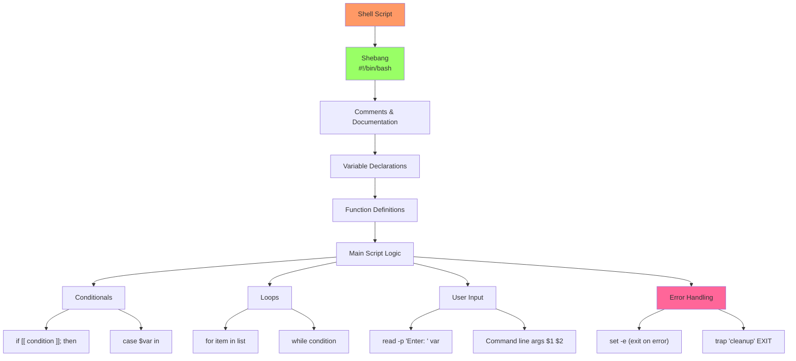

# Day 20: Basic Shell Scripting

## Learning Objectives
By the end of Day 20, you will:
- Write basic shell scripts for automation
- Use variables, conditionals, and loops
- Handle user input and command-line arguments
- Implement functions and error handling
- Apply scripting best practices

**Estimated Time:** 4-5 hours

## Notes

## Why Shell Scripting Matters
- Automates repetitive tasks, improves efficiency, and reduces manual errors.
- Essential for DevOps, SRE, and system administration roles.
- Forms the foundation for advanced automation and CI/CD pipelines.

- **Key Concepts:**
  - Shell script: Text file containing commands executed by shell
  - Shebang (`#!/bin/bash`): Specifies interpreter
  - Script permissions: `chmod +x script.sh` to make executable
  - Variables: Store and manipulate data
  - Control structures: Conditionals and loops
  - Functions: Reusable code blocks
  - Exit codes: Indicate success (0) or failure (non-zero)

- **Script Structure:**
  ```bash
  #!/bin/bash
  # Script description and author
  # Usage: ./script.sh [arguments]
  
  # Variables
  VAR="value"
  
  # Functions
  function_name() {
      # function body
  }
  
  # Main script logic
  echo "Script execution"
  ```



- **Essential Commands:**
  - **Output:** `echo`, `printf`
  - **Input:** `read`
  - **Text processing:** `grep`, `awk`, `sed`, `cut`
  - **File operations:** `test`, `[ ]`, `[[ ]]`
  - **System info:** `date`, `pwd`, `whoami`, `uname`

- **Advanced Examples:**
  ```bash
  # Command-line arguments
  #!/bin/bash
  echo "Script name: $0"
  echo "First argument: $1"
  echo "All arguments: $@"
  echo "Number of arguments: $#"
  
  # Error handling
  #!/bin/bash
  set -e  # Exit on error
  
  if ! command -v git &> /dev/null; then
      echo "Git is not installed" >&2
      exit 1
  fi
  
  # While loop with file processing
  #!/bin/bash
  while IFS= read -r line; do
      echo "Processing: $line"
  done < "$1"
  
  # Case statement
  #!/bin/bash
  case "$1" in
      start) echo "Starting service" ;;
      stop)  echo "Stopping service" ;;
      *)     echo "Usage: $0 {start|stop}" ;;
  esac
  ```

- **Best Practices:**
  - Always use shebang (`#!/bin/bash`)
  - Use `set -e` to exit on errors
  - Quote variables: `"$var"` to prevent word splitting
  - Use `[[ ]]` instead of `[ ]` for better conditionals
  - Add error handling and input validation
  - Use meaningful variable names
  - Comment complex logic
  - Test thoroughly before deployment

## Sample Exercises
1. Write a script to print the current date and time.
2. Write a script that takes a filename as input and checks if it exists.
3. Write a script to print numbers 1 to 10 using a loop.
4. Write a script to count the number of lines in a file.
5. Write a script that accepts a username and greets the user.
6. Create a backup script that copies files with timestamps.
7. Write a system monitoring script that checks disk usage.

## Solutions
1. **Date and time:**
   ```bash
   #!/bin/bash
   echo "Current date and time: $(date)"
   echo "Formatted: $(date '+%Y-%m-%d %H:%M:%S')"
   ```

2. **File existence check:**
   ```bash
   #!/bin/bash
   read -p "Enter filename: " fname
   if [[ -f "$fname" ]]; then
       echo "$fname exists and is a regular file."
   elif [[ -d "$fname" ]]; then
       echo "$fname exists and is a directory."
   else
       echo "$fname does not exist."
   fi
   ```

3. **Number loop:**
   ```bash
   #!/bin/bash
   for i in {1..10}; do
       echo "Number: $i"
   done
   ```

4. **Line counter:**
   ```bash
   #!/bin/bash
   if [[ $# -eq 0 ]]; then
       read -p "Enter filename: " fname
   else
       fname="$1"
   fi
   
   if [[ -f "$fname" ]]; then
       lines=$(wc -l < "$fname")
       echo "$fname has $lines lines."
   else
       echo "Error: File not found." >&2
       exit 1
   fi
   ```

5. **User greeting:**
   ```bash
   #!/bin/bash
   read -p "Enter your name: " name
   if [[ -n "$name" ]]; then
       echo "Hello, $name! Welcome to Linux scripting."
   else
       echo "Hello, anonymous user!"
   fi
   ```

6. **Backup script:**
   ```bash
   #!/bin/bash
   backup_dir="/backup"
   timestamp=$(date +%Y%m%d_%H%M%S)
   
   for file in "$@"; do
       if [[ -f "$file" ]]; then
           cp "$file" "${backup_dir}/$(basename "$file").${timestamp}"
           echo "Backed up: $file"
       fi
   done
   ```

7. **System monitoring:**
   ```bash
   #!/bin/bash
   threshold=80
   
   df -h | awk 'NR>1 {print $5 " " $6}' | while read usage mountpoint; do
       usage_num=${usage%\%}
       if [[ $usage_num -gt $threshold ]]; then
           echo "WARNING: $mountpoint is ${usage} full"
       fi
   done
   ```

## Sample Interview Questions
1. What is a shebang and why is it important?
2. How do you make a script executable?
3. How do you pass arguments to a shell script?
4. What is the difference between `$*` and `$@`?
5. How do you handle errors in shell scripts?
6. What is the difference between `[ ]` and `[[ ]]`?
7. How do you debug a shell script?
8. What is the purpose of `set -e` in scripts?
9. How do you read user input in a script?
10. How do you create and use functions in bash?

## Interview Question Answers
1. **Shebang:** `#!/bin/bash` tells system which interpreter to use for script execution
2. **Executable:** Use `chmod +x script.sh` to make script executable
3. **Arguments:** Access as `$1`, `$2`, etc.; `$0` is script name, `$#` is argument count
4. **$* vs $@:** Both represent all arguments; `"$@"` preserves individual arguments, `"$*"` joins them
5. **Error Handling:** Check `$?` exit codes, use `set -e`, implement error traps and validation
6. **[ ] vs [[ ]]:** `[[ ]]` is bash builtin with more features, pattern matching, safer
7. **Debugging:** Use `bash -x script.sh`, add `set -x`, or use `echo` statements
8. **set -e:** Makes script exit immediately if any command fails (non-zero exit code)
9. **User Input:** Use `read` command: `read -p "Prompt: " variable`
10. **Functions:** Define with `function_name() { commands; }`, call with `function_name args`

## Completion Checklist
- [ ] Can write basic shell scripts with proper structure
- [ ] Understand variables, conditionals, and loops
- [ ] Know how to handle command-line arguments
- [ ] Can implement functions and error handling
- [ ] Familiar with scripting best practices
- [ ] Can debug and troubleshoot scripts

## Key Commands Summary
```bash
# Script basics
chmod +x script.sh               # Make executable
bash -x script.sh                # Debug mode

# Variables and input
read -p "Prompt: " var           # Read user input
echo "Value: $var"               # Display variable

# Conditionals
if [[ condition ]]; then         # If statement
    commands
fi

# Loops
for item in list; do             # For loop
    echo "$item"
done
```

## Next Steps
Proceed to [Day 21: Volume Management](../Day_21/notes_and_exercises.md) to learn advanced storage management.
