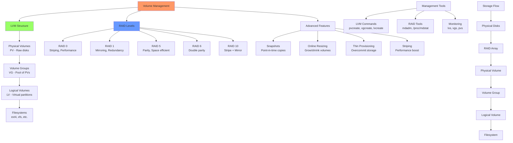

# Day 21: Volume Management (LVM, RAID, Snapshots, Resizing)

## Learning Objectives
By the end of Day 21, you will:
- Understand LVM concepts and implementation
- Configure RAID arrays for redundancy and performance
- Create and manage LVM snapshots
- Resize volumes safely
- Troubleshoot storage issues

**Estimated Time:** 4-5 hours

## Notes

## Why Volume Management Matters
- Enables flexible, scalable, and reliable storage management.
- Essential for handling growing data, backups, and disaster recovery.



- **LVM Components:**
  - **Physical Volume (PV):** Raw disk or partition
  - **Volume Group (VG):** Pool of PVs
  - **Logical Volume (LV):** Virtual partition from VG
  - **Physical Extent (PE):** Smallest unit of allocation

- **RAID Levels:**
  - **RAID 0:** Striping, no redundancy, best performance
  - **RAID 1:** Mirroring, 50% capacity, fault tolerant
  - **RAID 5:** Striping with parity, n-1 capacity, single disk failure
  - **RAID 6:** Striping with double parity, n-2 capacity, dual disk failure
  - **RAID 10:** Mirror + stripe, 50% capacity, high performance

- **Key Commands:**
  ```bash
  # LVM commands
  pvcreate /dev/sdb                # Create physical volume
  vgcreate vg01 /dev/sdb          # Create volume group
  lvcreate -L 10G -n lv01 vg01    # Create logical volume
  
  # RAID commands
  mdadm --create /dev/md0 --level=1 --raid-devices=2 /dev/sdc /dev/sdd
  
  # Monitoring
  pvs, vgs, lvs                   # Display PV/VG/LV info
  cat /proc/mdstat                # RAID status
  ```

## Sample Exercises
1. Create an LVM setup with a new disk, format, and mount it.
2. Set up a RAID 5 array and test disk failure recovery.
3. Take a snapshot of a logical volume and restore from it.
4. Resize a logical volume and verify data integrity.
5. Monitor RAID health and replace a failed disk.
6. Create a striped logical volume across multiple PVs.
7. Set up LVM on RAID for combined benefits.

## Solutions
1. **LVM Setup:**
   ```bash
   # Prepare disk
   sudo pvcreate /dev/sdb
   sudo vgcreate vg_data /dev/sdb
   sudo lvcreate -L 10G -n lv_data vg_data
   
   # Format and mount
   sudo mkfs.ext4 /dev/vg_data/lv_data
   sudo mkdir /mnt/data
   sudo mount /dev/vg_data/lv_data /mnt/data
   
   # Add to fstab
   echo '/dev/vg_data/lv_data /mnt/data ext4 defaults 0 2' >> /etc/fstab
   ```

2. **RAID 5 Setup:**
   ```bash
   # Create RAID 5 (minimum 3 disks)
   sudo mdadm --create /dev/md0 --level=5 --raid-devices=3 /dev/sdc /dev/sdd /dev/sde
   
   # Format and mount
   sudo mkfs.ext4 /dev/md0
   sudo mount /dev/md0 /mnt/raid5
   
   # Test failure
   sudo mdadm --fail /dev/md0 /dev/sde
   sudo mdadm --remove /dev/md0 /dev/sde
   sudo mdadm --add /dev/md0 /dev/sdf
   ```

3. **LVM Snapshots:**
   ```bash
   # Create snapshot (10% of original size)
   sudo lvcreate -L 1G -s -n lv_data_snap /dev/vg_data/lv_data
   
   # Mount snapshot
   sudo mkdir /mnt/snapshot
   sudo mount /dev/vg_data/lv_data_snap /mnt/snapshot
   
   # Restore from snapshot
   sudo umount /mnt/data
   sudo lvconvert --merge /dev/vg_data/lv_data_snap
   ```

4. **Volume Resizing:**
   ```bash
   # Extend logical volume
   sudo lvextend -L +5G /dev/vg_data/lv_data
   sudo resize2fs /dev/vg_data/lv_data
   
   # For XFS
   sudo xfs_growfs /mnt/data
   
   # Verify
   df -h /mnt/data
   ```

5. **RAID Monitoring:**
   ```bash
   # Check status
   cat /proc/mdstat
   sudo mdadm --detail /dev/md0
   
   # Replace failed disk
   sudo mdadm --fail /dev/md0 /dev/sdc
   sudo mdadm --remove /dev/md0 /dev/sdc
   sudo mdadm --add /dev/md0 /dev/sdg
   ```

## Sample Interview Questions
1. What is LVM and why use it?
2. Explain the difference between RAID levels 0, 1, 5, and 10.
3. How do you resize a logical volume safely?
4. How do you check RAID health and replace a failed disk?
5. What are LVM snapshots and their use cases?
6. How do you recover from LVM corruption?
7. What's the difference between hardware and software RAID?
8. How do you migrate data from one volume to another?
9. How do you monitor disk health proactively?
10. What are the performance implications of different RAID levels?

## Interview Question Answers
1. **LVM Benefits:** Flexible disk management, resizing, snapshots, spanning multiple disks
2. **RAID Levels:** 0 (striping), 1 (mirroring), 5 (parity), 10 (mirror+stripe)
3. **Safe Resizing:** Backup first, extend LV, then resize filesystem; shrinking requires filesystem resize first
4. **RAID Health:** Monitor /proc/mdstat, use mdadm --detail, replace with --fail, --remove, --add
5. **Snapshots:** Point-in-time copies for backups, testing, rollbacks
6. **LVM Recovery:** Use vgcfgbackup/vgcfgrestore, check metadata, rebuild from backups
7. **RAID Types:** Hardware RAID (dedicated controller), software RAID (OS managed)
8. **Data Migration:** Use pvmove, lvconvert --mirrors, or rsync between volumes
9. **Disk Monitoring:** SMART monitoring, regular health checks, predictive failure analysis
10. **RAID Performance:** RAID 0 fastest, RAID 1 good read performance, RAID 5/6 write penalty

## Completion Checklist
- [ ] Understand LVM architecture and components
- [ ] Can create and manage RAID arrays
- [ ] Know how to use LVM snapshots
- [ ] Can resize volumes safely
- [ ] Familiar with monitoring and troubleshooting
- [ ] Understand performance implications

## Key Commands Summary
```bash
# LVM
pvcreate /dev/sdX                # Create PV
vgcreate vg_name /dev/sdX       # Create VG
lvcreate -L size -n lv_name vg  # Create LV
lvextend -L +size /dev/vg/lv    # Extend LV

# RAID
mdadm --create /dev/md0 --level=X --raid-devices=N /dev/sd[X-Y]
mdadm --detail /dev/md0          # RAID info
cat /proc/mdstat                 # RAID status

# Monitoring
pvs, vgs, lvs                   # LVM status
lsblk                           # Block devices
```

## Best Practices
- Always backup before major storage operations
- Monitor RAID and LVM health regularly
- Use appropriate RAID levels for workload
- Document storage configurations
- Test recovery procedures
- Plan for growth and scalability

## Next Steps
Proceed to [Day 22: Certificate Management](../Day_22/notes_and_exercises.md) to learn SSL/TLS management.