# Day 23: Linux Interview Questions & Real-World Scenarios

## Learning Objectives
By the end of Day 23, you will:
- Prepare for Linux system administration interviews
- Handle real-world troubleshooting scenarios
- Apply best practices in production environments
- Demonstrate problem-solving methodologies
- Understand common interview topics and formats

**Estimated Time:** 3-4 hours

## Notes
- **Why Interview Prep Matters:**
  - Prepares you for technical interviews and real-world troubleshooting.
  - Covers practical scenarios, command usage, and best practices.

```mermaid
flowchart TD
    A[Linux Interview Preparation] --> B[Technical Skills]
    A --> C[Scenario-Based Questions]
    A --> D[System Design]
    A --> E[Troubleshooting Methodology]
    
    B --> B1[Command Mastery<br/>Basic to advanced]
    B --> B2[System Administration<br/>Users, services, security]
    B --> B3[Networking<br/>Configuration, troubleshooting]
    B --> B4[Storage Management<br/>Filesystems, LVM, RAID]
    
    C --> C1[Performance Issues<br/>High CPU, memory leaks]
    C --> C2[Security Incidents<br/>Breach response, hardening]
    C --> C3[Service Outages<br/>Recovery procedures]
    C --> C4[Automation Tasks<br/>Scripting, deployment]
    
    D --> D1[High Availability<br/>Load balancing, clustering]
    D --> D2[Scalability<br/>Horizontal, vertical scaling]
    D --> D3[Monitoring<br/>Observability stack]
    D --> D4[Security Architecture<br/>Defense in depth]
    
    E --> E1[Information Gathering<br/>What, when, where]
    E --> E2[Problem Reproduction<br/>Consistent testing]
    E --> E3[Log Analysis<br/>System, app, security]
    E --> E4[Resource Monitoring<br/>CPU, memory, I/O]
    E --> E5[Hypothesis Testing<br/>One change at a time]
    E --> E6[Documentation<br/>Solution recording]
    
    F[Interview Types] --> F1[Phone/Video Screen]
    F --> F2[Technical Assessment]
    F --> F3[On-site/Panel]
    F --> F4[Practical Demo]
    
    G[Common Scenarios] --> G1[Server Performance]
    G --> G2[Disk Space Issues]
    G --> G3[Network Problems]
    G --> G4[Security Incidents]
    
    style A fill:#f96
    style E fill:#9f6
    style G fill:#69f
```



- **Common Interview Topics:**
  - Filesystem hierarchy, permissions, process management, networking, scripting, troubleshooting, security, automation

- **Real-World Scenarios:**
  - Troubleshoot a slow server: check CPU, memory, disk, network, logs
  - Recover from accidental file deletion: use backups, `extundelete`, `testdisk`
  - Secure a public web server: firewall, permissions, updates, monitoring
  - Automate user onboarding: scripts, templates, version control
  - Migrate data between servers: `rsync`, `scp`, downtime planning

- **Best Practices:**
  - Always document changes and configs
  - Use version control for scripts and configs
  - Test in staging before production
  - Monitor and alert on key metrics
  - Backup before making major changes


- **Troubleshooting Methodology:**
  1. **Gather Information:** What, when, where, who, how
  2. **Reproduce Issue:** Consistent reproduction helps isolation
  3. **Check Logs:** System, application, security logs
  4. **Monitor Resources:** CPU, memory, disk, network
  5. **Test Hypotheses:** Make one change at a time
  6. **Document Solution:** For future reference

- **Common Scenarios:**
  ```bash
  # High load investigation
  top, htop                        # Process overview
  vmstat 1                         # System stats
  iostat -x 1                      # I/O stats
  sar -u 1 10                      # CPU utilization
  
  # Disk space issues
  df -h                            # Filesystem usage
  du -sh /*                        # Directory sizes
  lsof +L1                         # Deleted but open files
  
  # Network troubleshooting
  ping, traceroute, mtr            # Connectivity
  netstat -tuln, ss -tuln          # Port status
  tcpdump, wireshark               # Packet analysis
  ```

## Sample Exercises
1. Troubleshoot a server with high load and slow response.
2. Recover from a full root filesystem.
3. Investigate and resolve network connectivity issues.
4. Secure a newly deployed web server.
5. Plan and execute a zero-downtime application deployment.
6. Diagnose and fix a service that won't start.
7. Implement automated monitoring and alerting.

## Solutions
1. **High Load Troubleshooting:**
   ```bash
   # Step 1: Identify the bottleneck
   top                              # Overall system view
   htop                             # Interactive process viewer
   
   # Step 2: Analyze specific resources
   vmstat 1 5                       # Memory and CPU stats
   iostat -x 1 5                    # Disk I/O analysis
   sar -u 1 10                      # CPU utilization over time
   
   # Step 3: Investigate processes
   ps aux --sort=-%cpu | head -10   # Top CPU consumers
   ps aux --sort=-%mem | head -10   # Top memory consumers
   
   # Step 4: Check for issues
   dmesg | tail -20                 # Kernel messages
   journalctl -f                    # Live system logs
   ```

2. **Full Root Filesystem Recovery:**
   ```bash
   # Find large files/directories
   du -sh /* | sort -hr | head -10
   
   # Clean up common locations
   journalctl --vacuum-time=7d      # Clean old logs
   apt autoremove && apt autoclean  # Remove unused packages
   
   # Find deleted but open files
   lsof +L1
   
   # Emergency cleanup
   find /tmp -type f -atime +7 -delete
   find /var/log -name "*.log" -size +100M
   ```

3. **Network Connectivity Issues:**
   ```bash
   # Layer-by-layer approach
   ip link show                     # Physical/data link layer
   ip addr show                     # Network layer
   ping gateway_ip                  # Local connectivity
   ping 8.8.8.8                     # Internet connectivity
   nslookup domain.com              # DNS resolution
   
   # Port and service testing
   telnet target_host port          # Port connectivity
   ss -tuln | grep :80              # Service listening
   ```

4. **Web Server Security:**
   ```bash
   # Firewall configuration
   ufw enable
   ufw allow 22/tcp
   ufw allow 80/tcp
   ufw allow 443/tcp
   
   # SSH hardening
   # Edit /etc/ssh/sshd_config
   PermitRootLogin no
   PasswordAuthentication no
   Port 2222
   
   # Install fail2ban
   apt install fail2ban
   systemctl enable fail2ban
   ```

5. **Zero-Downtime Deployment:**
   ```bash
   # Blue-green deployment approach
   # 1. Deploy to staging environment
   rsync -av app/ staging:/var/www/app-new/
   
   # 2. Test thoroughly
   curl -H "Host: myapp.com" http://staging-ip/health
   
   # 3. Switch traffic (load balancer/DNS)
   # Update load balancer configuration
   
   # 4. Monitor and rollback if needed
   tail -f /var/log/nginx/access.log
   ```

## Sample Interview Questions
1. Walk me through troubleshooting a slow web server.
2. How do you handle a disk space emergency?
3. Describe your approach to securing a Linux server.
4. How do you investigate network connectivity issues?
5. What's your process for deploying applications safely?
6. How do you monitor system performance?
7. Describe a time you recovered from a system failure.
8. How do you automate routine maintenance tasks?
9. What's your backup and disaster recovery strategy?
10. How do you stay updated with security patches?

## Interview Question Answers
1. **Slow Web Server:** Check system resources (CPU, memory, disk I/O), analyze web server logs, review database performance, check network connectivity
2. **Disk Space Emergency:** Identify large files with du, clean logs and temp files, move data to other partitions, add storage if needed
3. **Server Security:** Firewall configuration, SSH hardening, regular updates, monitoring, intrusion detection, principle of least privilege
4. **Network Issues:** Layer-by-layer troubleshooting (physical, network, transport, application), use ping, traceroute, netstat, tcpdump
5. **Safe Deployment:** Blue-green deployment, staging environment testing, gradual rollout, monitoring, rollback procedures
6. **Performance Monitoring:** Use tools like top, htop, sar, iostat; set up alerting with Nagios/Prometheus; establish baselines
7. **System Recovery:** Assess damage, restore from backups, document incident, implement preventive measures, conduct post-mortem
8. **Automation:** Shell scripts, cron jobs, configuration management (Ansible), infrastructure as code, CI/CD pipelines
9. **Backup Strategy:** 3-2-1 rule (3 copies, 2 media types, 1 offsite), regular testing, automated backups, documented procedures
10. **Security Updates:** Automated updates for security patches, staging environment testing, maintenance windows, vulnerability scanning

## Completion Checklist
- [ ] Understand systematic troubleshooting approach
- [ ] Can handle common production scenarios
- [ ] Know security best practices
- [ ] Familiar with performance optimization
- [ ] Understand deployment strategies
- [ ] Can articulate solutions clearly

## Interview Tips
- **Think Out Loud:** Explain your reasoning process
- **Ask Questions:** Clarify requirements and constraints
- **Start Simple:** Begin with basic checks before complex solutions
- **Consider Impact:** Think about business impact and user experience
- **Learn from Mistakes:** Discuss what you learned from past incidents
- **Stay Current:** Keep up with industry trends and best practices

## Real-World Scenarios
- **Production Outage:** Systematic approach to diagnosis and resolution
- **Security Incident:** Containment, investigation, remediation
- **Capacity Planning:** Monitoring trends, predicting growth, scaling
- **Migration Projects:** Planning, testing, execution, rollback procedures
- **Compliance Requirements:** Implementing controls, auditing, documentation

## Next Steps
Proceed to [Day 24: System Updates & Patching](../Day_24/notes_and_exercises.md) to learn maintenance procedures.
