# Day 24: System Updates & Patching

## Learning Objectives
By the end of Day 24, you will:
- Understand different types of system updates
- Implement automated update strategies
- Manage patch deployment safely
- Handle update rollbacks and troubleshooting
- Establish update policies and procedures

**Estimated Time:** 2-3 hours

## Notes

## Why Updates & Patching Matter
- Fixes security vulnerabilities and bugs.
- Ensures system stability and compliance.
- Reduces risk of compromise and downtime.

```mermaid
flowchart TD
    A[System Updates & Patching] --> B[Update Types]
    A --> C[Update Process]
    A --> D[Automation]
    A --> E[Testing & Validation]
    
    B --> B1[Security Updates<br/>Critical patches]
    B --> B2[Bug Fixes<br/>Stability improvements]
    B --> B3[Feature Updates<br/>New functionality]
    B --> B4[Kernel Updates<br/>Core improvements]
    
    C --> C1[Assessment<br/>Available updates]
    C --> C2[Planning<br/>Maintenance windows]
    C --> C3[Testing<br/>Staging environment]
    C --> C4[Deployment<br/>Production rollout]
    C --> C5[Verification<br/>Post-update checks]
    
    D --> D1[Automated Updates<br/>unattended-upgrades]
    D --> D2[Scheduled Patching<br/>Cron jobs]
    D --> D3[Configuration Mgmt<br/>Ansible, Puppet]
    D --> D4[Update Notifications<br/>Alerts, reports]
    
    E --> E1[Pre-update Backup<br/>System snapshots]
    E --> E2[Staging Tests<br/>Compatibility checks]
    E --> E3[Rollback Plan<br/>Recovery procedures]
    E --> E4[Health Monitoring<br/>Post-update validation]
    
    F[Update Tools] --> F1[apt/yum/dnf<br/>Package managers]
    F --> F2[unattended-upgrades<br/>Automatic security]
    F --> F3[yum-cron/dnf-automatic<br/>Scheduled updates]
    F --> F4[Custom Scripts<br/>Automation]
    
    G[Update Strategy] --> G1[Manual Control]
    G --> G2[Automated Security]
    G --> G3[Staged Rollout]
    G --> G4[Emergency Patches]
    
    style A fill:#f96
    style C fill:#9f6
    style E fill:#69f
```



- **Update Types:**
  - **Security Updates:** Critical patches for vulnerabilities
  - **Bug Fixes:** Stability and functionality improvements
  - **Feature Updates:** New capabilities and enhancements
  - **Kernel Updates:** Core system improvements

- **Update Strategies:**
  - **Manual Updates:** Administrator-controlled timing
  - **Automated Updates:** Scheduled automatic installation
  - **Staged Updates:** Gradual rollout across environments
  - **Emergency Patches:** Immediate security fixes

- **Package Management by Distribution:**
  ```bash
  # Debian/Ubuntu (APT)
  apt update                       # Refresh package lists
  apt upgrade                      # Install available updates
  apt full-upgrade                 # Handle dependencies
  apt list --upgradable           # Show available updates
  
  # RHEL/CentOS/Fedora
  yum update                      # Update all packages
  dnf upgrade                     # Fedora/RHEL 8+
  yum check-update                # Check for updates
  
  # SUSE
  zypper refresh                  # Refresh repositories
  zypper update                   # Install updates
  ```

## Sample Exercises
1. Enable and configure unattended upgrades on a test server.
2. Write a script to check for and report available updates.
3. Test rolling back a package to a previous version.
4. Document a patch management policy for your team.
5. Set up update notifications and monitoring.
6. Create a maintenance window procedure.
7. Test update rollback scenarios.

## Solutions
1. **Automated Updates Setup:**
   ```bash
   # Ubuntu/Debian - Unattended Upgrades
   sudo apt install unattended-upgrades
   sudo dpkg-reconfigure unattended-upgrades
   
   # Configure /etc/apt/apt.conf.d/50unattended-upgrades
   Unattended-Upgrade::Allowed-Origins {
       "${distro_id}:${distro_codename}-security";
   };
   
   # RHEL/CentOS - yum-cron
   sudo yum install yum-cron
   sudo systemctl enable yum-cron
   
   # Edit /etc/yum/yum-cron.conf
   apply_updates = yes
   ```

2. **Update Check Script:**
   ```bash
   #!/bin/bash
   # update-check.sh
   
   if command -v apt &> /dev/null; then
       apt list --upgradable 2>/dev/null | grep -v "Listing" | wc -l
   elif command -v yum &> /dev/null; then
       yum check-update -q | grep -v "Loaded plugins" | wc -l
   fi
   ```

3. **Package Rollback:**
   ```bash
   # Debian/Ubuntu
   apt-cache policy package_name
   sudo apt install package_name=version
   
   # RHEL/CentOS
   yum history list
   sudo yum downgrade package_name
   
   # Hold package at current version
   sudo apt-mark hold package_name
   ```

4. **Patch Management Policy:**
   ```markdown
   # Patch Management Policy
   
   ## Update Schedule
   - Security patches: Within 72 hours
   - Critical updates: Monthly maintenance window
   - Feature updates: Quarterly review
   
   ## Testing Process
   1. Deploy to staging environment
   2. Run automated tests
   3. Manual verification
   4. Production deployment
   
   ## Rollback Procedures
   - Package downgrade commands
   - System restore from backup
   - Service-specific rollback steps
   ```

5. **Update Monitoring:**
   ```bash
   #!/bin/bash
   # update-monitor.sh
   
   UPDATES=$(apt list --upgradable 2>/dev/null | grep -c upgradable)
   SECURITY=$(apt list --upgradable 2>/dev/null | grep -c security)
   
   if [ $SECURITY -gt 0 ]; then
       echo "CRITICAL: $SECURITY security updates available"
       # Send alert
   elif [ $UPDATES -gt 10 ]; then
       echo "WARNING: $UPDATES updates available"
   fi
   ```

## Sample Interview Questions
1. Why are regular updates important for system security?
2. How do you automate system updates safely?
3. What's your approach to testing updates before production?
4. How do you handle emergency security patches?
5. Describe your rollback strategy for failed updates.
6. How do you monitor and report on update status?
7. What are the risks of automated updates?
8. How do you handle kernel updates?
9. What's your maintenance window strategy?
10. How do you ensure compliance with update policies?

## Interview Question Answers
1. **Update Importance:** Fix security vulnerabilities, improve stability, maintain compliance, prevent exploitation
2. **Safe Automation:** Staged deployment, testing in non-production, automated rollback, monitoring
3. **Testing Approach:** Staging environment, automated tests, gradual rollout, monitoring metrics
4. **Emergency Patches:** Immediate deployment process, risk assessment, expedited testing, communication
5. **Rollback Strategy:** Package downgrade, system snapshots, configuration backups, service restoration
6. **Update Monitoring:** Automated reporting, dashboard metrics, compliance tracking, alert systems
7. **Automation Risks:** Service disruption, compatibility issues, unattended failures, security gaps
8. **Kernel Updates:** Require reboot, test thoroughly, schedule maintenance windows, have rollback plan
9. **Maintenance Windows:** Scheduled downtime, user communication, rollback procedures, post-update verification
10. **Compliance:** Regular audits, documentation, automated reporting, policy enforcement

## Completion Checklist
- [ ] Understand different update types and priorities
- [ ] Can configure automated update systems
- [ ] Know how to test updates safely
- [ ] Familiar with rollback procedures
- [ ] Can monitor update status and compliance
- [ ] Understand maintenance window planning

## Key Commands Summary
```bash
# Check for updates
apt list --upgradable            # Debian/Ubuntu
yum check-update                 # RHEL/CentOS
dnf check-update                 # Fedora

# Install updates
apt update && apt upgrade        # Debian/Ubuntu
yum update                       # RHEL/CentOS
dnf upgrade                      # Fedora

# Automated updates
unattended-upgrades             # Debian/Ubuntu
yum-cron                        # RHEL/CentOS
dnf-automatic                   # Fedora
```

## Best Practices
- Test all updates in staging first
- Schedule regular maintenance windows
- Implement automated rollback procedures
- Monitor update status continuously
- Document all update procedures
- Maintain update compliance policies

## Next Steps
Proceed to [Day 25: System Hardening](../Day_25/notes_and_exercises.md) to learn security hardening techniques.
