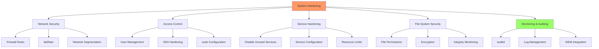

# Day 25: System Hardening

## Learning Objectives
By the end of Day 25, you will:
- Implement comprehensive system hardening measures
- Secure services and network access
- Configure security monitoring and auditing
- Apply security frameworks and best practices
- Understand compliance requirements

**Estimated Time:** 4-5 hours

## Notes

## Why System Hardening Matters
- Reduces attack surface and risk of compromise.
- Essential for compliance, security, and production reliability.

- **Security Principles:**
  - **Least Privilege:** Minimum necessary access
  - **Defense in Depth:** Multiple security layers
  - **Fail Secure:** Secure defaults when systems fail
  - **Security by Design:** Built-in security measures



- **Hardening Categories:**
  ```bash
  # Service Hardening
  systemctl disable unnecessary_service
  systemctl mask dangerous_service
  
  # Network Hardening
  ufw enable
  ufw default deny incoming
  
  # File System Hardening
  chmod 600 /etc/ssh/ssh_host_*_key
  chmod 644 /etc/passwd
  
  # Kernel Hardening
  sysctl -w net.ipv4.ip_forward=0
  sysctl -w kernel.dmesg_restrict=1
  ```

- **Security Tools:**
  - **fail2ban:** Intrusion prevention
  - **auditd:** System call auditing
  - **AIDE:** File integrity monitoring
  - **chkrootkit/rkhunter:** Rootkit detection
  - **lynis:** Security auditing
  - **ClamAV:** Antivirus scanning

## Sample Exercises
1. Harden SSH configuration and test security.
2. Remove unnecessary services and packages.
3. Configure comprehensive firewall rules.
4. Set up intrusion detection and monitoring.
5. Implement file integrity monitoring.
6. Create security audit checklist.
7. Configure system-wide security policies.

## Solutions
1. **SSH Hardening:**
   ```bash
   # Edit /etc/ssh/sshd_config
   PermitRootLogin no
   PasswordAuthentication no
   PubkeyAuthentication yes
   Port 2222
   Protocol 2
   MaxAuthTries 3
   ClientAliveInterval 300
   ClientAliveCountMax 2
   
   # Restart SSH service
   sudo systemctl restart sshd
   
   # Test configuration
   sudo sshd -t
   ```

2. **Service Removal:**
   ```bash
   # List all services
   systemctl list-unit-files --type=service
   
   # Disable unnecessary services
   sudo systemctl disable --now avahi-daemon
   sudo systemctl disable --now cups
   sudo systemctl disable --now bluetooth
   
   # Remove unnecessary packages
   sudo apt purge telnet rsh-client rsh-redone-client
   ```

3. **Firewall Configuration:**
   ```bash
   # UFW setup
   sudo ufw --force reset
   sudo ufw default deny incoming
   sudo ufw default allow outgoing
   sudo ufw allow 2222/tcp comment 'SSH'
   sudo ufw allow 80/tcp comment 'HTTP'
   sudo ufw allow 443/tcp comment 'HTTPS'
   sudo ufw enable
   
   # Verify rules
   sudo ufw status verbose
   ```

4. **Intrusion Detection:**
   ```bash
   # Install and configure fail2ban
   sudo apt install fail2ban
   
   # Create local configuration
   sudo cp /etc/fail2ban/jail.conf /etc/fail2ban/jail.local
   
   # Edit jail.local
   [sshd]
   enabled = true
   port = 2222
   filter = sshd
   logpath = /var/log/auth.log
   maxretry = 3
   bantime = 3600
   
   sudo systemctl restart fail2ban
   ```

5. **File Integrity Monitoring:**
   ```bash
   # Install AIDE
   sudo apt install aide
   
   # Initialize database
   sudo aideinit
   
   # Copy database
   sudo cp /var/lib/aide/aide.db.new /var/lib/aide/aide.db
   
   # Run check
   sudo aide --check
   
   # Schedule regular checks
   echo "0 2 * * * root /usr/bin/aide --check" >> /etc/crontab
   ```

6. **Security Audit Checklist:**
   ```bash
   #!/bin/bash
   # security-audit.sh
   
   echo "=== Security Audit Report ==="
   echo "Date: $(date)"
   echo
   
   # Check for users with UID 0
   echo "Users with UID 0:"
   awk -F: '$3==0 {print $1}' /etc/passwd
   echo
   
   # Check for empty passwords
   echo "Users with empty passwords:"
   awk -F: '$2=="" {print $1}' /etc/shadow
   echo
   
   # Check listening services
   echo "Listening services:"
   ss -tuln
   echo
   
   # Check failed login attempts
   echo "Recent failed logins:"
   grep "Failed password" /var/log/auth.log | tail -5
   ```

7. **System-wide Security Policies:**
   ```bash
   # Password policies in /etc/login.defs
   PASS_MAX_DAYS 90
   PASS_MIN_DAYS 7
   PASS_WARN_AGE 14
   PASS_MIN_LEN 12
   
   # Kernel security parameters in /etc/sysctl.conf
   net.ipv4.ip_forward=0
   net.ipv4.conf.all.send_redirects=0
   net.ipv4.conf.all.accept_redirects=0
   net.ipv4.conf.all.accept_source_route=0
   kernel.dmesg_restrict=1
   
   # Apply settings
   sudo sysctl -p
   ```

## Sample Interview Questions
1. What is system hardening and why is it important?
2. How do you secure SSH access on a Linux server?
3. What tools do you use for intrusion detection?
4. How do you implement the principle of least privilege?
5. Describe your approach to file system security.
6. How do you monitor for security violations?
7. What are common attack vectors you protect against?
8. How do you handle security compliance requirements?
9. What's your process for security auditing?
10. How do you stay updated on security threats?

## Interview Question Answers
1. **System Hardening:** Process of securing systems by reducing attack surface, removing vulnerabilities, implementing controls
2. **SSH Security:** Disable root login, use key authentication, change default port, implement fail2ban, restrict access
3. **Intrusion Detection:** fail2ban, AIDE, auditd, log monitoring, SIEM systems, network monitoring
4. **Least Privilege:** Grant minimum necessary permissions, role-based access, regular access reviews, sudo restrictions
5. **File System Security:** Proper permissions, encryption, integrity monitoring, access controls, regular audits
6. **Security Monitoring:** Log analysis, real-time alerts, SIEM integration, automated responses, regular reporting
7. **Attack Vectors:** Brute force, privilege escalation, malware, network attacks, social engineering
8. **Compliance:** Framework implementation (CIS, NIST), regular audits, documentation, automated compliance checking
9. **Security Auditing:** Regular scans, vulnerability assessments, penetration testing, compliance checks
10. **Threat Intelligence:** Security feeds, vendor advisories, community forums, training, certifications

## Completion Checklist
- [ ] Understand security hardening principles
- [ ] Can secure SSH and network services
- [ ] Know how to configure firewalls and intrusion detection
- [ ] Familiar with security monitoring tools
- [ ] Can implement file integrity monitoring
- [ ] Understand compliance frameworks

## Key Commands Summary
```bash
# Service hardening
systemctl disable service        # Disable service
systemctl mask service          # Prevent service start

# Network security
ufw enable                      # Enable firewall
fail2ban-client status          # Check fail2ban status

# File security
chmod 600 sensitive_file        # Restrict file access
chown root:root system_file     # Set proper ownership

# Monitoring
auditctl -l                     # List audit rules
aide --check                    # Check file integrity
```

## Security Frameworks
- **CIS Controls:** Center for Internet Security benchmarks
- **NIST Framework:** National Institute of Standards guidelines
- **ISO 27001:** International security management standard
- **OWASP:** Web application security guidelines

## Best Practices
- Implement defense in depth
- Regular security assessments
- Automated compliance monitoring
- Incident response procedures
- Security awareness training
- Continuous improvement process

## Next Steps
Proceed to [Day 26: Mega Project](../Day_26/notes_and_exercises.md) for the final capstone challenge.
