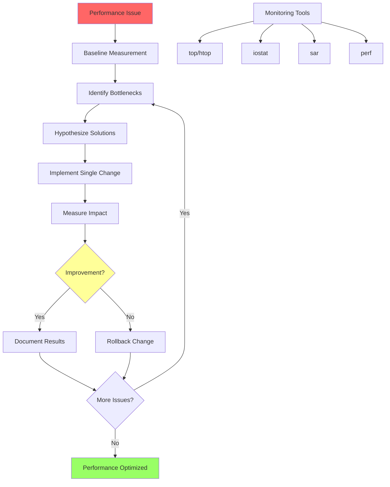

# Day 27: Linux Performance Tuning & Optimization

## Learning Objectives
By the end of this day, you will:
- Master performance monitoring and profiling tools
- Understand CPU, memory, I/O, and network optimization techniques
- Apply systematic performance tuning methodology
- Configure kernel parameters for optimal performance
- Implement production-ready performance monitoring

## Table of Contents
1. [Performance Tuning Fundamentals](#performance-tuning-fundamentals)
2. [CPU Performance Optimization](#cpu-performance-optimization)
3. [Memory Management Tuning](#memory-management-tuning)
4. [I/O and Filesystem Optimization](#io-and-filesystem-optimization)
5. [Network Performance Tuning](#network-performance-tuning)
6. [Kernel Parameter Optimization](#kernel-parameter-optimization)
7. [Performance Monitoring Strategy](#performance-monitoring-strategy)
8. [Exercises](#exercises)
9. [Solutions](#solutions)
10. [Interview Questions](#interview-questions)

---

## Performance Tuning Fundamentals

### Core Principles
- **Measure First**: Always establish baseline metrics before making changes
- **One Change at a Time**: Isolate variables to understand impact
- **Document Everything**: Track changes and their effects
- **Test Under Load**: Performance characteristics change under stress
- **Monitor Continuously**: Performance degrades over time

### Performance Tuning Methodology


### Key Performance Metrics
- **Throughput**: Operations per second
- **Latency**: Response time
- **Utilization**: Resource usage percentage
- **Saturation**: Queue depth and wait times
- **Errors**: Failed operations

---

## CPU Performance Optimization

### CPU Monitoring Tools
```bash
# Real-time CPU monitoring
top -d 1
htop

# Detailed CPU statistics
mpstat 1 10
pidstat -u 1 10
sar -u 1 10

# CPU performance counters
perf stat -a sleep 10
perf top
```

### CPU Affinity and Scheduling
```bash
# Check current CPU affinity
taskset -cp $$

# Set CPU affinity for process
taskset -cp 0,1 <pid>

# Start process with specific CPU affinity
taskset -c 0,1 ./cpu_intensive_app

# Check scheduling policy
chrt -p <pid>

# Set real-time scheduling
chrt -f -p 50 <pid>
```

### CPU Frequency Scaling
```bash
# Check current governor
cpupower frequency-info

# Available governors
cat /sys/devices/system/cpu/cpu0/cpufreq/scaling_available_governors

# Set performance governor
cpupower frequency-set -g performance

# Set specific frequency
cpupower frequency-set -f 2.4GHz
```

### CPU Optimization Techniques
- **Process Priority**: Use `nice` and `renice` for CPU scheduling priority
- **CPU Affinity**: Bind processes to specific CPU cores
- **Governor Selection**: Choose appropriate frequency scaling governor
- **Interrupt Balancing**: Distribute interrupts across CPUs

---

## Memory Management Tuning

### Memory Monitoring
```bash
# Memory usage overview
free -h
vmstat 1 10
sar -r 1 10

# Detailed memory information
cat /proc/meminfo
smem -t

# Memory pressure
cat /proc/pressure/memory
```

### Virtual Memory Tuning
```bash
# Check current swappiness
cat /proc/sys/vm/swappiness

# Set swappiness (0-100, lower = less swapping)
echo 10 > /proc/sys/vm/swappiness
sysctl vm.swappiness=10

# Memory overcommit settings
sysctl vm.overcommit_memory=1
sysctl vm.overcommit_ratio=80

# Dirty page writeback tuning
sysctl vm.dirty_ratio=15
sysctl vm.dirty_background_ratio=5
```

### Transparent Huge Pages (THP)
```bash
# Check THP status
cat /sys/kernel/mm/transparent_hugepage/enabled

# Disable THP (sometimes better for databases)
echo never > /sys/kernel/mm/transparent_hugepage/enabled

# Enable THP
echo always > /sys/kernel/mm/transparent_hugepage/enabled
```

### Memory Optimization Best Practices
- **Appropriate Swappiness**: Lower for servers, higher for desktops
- **THP Configuration**: Disable for databases, enable for general workloads
- **Memory Overcommit**: Configure based on workload characteristics
- **NUMA Awareness**: Consider NUMA topology for large systems

---

## I/O and Filesystem Optimization

### I/O Monitoring Tools
```bash
# I/O statistics
iostat -x 1 10
sar -d 1 10

# Process I/O
iotop
pidstat -d 1 10

# Block device tracing
blktrace /dev/sda
blkparse sda.blktrace.0
```

### I/O Scheduler Optimization
```bash
# Check current scheduler
cat /sys/block/sda/queue/scheduler

# Available schedulers
ls /sys/block/sda/queue/

# Set I/O scheduler
echo mq-deadline > /sys/block/sda/queue/scheduler

# Scheduler-specific tuning
echo 64 > /sys/block/sda/queue/iosched/read_expire
```

### Filesystem Mount Options
```bash
# Performance-oriented mount options
mount -o noatime,nodiratime,discard /dev/sda1 /mnt

# For SSDs
mount -o noatime,discard,commit=60 /dev/sda1 /mnt

# For databases
mount -o noatime,barrier=0,commit=100 /dev/sda1 /mnt
```

### Block Device Tuning
```bash
# Check readahead
blockdev --getra /dev/sda

# Set readahead (KB)
blockdev --setra 1024 /dev/sda

# Queue depth
echo 32 > /sys/block/sda/queue/nr_requests
```

---

## Network Performance Tuning

### Network Monitoring
```bash
# Network statistics
ss -s
sar -n DEV 1 10
sar -n TCP 1 10

# Interface statistics
ethtool -S eth0
ip -s link show eth0

# Network performance testing
iperf3 -s  # Server
iperf3 -c server_ip  # Client
```

### TCP/IP Stack Tuning
```bash
# TCP buffer sizes
sysctl net.core.rmem_max=134217728
sysctl net.core.wmem_max=134217728
sysctl net.ipv4.tcp_rmem="4096 87380 134217728"
sysctl net.ipv4.tcp_wmem="4096 65536 134217728"

# Connection handling
sysctl net.core.somaxconn=1024
sysctl net.core.netdev_max_backlog=4096
sysctl net.ipv4.tcp_max_syn_backlog=2048

# TCP optimization
sysctl net.ipv4.tcp_fin_timeout=15
sysctl net.ipv4.tcp_tw_reuse=1
sysctl net.ipv4.tcp_congestion_control=bbr
```

### Network Interface Optimization
```bash
# Check interface settings
ethtool eth0

# Enable/disable features
ethtool -K eth0 gso on
ethtool -K eth0 tso on
ethtool -K eth0 lro on

# Interrupt coalescing
ethtool -C eth0 rx-usecs 50

# Ring buffer sizes
ethtool -G eth0 rx 4096 tx 4096
```

---

## Kernel Parameter Optimization

### Sysctl Configuration
```bash
# View all parameters
sysctl -a | less

# Create tuning configuration
cat > /etc/sysctl.d/99-performance.conf << EOF
# Network performance
net.core.somaxconn = 1024
net.core.netdev_max_backlog = 4096
net.ipv4.tcp_fin_timeout = 15
net.ipv4.tcp_tw_reuse = 1

# Memory management
vm.swappiness = 10
vm.dirty_ratio = 15
vm.dirty_background_ratio = 5

# File system
fs.file-max = 1000000
fs.nr_open = 1000000
EOF

# Apply configuration
sysctl --system
```

### Process Limits
```bash
# Check current limits
ulimit -a

# Set limits in /etc/security/limits.conf
echo "* soft nofile 65536" >> /etc/security/limits.conf
echo "* hard nofile 65536" >> /etc/security/limits.conf
```

---

## Performance Monitoring Strategy

### Continuous Monitoring Setup
```bash
# System activity reporter
sar -A 1 > /var/log/system_performance.log &

# Custom monitoring script
cat > /usr/local/bin/perf_monitor.sh << 'EOF'
#!/bin/bash
while true; do
    echo "$(date): CPU=$(top -bn1 | grep "Cpu(s)" | awk '{print $2}' | cut -d'%' -f1)"
    echo "$(date): MEM=$(free | grep Mem | awk '{printf "%.1f", $3/$2 * 100.0}')"
    echo "$(date): LOAD=$(uptime | awk -F'load average:' '{print $2}')"
    sleep 60
done >> /var/log/custom_metrics.log
EOF
chmod +x /usr/local/bin/perf_monitor.sh
```

### Performance Baseline Collection
```bash
# Comprehensive baseline script
cat > baseline_collect.sh << 'EOF'
#!/bin/bash
BASELINE_DIR="/tmp/baseline_$(date +%Y%m%d_%H%M%S)"
mkdir -p $BASELINE_DIR

# System information
uname -a > $BASELINE_DIR/system_info.txt
lscpu > $BASELINE_DIR/cpu_info.txt
free -h > $BASELINE_DIR/memory_info.txt
lsblk > $BASELINE_DIR/disk_info.txt

# Performance data collection
sar -A 1 300 > $BASELINE_DIR/sar_5min.txt &
iostat -x 1 300 > $BASELINE_DIR/iostat_5min.txt &
vmstat 1 300 > $BASELINE_DIR/vmstat_5min.txt &

echo "Baseline collection started in $BASELINE_DIR"
echo "Collection will run for 5 minutes..."
wait
echo "Baseline collection completed"
EOF
chmod +x baseline_collect.sh
```

---

## Exercises

### Exercise 1: CPU Performance Analysis
**Objective**: Analyze and optimize CPU performance for a high-load scenario.

**Tasks**:
1. Create a CPU-intensive workload
2. Monitor CPU usage with multiple tools
3. Apply CPU affinity and priority tuning
4. Measure performance improvements

### Exercise 2: Memory Optimization
**Objective**: Tune memory management for optimal performance.

**Tasks**:
1. Create memory pressure scenario
2. Monitor memory usage and swapping
3. Tune swappiness and THP settings
4. Compare performance before and after

### Exercise 3: I/O Performance Tuning
**Objective**: Optimize disk I/O performance.

**Tasks**:
1. Run I/O benchmarks with `fio`
2. Test different I/O schedulers
3. Optimize readahead and mount options
4. Document performance improvements

### Exercise 4: Network Performance Optimization
**Objective**: Tune network stack for high throughput.

**Tasks**:
1. Establish network performance baseline
2. Tune TCP parameters
3. Optimize network interface settings
4. Validate improvements with `iperf3`

### Exercise 5: Comprehensive System Tuning
**Objective**: Apply holistic performance optimization.

**Tasks**:
1. Collect comprehensive baseline
2. Identify primary bottlenecks
3. Apply targeted optimizations
4. Validate overall performance improvement

---

## Solutions

### Solution 1: CPU Performance Analysis
```bash
# Create CPU workload
stress-ng --cpu 4 --timeout 300s &
WORKLOAD_PID=$!

# Monitor CPU usage
mpstat 1 10 > cpu_baseline.txt
top -p $WORKLOAD_PID -d 1 -n 10 > cpu_top.txt

# Apply CPU affinity
taskset -cp 0,1 $WORKLOAD_PID

# Set high priority
renice -10 $WORKLOAD_PID

# Monitor optimized performance
mpstat 1 10 > cpu_optimized.txt

# Compare results
echo "Baseline vs Optimized CPU usage:"
diff cpu_baseline.txt cpu_optimized.txt
```

### Solution 2: Memory Optimization
```bash
# Create memory pressure
stress-ng --vm 2 --vm-bytes 1G --timeout 300s &

# Monitor memory before tuning
vmstat 1 10 > memory_baseline.txt
free -h > memory_free_baseline.txt

# Apply memory tuning
sysctl vm.swappiness=5
sysctl vm.dirty_ratio=10
echo madvise > /sys/kernel/mm/transparent_hugepage/enabled

# Monitor after tuning
vmstat 1 10 > memory_optimized.txt
free -h > memory_free_optimized.txt

# Compare swap usage
echo "Swap usage comparison:"
grep "swap" memory_*baseline.txt memory_*optimized.txt
```

### Solution 3: I/O Performance Tuning
```bash
# Baseline I/O test
fio --name=baseline --rw=randread --bs=4k --size=1G --numjobs=4 \
    --runtime=60 --group_reporting > fio_baseline.txt

# Check current scheduler
cat /sys/block/sda/queue/scheduler

# Test different scheduler
echo mq-deadline > /sys/block/sda/queue/scheduler

# Optimize readahead
blockdev --setra 2048 /dev/sda

# Optimized I/O test
fio --name=optimized --rw=randread --bs=4k --size=1G --numjobs=4 \
    --runtime=60 --group_reporting > fio_optimized.txt

# Compare IOPS
echo "IOPS Comparison:"
grep "IOPS" fio_baseline.txt fio_optimized.txt
```

### Solution 4: Network Performance Optimization
```bash
# Baseline network test (run on server)
iperf3 -s -p 5001 &

# Client baseline test
iperf3 -c server_ip -p 5001 -t 30 > network_baseline.txt

# Apply network tuning
sysctl net.core.somaxconn=2048
sysctl net.core.netdev_max_backlog=8192
sysctl net.ipv4.tcp_rmem="4096 131072 268435456"
sysctl net.ipv4.tcp_wmem="4096 131072 268435456"

# Optimized network test
iperf3 -c server_ip -p 5001 -t 30 > network_optimized.txt

# Compare throughput
echo "Throughput Comparison:"
grep "Mbits/sec" network_baseline.txt network_optimized.txt
```

### Solution 5: Comprehensive System Tuning
```bash
# Comprehensive baseline collection
./baseline_collect.sh

# Apply comprehensive tuning
cat > /etc/sysctl.d/99-performance-tuning.conf << EOF
# CPU and scheduling
kernel.sched_migration_cost_ns = 5000000

# Memory management
vm.swappiness = 10
vm.dirty_ratio = 15
vm.dirty_background_ratio = 5
vm.overcommit_memory = 1

# Network performance
net.core.somaxconn = 2048
net.core.netdev_max_backlog = 8192
net.ipv4.tcp_fin_timeout = 15
net.ipv4.tcp_tw_reuse = 1

# File system
fs.file-max = 2097152
EOF

# Apply settings
sysctl --system

# I/O scheduler optimization
echo mq-deadline > /sys/block/sda/queue/scheduler
blockdev --setra 2048 /dev/sda

# Collect post-optimization baseline
./baseline_collect.sh

# Generate performance report
echo "System optimization completed. Compare baseline directories."
```

---

## Interview Questions

### Basic Level

1. **Q**: What is the difference between throughput and latency in performance tuning?
   **A**: Throughput measures the number of operations completed per unit time (ops/sec), while latency measures the time taken to complete a single operation. High throughput doesn't guarantee low latency.

2. **Q**: How do you identify I/O bottlenecks on a Linux system?
   **A**: Use `iostat -x` to check %util (utilization), await (average wait time), and svctm (service time). High %util (>80%) and await times indicate I/O bottlenecks.

3. **Q**: What is swappiness and how does it affect system performance?
   **A**: Swappiness (0-100) controls how aggressively the kernel swaps memory pages to disk. Lower values (10-20) prefer keeping data in RAM, higher values (60+) swap more aggressively. For servers, lower swappiness typically improves performance.

4. **Q**: Explain the purpose of CPU affinity in performance tuning.
   **A**: CPU affinity binds processes to specific CPU cores, improving cache locality and reducing context switching overhead. It's useful for CPU-intensive applications and interrupt handling optimization.

### Intermediate Level

5. **Q**: How do you tune TCP parameters for high-throughput applications?
   **A**: Key parameters include increasing buffer sizes (tcp_rmem/tcp_wmem), connection queues (somaxconn, netdev_max_backlog), and enabling features like tcp_tw_reuse. Also consider congestion control algorithms like BBR.

6. **Q**: What are the trade-offs of disabling Transparent Huge Pages (THP)?
   **A**: Disabling THP reduces memory fragmentation and latency spikes (good for databases) but may increase TLB misses and memory overhead for applications that benefit from large pages.

7. **Q**: How do you choose the appropriate I/O scheduler for different workloads?
   **A**: 
   - `mq-deadline`: Good for general server workloads
   - `none`: Best for NVMe SSDs with low latency
   - `bfq`: Better for desktop/interactive workloads
   - Consider workload characteristics (random vs sequential, read vs write)

8. **Q**: Describe the methodology for systematic performance tuning.
   **A**: 1) Establish baseline measurements, 2) Identify bottlenecks using monitoring tools, 3) Hypothesize solutions, 4) Change one parameter at a time, 5) Measure impact, 6) Document results, 7) Iterate or rollback.

### Advanced Level

9. **Q**: How do you optimize performance for NUMA systems?
   **A**: Use `numactl` to bind processes to specific NUMA nodes, configure memory allocation policies, monitor cross-node memory access with `numastat`, and consider application-level NUMA awareness.

10. **Q**: Explain the relationship between dirty page writeback and system performance.
    **A**: Dirty pages are modified memory pages not yet written to disk. Parameters like `dirty_ratio` and `dirty_background_ratio` control when writeback occurs. Tuning these prevents memory pressure and I/O spikes.

11. **Q**: How do you troubleshoot performance issues in containerized environments?
    **A**: Monitor cgroup limits, check for CPU throttling, analyze container-specific metrics, consider host-level resource contention, and use tools like `docker stats` and `systemd-cgtop`.

12. **Q**: What kernel parameters would you tune for a high-frequency trading application?
    **A**: Disable power management, set performance governor, tune network stack for low latency, disable THP, set real-time scheduling, optimize interrupt handling, and consider kernel bypass technologies.

### Expert Level

13. **Q**: How do you implement performance monitoring for microservices architecture?
    **A**: Use distributed tracing, implement SLI/SLO monitoring, deploy service mesh observability, monitor resource usage per service, implement circuit breakers, and use tools like Prometheus/Grafana.

14. **Q**: Describe advanced techniques for optimizing database server performance.
    **A**: Tune I/O scheduler and filesystem (ext4 vs XFS), optimize memory allocation, configure NUMA policies, tune network stack, implement connection pooling, and consider storage-specific optimizations (NVMe, RAID).

15. **Q**: How do you handle performance optimization in cloud environments?
    **A**: Understand instance types and limitations, optimize for cloud-specific features (enhanced networking, placement groups), monitor cloud-specific metrics, implement auto-scaling based on performance metrics, and consider multi-region optimization.

---

## Troubleshooting Guide

### Common Performance Issues

1. **High CPU Usage**
   - Check with `top`, `htop`, `mpstat`
   - Identify CPU-bound processes
   - Consider CPU affinity and priority tuning
   - Check for inefficient algorithms or infinite loops

2. **Memory Pressure**
   - Monitor with `free`, `vmstat`, `sar -r`
   - Check swap usage and swappiness
   - Identify memory leaks with `valgrind` or `smem`
   - Tune memory overcommit settings

3. **I/O Bottlenecks**
   - Use `iostat`, `iotop`, `blktrace`
   - Check disk utilization and queue depths
   - Optimize I/O scheduler and readahead
   - Consider storage upgrade or RAID configuration

4. **Network Performance Issues**
   - Monitor with `ss`, `netstat`, `sar -n`
   - Check for packet drops and errors
   - Tune TCP/IP stack parameters
   - Optimize network interface settings

---

## Community and Support

- **Discord Community**: [Join our Discord](https://discord.gg/linux-learning) for real-time discussions and performance tuning tips
- **Google Group**: [Linux Performance Tuning Group](https://groups.google.com/g/linux-performance-tuning) for detailed technical discussions
- **YouTube Channel**: [Linux Performance Tutorials](https://youtube.com/c/linux-performance) for video guides and demonstrations
- **Performance Tools**: Share your custom monitoring scripts and tools with the community

---

## Completion Checklist

- [ ] Understand performance tuning methodology
- [ ] Master CPU monitoring and optimization tools
- [ ] Configure memory management parameters
- [ ] Optimize I/O performance and schedulers
- [ ] Tune network stack for high performance
- [ ] Implement kernel parameter optimization
- [ ] Set up continuous performance monitoring
- [ ] Complete all practical exercises
- [ ] Practice troubleshooting performance issues
- [ ] Review and answer all interview questions
- [ ] Join community discussions on performance optimization

---

**Next**: [Day 28 - Linux Containers & Namespaces Internals](../Day_28/notes_and_exercises.md)

