# Day 29: Advanced Monitoring & Observability

## Learning Objectives
By the end of this day, you will:
- Master the three pillars of observability: logs, metrics, and traces
- Implement comprehensive Linux system monitoring
- Use advanced profiling and tracing tools
- Set up observability pipelines for production systems
- Troubleshoot performance issues using observability data

## Table of Contents
1. [Observability Fundamentals](#observability-fundamentals)
2. [Advanced Log Management](#advanced-log-management)
3. [System Metrics Collection](#system-metrics-collection)
4. [Application Performance Monitoring](#application-performance-monitoring)
5. [Distributed Tracing](#distributed-tracing)
6. [eBPF and Advanced Tracing](#ebpf-and-advanced-tracing)
7. [Observability Stack Setup](#observability-stack-setup)
8. [Exercises](#exercises)
9. [Solutions](#solutions)
10. [Interview Questions](#interview-questions)

---

## Observability Fundamentals

### Three Pillars of Observability

```mermaid
flowchart TD
    A[Observability] --> B[Logs]
    A --> C[Metrics]
    A --> D[Traces]
    
    B --> B1[Discrete Events<br/>Timestamped]
    B --> B2[Contextual Info<br/>System state]
    B --> B3[Debugging<br/>Audit trails]
    B --> B4[Structured/Unstructured<br/>JSON vs text]
    
    C --> C1[Numerical Data<br/>Time series]
    C --> C2[Aggregatable<br/>Statistics]
    C --> C3[Alerting<br/>Thresholds]
    C --> C4[Types<br/>Counter, Gauge, Histogram]
    
    D --> D1[Request Flow<br/>Distributed systems]
    D --> D2[Performance<br/>Bottlenecks]
    D --> D3[Dependencies<br/>Service mapping]
    D --> D4[End-to-end<br/>Request lifecycle]
    
    E[Observability Stack] --> E1[Collection<br/>Agents, exporters]
    E --> E2[Storage<br/>Time series, logs]
    E --> E3[Analysis<br/>Queries, dashboards]
    E --> E4[Alerting<br/>Notifications]
    
    F[Tools] --> F1[Prometheus + Grafana]
    F --> F2[ELK Stack]
    F --> F3[Jaeger/Zipkin]
    F --> F4[OpenTelemetry]
    
    style A fill:#f96
    style E fill:#9f6
    style F fill:#69f
```



#### 1. Logs
- **Discrete events** with timestamps
- **Contextual information** about system state
- **Debugging** and audit trails
- **Structured** (JSON) vs unstructured text

#### 2. Metrics
- **Numerical measurements** over time
- **Aggregatable** data points
- **Alerting** and trend analysis
- **Counter, Gauge, Histogram, Summary** types

#### 3. Traces
- **Request flow** through distributed systems
- **Performance bottlenecks** identification
- **Service dependencies** mapping
- **End-to-end** request lifecycle

### Observability vs Monitoring
```
Monitoring (Known Unknowns):
- Predefined dashboards
- Static thresholds
- Known failure modes
- Reactive approach

Observability (Unknown Unknowns):
- Ad-hoc queries
- Dynamic exploration
- Novel failure modes
- Proactive investigation
```

### Linux Observability Tools Landscape
```
┌─────────────────┬─────────────────┬─────────────────┐
│      Logs       │     Metrics     │     Traces      │
├─────────────────┼─────────────────┼─────────────────┤
│ journalctl      │ sar, vmstat     │ strace, ltrace  │
│ rsyslog         │ iostat, mpstat  │ perf            │
│ logrotate       │ pidstat         │ ftrace          │
│ dmesg           │ netstat, ss     │ eBPF/bpftrace   │
│ audit logs      │ /proc, /sys     │ SystemTap       │
└─────────────────┴─────────────────┴─────────────────┘
```

---

## Advanced Log Management

### systemd Journal Deep Dive
```bash
# Advanced journalctl usage
journalctl -xe                    # Recent entries with explanations
journalctl -u nginx -f            # Follow specific service
journalctl -p err                 # Error priority and above
journalctl --since "2 hours ago"  # Time-based filtering
journalctl -k                     # Kernel messages only
journalctl --disk-usage           # Journal disk usage

# Structured logging
journalctl -o json-pretty         # JSON output format
journalctl -F _SYSTEMD_UNIT       # List all units
journalctl _PID=1234              # Filter by PID

# Performance and storage
journalctl --vacuum-time=7d       # Keep only 7 days
journalctl --vacuum-size=1G       # Limit to 1GB
```

### Advanced rsyslog Configuration
```bash
# /etc/rsyslog.d/50-custom.conf
# High-performance logging setup

# Load modules
module(load="imfile")
module(load="omkafka")
module(load="omelasticsearch")

# Input from application logs
input(type="imfile"
      file="/var/log/app/*.log"
      tag="app"
      ruleset="app_processing")

# Structured logging template
template(name="json_template" type="list") {
    constant(value="{")
    constant(value="\"timestamp\":\"")
    property(name="timereported" dateFormat="rfc3339")
    constant(value="\",\"host\":\"")
    property(name="hostname")
    constant(value="\",\"severity\":\"")
    property(name="syslogseverity-text")
    constant(value="\",\"message\":\"")
    property(name="msg" format="json")
    constant(value="\"}\n")
}

# Ruleset for application processing
ruleset(name="app_processing") {
    # Parse JSON logs
    if ($msg contains "{") then {
        action(type="omelasticsearch"
               server="localhost"
               serverport="9200"
               template="json_template")
    }
    
    # High-priority alerts to Kafka
    if ($syslogseverity <= 3) then {
        action(type="omkafka"
               broker="localhost:9092"
               topic="alerts")
    }
}
```

### Log Rotation and Archival
```bash
# Advanced logrotate configuration
cat > /etc/logrotate.d/application << 'EOF'
/var/log/app/*.log {
    daily
    rotate 30
    compress
    delaycompress
    missingok
    notifempty
    create 0644 app app
    postrotate
        systemctl reload rsyslog
    endscript
    
    # Size-based rotation
    size 100M
    
    # Custom compression
    compresscmd /usr/bin/xz
    compressext .xz
    
    # Archive old logs
    lastaction
        find /var/log/app -name "*.xz" -mtime +90 -exec mv {} /archive/logs/ \;
    endscript
}
EOF
```

### Centralized Logging Pipeline
```bash
# Fluentd configuration for log aggregation
cat > /etc/fluent/fluent.conf << 'EOF'
<source>
  @type tail
  path /var/log/app/*.log
  pos_file /var/log/fluentd/app.log.pos
  tag app.logs
  format json
  time_key timestamp
  time_format %Y-%m-%dT%H:%M:%S.%L%z
</source>

<filter app.logs>
  @type record_transformer
  <record>
    hostname "#{Socket.gethostname}"
    environment "#{ENV['ENVIRONMENT']}"
  </record>
</filter>

<match app.logs>
  @type elasticsearch
  host elasticsearch.local
  port 9200
  index_name app-logs
  type_name _doc
  
  <buffer>
    @type file
    path /var/log/fluentd/buffer
    flush_mode interval
    flush_interval 10s
    chunk_limit_size 8MB
  </buffer>
</match>
EOF
```

---

## System Metrics Collection

### Advanced sar Usage
```bash
# Comprehensive system monitoring
sar -A 1 > system_metrics.log &    # All metrics every second

# Specific metric collection
sar -u 1 60    # CPU utilization for 1 minute
sar -r 1 60    # Memory usage
sar -d 1 60    # Disk I/O
sar -n DEV 1 60    # Network device statistics
sar -n TCP 1 60    # TCP statistics
sar -q 1 60    # Load average and run queue

# Historical data analysis
sar -u -f /var/log/sysstat/sa$(date +%d)    # CPU from daily file
sar -r -s 09:00:00 -e 17:00:00              # Memory during work hours

# Generate reports
sadf -d /var/log/sysstat/sa$(date +%d) > metrics.csv    # CSV format
sadf -j /var/log/sysstat/sa$(date +%d) > metrics.json   # JSON format
```

### Custom Metrics Collection
```bash
# System metrics collector script
cat > /usr/local/bin/collect_metrics.sh << 'EOF'
#!/bin/bash

METRICS_DIR="/var/lib/metrics"
mkdir -p $METRICS_DIR

while true; do
    TIMESTAMP=$(date +%s)
    
    # CPU metrics
    CPU_USAGE=$(top -bn1 | grep "Cpu(s)" | awk '{print $2}' | cut -d'%' -f1)
    echo "cpu.usage $CPU_USAGE $TIMESTAMP" >> $METRICS_DIR/cpu.metrics
    
    # Memory metrics
    MEM_TOTAL=$(free -b | grep Mem | awk '{print $2}')
    MEM_USED=$(free -b | grep Mem | awk '{print $3}')
    MEM_PERCENT=$(echo "scale=2; $MEM_USED * 100 / $MEM_TOTAL" | bc)
    echo "memory.usage_percent $MEM_PERCENT $TIMESTAMP" >> $METRICS_DIR/memory.metrics
    
    # Disk I/O metrics
    DISK_READS=$(iostat -d 1 2 | tail -n +4 | awk '{sum+=$4} END {print sum}')
    DISK_WRITES=$(iostat -d 1 2 | tail -n +4 | awk '{sum+=$5} END {print sum}')
    echo "disk.reads_per_sec $DISK_READS $TIMESTAMP" >> $METRICS_DIR/disk.metrics
    echo "disk.writes_per_sec $DISK_WRITES $TIMESTAMP" >> $METRICS_DIR/disk.metrics
    
    # Network metrics
    RX_BYTES=$(cat /proc/net/dev | grep eth0 | awk '{print $2}')
    TX_BYTES=$(cat /proc/net/dev | grep eth0 | awk '{print $10}')
    echo "network.rx_bytes $RX_BYTES $TIMESTAMP" >> $METRICS_DIR/network.metrics
    echo "network.tx_bytes $TX_BYTES $TIMESTAMP" >> $METRICS_DIR/network.metrics
    
    sleep 10
done
EOF

chmod +x /usr/local/bin/collect_metrics.sh
```

### Prometheus Node Exporter Setup
```bash
# Install and configure node_exporter
wget https://github.com/prometheus/node_exporter/releases/download/v1.6.1/node_exporter-1.6.1.linux-amd64.tar.gz
tar xzf node_exporter-1.6.1.linux-amd64.tar.gz
sudo cp node_exporter-1.6.1.linux-amd64/node_exporter /usr/local/bin/

# Create systemd service
sudo tee /etc/systemd/system/node_exporter.service << 'EOF'
[Unit]
Description=Node Exporter
After=network.target

[Service]
Type=simple
User=node_exporter
Group=node_exporter
ExecStart=/usr/local/bin/node_exporter \
    --collector.systemd \
    --collector.processes \
    --collector.interrupts \
    --web.listen-address=:9100
Restart=always
RestartSec=3

[Install]
WantedBy=multi-user.target
EOF

# Create user and start service
sudo useradd -r -s /bin/false node_exporter
sudo systemctl daemon-reload
sudo systemctl enable --now node_exporter

# Verify metrics
curl http://localhost:9100/metrics | head -20
```

---

## Application Performance Monitoring

### Process-Level Monitoring
```bash
# Detailed process monitoring
pidstat -u -r -d -s 1 10    # CPU, memory, I/O, context switches
pidstat -t 1 10             # Per-thread statistics
pidstat -w 1 10             # Task switching activity

# Process tree analysis
pstree -p                   # Process tree with PIDs
ps -eo pid,ppid,cmd,pcpu,pmem,etime --sort=-pcpu | head -20

# File descriptor usage
lsof -p <pid>               # Files opened by process
ls -la /proc/<pid>/fd/      # File descriptors
cat /proc/<pid>/limits      # Process limits
```

### Application Tracing
```bash
# System call tracing
strace -c -p <pid>          # System call summary
strace -e trace=network -p <pid>    # Network calls only
strace -e trace=file -p <pid>       # File operations only
strace -f -p <pid>          # Follow forks
strace -T -p <pid>          # Show time spent in syscalls

# Library call tracing
ltrace -c -p <pid>          # Library call summary
ltrace -e malloc,free -p <pid>      # Memory allocation calls

# Advanced strace filtering
strace -e trace=!clock_gettime,gettimeofday -p <pid>    # Exclude noisy calls
strace -o trace.log -p <pid>        # Output to file
```

### Performance Profiling with perf
```bash
# CPU profiling
perf top                    # Real-time CPU profiling
perf top -p <pid>           # Profile specific process
perf record -g -p <pid>     # Record with call graphs
perf report                 # Analyze recorded data

# Advanced perf usage
perf record -F 99 -g -p <pid> sleep 30    # Sample at 99Hz for 30 seconds
perf record -e cycles,instructions -p <pid>    # Specific events
perf stat -p <pid>          # Performance counters

# Flame graph generation
perf record -F 99 -g -p <pid> sleep 30
perf script | stackcollapse-perf.pl | flamegraph.pl > flamegraph.svg

# Memory profiling
perf record -e cache-misses -p <pid>
perf record -e page-faults -p <pid>
```

---

## Distributed Tracing

### OpenTelemetry Setup
```bash
# Install OpenTelemetry collector
wget https://github.com/open-telemetry/opentelemetry-collector-releases/releases/download/v0.88.0/otelcol_0.88.0_linux_amd64.tar.gz
tar xzf otelcol_0.88.0_linux_amd64.tar.gz
sudo cp otelcol /usr/local/bin/

# Configuration file
cat > otel-collector.yaml << 'EOF'
receivers:
  otlp:
    protocols:
      grpc:
        endpoint: 0.0.0.0:4317
      http:
        endpoint: 0.0.0.0:4318
  
  jaeger:
    protocols:
      grpc:
        endpoint: 0.0.0.0:14250
      thrift_http:
        endpoint: 0.0.0.0:14268

processors:
  batch:
    timeout: 1s
    send_batch_size: 1024
  
  memory_limiter:
    limit_mib: 512

exporters:
  jaeger:
    endpoint: jaeger:14250
    tls:
      insecure: true
  
  prometheus:
    endpoint: "0.0.0.0:8889"

service:
  pipelines:
    traces:
      receivers: [otlp, jaeger]
      processors: [memory_limiter, batch]
      exporters: [jaeger]
    
    metrics:
      receivers: [otlp]
      processors: [memory_limiter, batch]
      exporters: [prometheus]
EOF

# Start collector
otelcol --config-file otel-collector.yaml
```

### Application Instrumentation
```python
# Python application with OpenTelemetry
from opentelemetry import trace
from opentelemetry.exporter.jaeger.thrift import JaegerExporter
from opentelemetry.sdk.trace import TracerProvider
from opentelemetry.sdk.trace.export import BatchSpanProcessor
from opentelemetry.instrumentation.requests import RequestsInstrumentor
from opentelemetry.instrumentation.flask import FlaskInstrumentor

# Configure tracing
trace.set_tracer_provider(TracerProvider())
tracer = trace.get_tracer(__name__)

# Configure Jaeger exporter
jaeger_exporter = JaegerExporter(
    agent_host_name="localhost",
    agent_port=6831,
)

span_processor = BatchSpanProcessor(jaeger_exporter)
trace.get_tracer_provider().add_span_processor(span_processor)

# Auto-instrument libraries
RequestsInstrumentor().instrument()
FlaskInstrumentor().instrument_app(app)

# Manual instrumentation
@app.route('/api/data')
def get_data():
    with tracer.start_as_current_span("get_data") as span:
        span.set_attribute("user.id", user_id)
        
        with tracer.start_as_current_span("database_query") as db_span:
            db_span.set_attribute("db.statement", "SELECT * FROM users")
            result = database.query("SELECT * FROM users")
        
        return result
```

---

## eBPF and Advanced Tracing

### bpftrace Basics
```bash
# Install bpftrace
sudo apt install bpftrace    # Ubuntu/Debian
sudo yum install bpftrace    # RHEL/CentOS

# List available probes
bpftrace -l 'tracepoint:syscalls:*' | head -10
bpftrace -l 'kprobe:*tcp*' | head -10

# Basic tracing examples
bpftrace -e 'tracepoint:syscalls:sys_enter_openat { printf("%s %s\n", comm, str(args->filename)); }'
bpftrace -e 'kprobe:do_sys_open { printf("%s opened file\n", comm); }'
```

### Advanced eBPF Programs
```bash
# Network connection tracking
cat > tcp_connections.bt << 'EOF'
#!/usr/bin/env bpftrace

kprobe:tcp_v4_connect
{
    $sk = (struct sock *)arg0;
    $inet = (struct inet_sock *)$sk;
    
    printf("TCP connect: %s -> %s:%d\n",
           comm,
           ntop(AF_INET, $inet->inet_daddr),
           $inet->inet_dport);
}

kprobe:tcp_close
{
    $sk = (struct sock *)arg0;
    printf("TCP close: %s\n", comm);
}
EOF

chmod +x tcp_connections.bt
sudo ./tcp_connections.bt
```

```bash
# File I/O latency tracking
cat > file_io_latency.bt << 'EOF'
#!/usr/bin/env bpftrace

kprobe:vfs_read,
kprobe:vfs_write
{
    @start[tid] = nsecs;
}

kretprobe:vfs_read,
kretprobe:vfs_write
{
    $duration = nsecs - @start[tid];
    delete(@start[tid]);
    
    @latency_us = hist($duration / 1000);
    
    if ($duration > 10000000) {  // > 10ms
        printf("Slow I/O: %s %d us\n", comm, $duration / 1000);
    }
}
EOF

chmod +x file_io_latency.bt
sudo ./file_io_latency.bt
```

### BCC Tools
```bash
# Install BCC tools
sudo apt install bpfcc-tools    # Ubuntu/Debian

# Common BCC tools
execsnoop           # Trace process execution
opensnoop           # Trace file opens
biolatency          # Block I/O latency
tcpconnect          # Trace TCP connections
tcpretrans          # Trace TCP retransmissions
runqlat             # Run queue latency
cpudist             # CPU usage distribution

# Example usage
sudo execsnoop -t   # Trace with timestamps
sudo opensnoop -p $(pgrep nginx)    # Trace specific process
sudo biolatency 1 10    # I/O latency for 10 seconds
```

---

## Observability Stack Setup

### Prometheus + Grafana Stack
```bash
# Docker Compose for observability stack
cat > docker-compose.yml << 'EOF'
version: '3.8'

services:
  prometheus:
    image: prom/prometheus:latest
    ports:
      - "9090:9090"
    volumes:
      - ./prometheus.yml:/etc/prometheus/prometheus.yml
      - prometheus_data:/prometheus
    command:
      - '--config.file=/etc/prometheus/prometheus.yml'
      - '--storage.tsdb.path=/prometheus'
      - '--web.console.libraries=/etc/prometheus/console_libraries'
      - '--web.console.templates=/etc/prometheus/consoles'
      - '--storage.tsdb.retention.time=200h'
      - '--web.enable-lifecycle'

  grafana:
    image: grafana/grafana:latest
    ports:
      - "3000:3000"
    environment:
      - GF_SECURITY_ADMIN_PASSWORD=admin
    volumes:
      - grafana_data:/var/lib/grafana
      - ./grafana/provisioning:/etc/grafana/provisioning

  node_exporter:
    image: prom/node-exporter:latest
    ports:
      - "9100:9100"
    volumes:
      - /proc:/host/proc:ro
      - /sys:/host/sys:ro
      - /:/rootfs:ro
    command:
      - '--path.procfs=/host/proc'
      - '--path.rootfs=/rootfs'
      - '--path.sysfs=/host/sys'
      - '--collector.filesystem.mount-points-exclude=^/(sys|proc|dev|host|etc)($$|/)'

  jaeger:
    image: jaegertracing/all-in-one:latest
    ports:
      - "16686:16686"
      - "14268:14268"
    environment:
      - COLLECTOR_OTLP_ENABLED=true

volumes:
  prometheus_data:
  grafana_data:
EOF

# Prometheus configuration
cat > prometheus.yml << 'EOF'
global:
  scrape_interval: 15s
  evaluation_interval: 15s

scrape_configs:
  - job_name: 'prometheus'
    static_configs:
      - targets: ['localhost:9090']

  - job_name: 'node_exporter'
    static_configs:
      - targets: ['node_exporter:9100']

  - job_name: 'application'
    static_configs:
      - targets: ['host.docker.internal:8080']
    metrics_path: /metrics
    scrape_interval: 5s
EOF

# Start the stack
docker-compose up -d
```

### ELK Stack Setup
```bash
# Elasticsearch, Logstash, Kibana setup
cat > elk-compose.yml << 'EOF'
version: '3.8'

services:
  elasticsearch:
    image: docker.elastic.co/elasticsearch/elasticsearch:8.10.0
    environment:
      - discovery.type=single-node
      - xpack.security.enabled=false
      - "ES_JAVA_OPTS=-Xms512m -Xmx512m"
    ports:
      - "9200:9200"
    volumes:
      - elasticsearch_data:/usr/share/elasticsearch/data

  logstash:
    image: docker.elastic.co/logstash/logstash:8.10.0
    ports:
      - "5044:5044"
      - "9600:9600"
    volumes:
      - ./logstash/pipeline:/usr/share/logstash/pipeline
      - ./logstash/config:/usr/share/logstash/config
    depends_on:
      - elasticsearch

  kibana:
    image: docker.elastic.co/kibana/kibana:8.10.0
    ports:
      - "5601:5601"
    environment:
      - ELASTICSEARCH_HOSTS=http://elasticsearch:9200
    depends_on:
      - elasticsearch

  filebeat:
    image: docker.elastic.co/beats/filebeat:8.10.0
    user: root
    volumes:
      - ./filebeat/filebeat.yml:/usr/share/filebeat/filebeat.yml:ro
      - /var/log:/var/log:ro
      - /var/lib/docker/containers:/var/lib/docker/containers:ro
      - /var/run/docker.sock:/var/run/docker.sock:ro
    depends_on:
      - logstash

volumes:
  elasticsearch_data:
EOF

# Logstash pipeline configuration
mkdir -p logstash/pipeline
cat > logstash/pipeline/logstash.conf << 'EOF'
input {
  beats {
    port => 5044
  }
}

filter {
  if [fields][log_type] == "application" {
    json {
      source => "message"
    }
    
    date {
      match => [ "timestamp", "ISO8601" ]
    }
    
    mutate {
      remove_field => [ "message" ]
    }
  }
}

output {
  elasticsearch {
    hosts => ["elasticsearch:9200"]
    index => "%{[@metadata][beat]}-%{[@metadata][version]}-%{+YYYY.MM.dd}"
  }
}
EOF

# Start ELK stack
docker-compose -f elk-compose.yml up -d
```

---

## Exercises

### Exercise 1: Comprehensive Log Analysis
**Objective**: Set up advanced log collection and analysis pipeline.

**Tasks**:
1. Configure structured logging for a web application
2. Set up log rotation and archival
3. Implement log parsing and enrichment
4. Create log-based alerts and dashboards

### Exercise 2: System Metrics Dashboard
**Objective**: Build comprehensive system monitoring.

**Tasks**:
1. Deploy Prometheus and Grafana
2. Configure node_exporter with custom metrics
3. Create system performance dashboards
4. Set up alerting rules

### Exercise 3: Application Performance Profiling
**Objective**: Profile and optimize application performance.

**Tasks**:
1. Use perf to identify CPU bottlenecks
2. Generate flame graphs
3. Trace system calls with strace
4. Analyze memory usage patterns

### Exercise 4: Distributed Tracing Implementation
**Objective**: Implement end-to-end request tracing.

**Tasks**:
1. Set up OpenTelemetry collector
2. Instrument a multi-service application
3. Deploy Jaeger for trace visualization
4. Analyze service dependencies and latencies

### Exercise 5: eBPF Monitoring Tools
**Objective**: Create custom monitoring with eBPF.

**Tasks**:
1. Write bpftrace scripts for network monitoring
2. Track file I/O latency with eBPF
3. Monitor process creation and termination
4. Create custom performance dashboards

---

## Solutions

### Solution 1: Comprehensive Log Analysis
```bash
# Application with structured logging
cat > app_with_logging.py << 'EOF'
import json
import logging
import time
from datetime import datetime

# Configure structured logging
class JSONFormatter(logging.Formatter):
    def format(self, record):
        log_entry = {
            'timestamp': datetime.utcnow().isoformat(),
            'level': record.levelname,
            'logger': record.name,
            'message': record.getMessage(),
            'module': record.module,
            'function': record.funcName,
            'line': record.lineno
        }
        
        if hasattr(record, 'user_id'):
            log_entry['user_id'] = record.user_id
        if hasattr(record, 'request_id'):
            log_entry['request_id'] = record.request_id
            
        return json.dumps(log_entry)

# Setup logger
logger = logging.getLogger('myapp')
logger.setLevel(logging.INFO)

handler = logging.FileHandler('/var/log/app/application.log')
handler.setFormatter(JSONFormatter())
logger.addHandler(handler)

# Application code with logging
def process_request(user_id, request_id):
    logger.info('Processing request', extra={'user_id': user_id, 'request_id': request_id})
    
    try:
        # Simulate processing
        time.sleep(0.1)
        logger.info('Request processed successfully', extra={'user_id': user_id, 'request_id': request_id})
    except Exception as e:
        logger.error('Request processing failed', extra={'user_id': user_id, 'request_id': request_id, 'error': str(e)})

if __name__ == '__main__':
    for i in range(100):
        process_request(f'user_{i}', f'req_{i}')
EOF

# Log parsing with Logstash
cat > logstash_app.conf << 'EOF'
input {
  file {
    path => "/var/log/app/application.log"
    start_position => "beginning"
    codec => "json"
  }
}

filter {
  # Parse timestamp
  date {
    match => [ "timestamp", "ISO8601" ]
  }
  
  # Add hostname
  mutate {
    add_field => { "hostname" => "%{host}" }
  }
  
  # Classify log levels
  if [level] == "ERROR" {
    mutate {
      add_tag => [ "error", "alert" ]
    }
  }
}

output {
  elasticsearch {
    hosts => ["localhost:9200"]
    index => "application-logs-%{+YYYY.MM.dd}"
  }
}
EOF
```

### Solution 2: System Metrics Dashboard
```bash
# Custom metrics exporter
cat > custom_exporter.py << 'EOF'
#!/usr/bin/env python3
import time
import psutil
from prometheus_client import start_http_server, Gauge, Counter

# Define metrics
cpu_usage = Gauge('system_cpu_usage_percent', 'CPU usage percentage')
memory_usage = Gauge('system_memory_usage_percent', 'Memory usage percentage')
disk_io_read = Counter('system_disk_read_bytes_total', 'Total disk read bytes')
disk_io_write = Counter('system_disk_write_bytes_total', 'Total disk write bytes')
network_rx = Counter('system_network_rx_bytes_total', 'Total network receive bytes')
network_tx = Counter('system_network_tx_bytes_total', 'Total network transmit bytes')

def collect_metrics():
    while True:
        # CPU usage
        cpu_usage.set(psutil.cpu_percent())
        
        # Memory usage
        memory = psutil.virtual_memory()
        memory_usage.set(memory.percent)
        
        # Disk I/O
        disk_io = psutil.disk_io_counters()
        disk_io_read._value._value = disk_io.read_bytes
        disk_io_write._value._value = disk_io.write_bytes
        
        # Network I/O
        network_io = psutil.net_io_counters()
        network_rx._value._value = network_io.bytes_recv
        network_tx._value._value = network_io.bytes_sent
        
        time.sleep(10)

if __name__ == '__main__':
    start_http_server(8000)
    collect_metrics()
EOF

chmod +x custom_exporter.py

# Grafana dashboard JSON
cat > system_dashboard.json << 'EOF'
{
  "dashboard": {
    "title": "System Metrics",
    "panels": [
      {
        "title": "CPU Usage",
        "type": "stat",
        "targets": [
          {
            "expr": "system_cpu_usage_percent",
            "legendFormat": "CPU %"
          }
        ]
      },
      {
        "title": "Memory Usage",
        "type": "stat",
        "targets": [
          {
            "expr": "system_memory_usage_percent",
            "legendFormat": "Memory %"
          }
        ]
      },
      {
        "title": "Disk I/O",
        "type": "graph",
        "targets": [
          {
            "expr": "rate(system_disk_read_bytes_total[5m])",
            "legendFormat": "Read"
          },
          {
            "expr": "rate(system_disk_write_bytes_total[5m])",
            "legendFormat": "Write"
          }
        ]
      }
    ]
  }
}
EOF
```

### Solution 3: Application Performance Profiling
```bash
# CPU profiling script
cat > profile_app.sh << 'EOF'
#!/bin/bash

APP_PID=$1
if [ -z "$APP_PID" ]; then
    echo "Usage: $0 <pid>"
    exit 1
fi

echo "Profiling application PID: $APP_PID"

# CPU profiling with perf
echo "Starting CPU profiling..."
perf record -F 99 -g -p $APP_PID sleep 30

# Generate flame graph
echo "Generating flame graph..."
perf script | stackcollapse-perf.pl | flamegraph.pl > cpu_flamegraph.svg

# System call analysis
echo "Analyzing system calls..."
strace -c -p $APP_PID &
STRACE_PID=$!
sleep 30
kill $STRACE_PID

# Memory analysis
echo "Memory analysis..."
ps -o pid,vsz,rss,pmem -p $APP_PID
cat /proc/$APP_PID/status | grep -E "VmSize|VmRSS|VmData|VmStk"

# File descriptor usage
echo "File descriptor usage..."
ls /proc/$APP_PID/fd | wc -l
lsof -p $APP_PID | head -20

echo "Profiling complete. Check cpu_flamegraph.svg for results."
EOF

chmod +x profile_app.sh
```

### Solution 4: Distributed Tracing Implementation
```python
# Microservice with OpenTelemetry
from flask import Flask, request
from opentelemetry import trace
from opentelemetry.exporter.jaeger.thrift import JaegerExporter
from opentelemetry.sdk.trace import TracerProvider
from opentelemetry.sdk.trace.export import BatchSpanProcessor
from opentelemetry.instrumentation.flask import FlaskInstrumentor
from opentelemetry.instrumentation.requests import RequestsInstrumentor
import requests
import time

# Configure tracing
trace.set_tracer_provider(TracerProvider())
tracer = trace.get_tracer(__name__)

jaeger_exporter = JaegerExporter(
    agent_host_name="localhost",
    agent_port=6831,
)

span_processor = BatchSpanProcessor(jaeger_exporter)
trace.get_tracer_provider().add_span_processor(span_processor)

app = Flask(__name__)

# Auto-instrument Flask and requests
FlaskInstrumentor().instrument_app(app)
RequestsInstrumentor().instrument()

@app.route('/api/users/<user_id>')
def get_user(user_id):
    with tracer.start_as_current_span("get_user") as span:
        span.set_attribute("user.id", user_id)
        span.set_attribute("http.method", request.method)
        
        # Simulate database call
        with tracer.start_as_current_span("database_query") as db_span:
            db_span.set_attribute("db.statement", f"SELECT * FROM users WHERE id = {user_id}")
            time.sleep(0.05)  # Simulate DB latency
            
        # Call another service
        with tracer.start_as_current_span("external_service_call") as ext_span:
            ext_span.set_attribute("http.url", "http://auth-service/validate")
            # response = requests.get(f"http://auth-service/validate/{user_id}")
            time.sleep(0.02)  # Simulate external call
            
        return {"user_id": user_id, "name": f"User {user_id}"}

if __name__ == '__main__':
    app.run(host='0.0.0.0', port=5000, debug=True)
```

### Solution 5: eBPF Monitoring Tools
```bash
# Network connection monitor
cat > network_monitor.bt << 'EOF'
#!/usr/bin/env bpftrace

BEGIN {
    printf("Monitoring network connections...\n");
}

kprobe:tcp_v4_connect {
    $sk = (struct sock *)arg0;
    $inet = (struct inet_sock *)$sk;
    
    @connections[comm] = count();
    
    printf("%s: TCP connect to %s:%d\n",
           comm,
           ntop(AF_INET, $inet->inet_daddr),
           $inet->inet_dport);
}

kprobe:tcp_close {
    printf("%s: TCP connection closed\n", comm);
}

interval:s:10 {
    printf("\n=== Connection Summary ===\n");
    print(@connections);
    clear(@connections);
}
EOF

# File I/O latency monitor
cat > io_latency.bt << 'EOF'
#!/usr/bin/env bpftrace

kprobe:vfs_read,
kprobe:vfs_write {
    @start[tid] = nsecs;
    @io_type[tid] = probe;
}

kretprobe:vfs_read,
kretprobe:vfs_write {
    $duration = nsecs - @start[tid];
    $type = @io_type[tid];
    
    delete(@start[tid]);
    delete(@io_type[tid]);
    
    @latency_ms = hist($duration / 1000000);
    
    if ($duration > 50000000) {  // > 50ms
        printf("Slow I/O: %s %s %d ms\n", 
               comm, 
               $type == "kprobe:vfs_read" ? "READ" : "WRITE",
               $duration / 1000000);
    }
}

interval:s:30 {
    printf("\n=== I/O Latency Distribution (ms) ===\n");
    print(@latency_ms);
    clear(@latency_ms);
}
EOF

chmod +x network_monitor.bt io_latency.bt
```

---

## Interview Questions

### Basic Level

1. **Q**: What are the three pillars of observability and how do they differ?
   **A**: Logs (discrete events with context), Metrics (numerical measurements over time), and Traces (request flow through systems). Logs provide detailed context, metrics enable alerting and trends, traces show service interactions.

2. **Q**: How do you configure log rotation in Linux?
   **A**: Use logrotate with configuration files in /etc/logrotate.d/. Specify rotation frequency (daily/weekly), retention count, compression, and post-rotation actions.

3. **Q**: What is the difference between strace and ltrace?
   **A**: strace traces system calls (kernel interface), while ltrace traces library calls (user-space libraries). strace shows kernel interactions, ltrace shows library function calls.

4. **Q**: How do you monitor system performance using sar?
   **A**: sar collects system activity data. Use `sar -u` for CPU, `sar -r` for memory, `sar -d` for disk I/O, `sar -n DEV` for network. Data is stored in /var/log/sysstat/.

### Intermediate Level

5. **Q**: Explain the difference between monitoring and observability.
   **A**: Monitoring tracks known metrics and predefined dashboards (known unknowns). Observability enables exploration of system behavior and investigation of novel issues (unknown unknowns) through rich data correlation.

6. **Q**: How do you implement distributed tracing in a microservices architecture?
   **A**: Use OpenTelemetry for instrumentation, propagate trace context between services, collect traces with collectors (Jaeger/Zipkin), and analyze service dependencies and latencies.

7. **Q**: What are the key metrics for monitoring web application performance?
   **A**: Response time, throughput (requests/sec), error rate, CPU/memory usage, database query time, cache hit ratio, and business metrics (conversion rate, user sessions).

8. **Q**: How do you troubleshoot high CPU usage using Linux tools?
   **A**: Use `top`/`htop` to identify processes, `perf top` for function-level analysis, `strace` for system call patterns, and `perf record/report` for detailed profiling.

### Advanced Level

9. **Q**: How do you implement custom metrics collection for Prometheus?
   **A**: Create exporters using client libraries, expose metrics on /metrics endpoint, configure Prometheus scraping, use appropriate metric types (counter, gauge, histogram, summary).

10. **Q**: Explain how eBPF enhances Linux observability.
    **A**: eBPF allows safe kernel programming for custom tracing, provides low-overhead monitoring, enables real-time analysis without kernel modules, and offers programmable packet processing.

11. **Q**: How do you correlate logs, metrics, and traces in a production environment?
    **A**: Use common identifiers (trace ID, request ID), implement structured logging with trace context, use tools like Grafana for unified dashboards, and establish consistent tagging strategies.

12. **Q**: What are the challenges of monitoring containerized applications?
    **A**: Dynamic service discovery, ephemeral containers, resource attribution, network complexity, log aggregation from multiple containers, and maintaining observability across orchestration platforms.

### Expert Level

13. **Q**: How do you design an observability strategy for a large-scale distributed system?
    **A**: Implement sampling strategies, use service mesh for automatic instrumentation, establish SLI/SLO frameworks, implement multi-tier storage (hot/warm/cold), and design for cost optimization.

14. **Q**: Explain advanced eBPF use cases for production monitoring.
    **A**: Network security monitoring, custom scheduler analysis, memory leak detection, application-specific tracing, kernel bypass monitoring, and real-time anomaly detection.

15. **Q**: How do you handle observability data at scale (petabytes)?
    **A**: Implement data tiering, use sampling and aggregation, deploy distributed storage systems, implement data lifecycle management, and optimize for query performance vs storage cost.

---

## Troubleshooting Guide

### Common Observability Issues

1. **High Cardinality Metrics**
   - Limit label combinations
   - Use recording rules for aggregation
   - Implement metric retention policies

2. **Log Volume Management**
   - Implement structured logging
   - Use log sampling for high-volume applications
   - Set up proper log rotation and archival

3. **Trace Sampling Configuration**
   - Balance between coverage and overhead
   - Use adaptive sampling strategies
   - Implement head-based and tail-based sampling

4. **Performance Impact**
   - Monitor observability infrastructure overhead
   - Use asynchronous data collection
   - Implement circuit breakers for data pipelines

---

## Community and Support

- **Discord Community**: [Join our Discord](https://discord.gg/linux-learning) for observability discussions and troubleshooting
- **Google Group**: [Linux Observability Group](https://groups.google.com/g/linux-observability) for technical deep dives
- **YouTube Channel**: [Observability Tutorials](https://youtube.com/c/linux-observability) for hands-on demonstrations
- **Monitoring Labs**: Share your custom dashboards and monitoring setups

---

## Completion Checklist

- [ ] Understand the three pillars of observability
- [ ] Master advanced log management and analysis
- [ ] Implement comprehensive system metrics collection
- [ ] Set up application performance monitoring
- [ ] Deploy distributed tracing infrastructure
- [ ] Create custom eBPF monitoring tools
- [ ] Build complete observability stack
- [ ] Complete all practical exercises
- [ ] Practice troubleshooting with observability data
- [ ] Review and answer all interview questions
- [ ] Contribute to community monitoring projects

---

**Next**: [Day 30 - Advanced Security Hardening & Compliance](../Day_30/notes_and_exercises.md)

